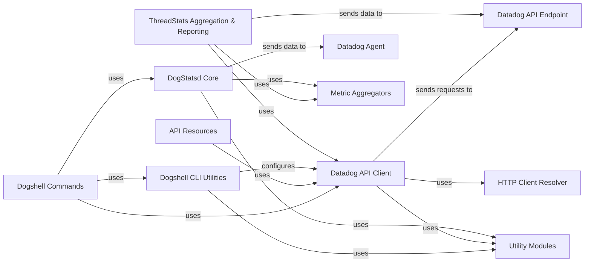

## Component Details

This architecture describes the core components of the Datadog Python client library, focusing on how it interacts with the Datadog API and the DogStatsd Agent. The main flow involves sending metrics, events, and service checks to Datadog. This is achieved either directly via HTTP requests to the Datadog API or by sending DogStatsd-formatted data to a local Datadog Agent. The system also includes utilities for command-line interactions and robust error handling.

### Datadog API Client
The foundational component for all interactions with the Datadog HTTP API, managing API key authentication, request submission, error handling (including exceptions from `datadog.api.exceptions`), retry logic, and providing interfaces for various Datadog API endpoints. It utilizes different HTTP client implementations.

**Related Classes/Methods**:

- <a href="https://github.com/DataDog/datadogpy/blob/master/datadog/api/api_client.py#L21-L290" target="_blank" rel="noopener noreferrer">`datadogpy.datadog.api.api_client.APIClient` (21:290)</a>
- <a href="https://github.com/DataDog/datadogpy/blob/master/datadog/api/api_client.py#L48-L236" target="_blank" rel="noopener noreferrer">`datadogpy.datadog.api.api_client.APIClient:submit` (48:236)</a>
- <a href="https://github.com/DataDog/datadogpy/blob/master/datadog/api/api_client.py#L38-L45" target="_blank" rel="noopener noreferrer">`datadogpy.datadog.api.api_client.APIClient:_get_http_client` (38:45)</a>
- <a href="https://github.com/DataDog/datadogpy/blob/master/datadog/api/api_client.py#L239-L280" target="_blank" rel="noopener noreferrer">`datadogpy.datadog.api.api_client.APIClient:_should_submit` (239:280)</a>
- <a href="https://github.com/DataDog/datadogpy/blob/master/datadog/api/http_client.py#L81-L126" target="_blank" rel="noopener noreferrer">`datadogpy.datadog.api.http_client.RequestClient` (81:126)</a>
- <a href="https://github.com/DataDog/datadogpy/blob/master/datadog/api/http_client.py#L91-L126" target="_blank" rel="noopener noreferrer">`datadogpy.datadog.api.http_client.RequestClient:request` (91:126)</a>
- <a href="https://github.com/DataDog/datadogpy/blob/master/datadog/api/http_client.py#L129-L183" target="_blank" rel="noopener noreferrer">`datadogpy.datadog.api.http_client.URLFetchClient` (129:183)</a>
- <a href="https://github.com/DataDog/datadogpy/blob/master/datadog/api/http_client.py#L135-L170" target="_blank" rel="noopener noreferrer">`datadogpy.datadog.api.http_client.URLFetchClient:request` (135:170)</a>
- <a href="https://github.com/DataDog/datadogpy/blob/master/datadog/api/http_client.py#L173-L183" target="_blank" rel="noopener noreferrer">`datadogpy.datadog.api.http_client.URLFetchClient:raise_on_status` (173:183)</a>
- <a href="https://github.com/DataDog/datadogpy/blob/master/datadog/api/http_client.py#L186-L235" target="_blank" rel="noopener noreferrer">`datadogpy.datadog.api.http_client.Urllib3Client` (186:235)</a>
- <a href="https://github.com/DataDog/datadogpy/blob/master/datadog/api/http_client.py#L195-L225" target="_blank" rel="noopener noreferrer">`datadogpy.datadog.api.http_client.Urllib3Client:request` (195:225)</a>
- <a href="https://github.com/DataDog/datadogpy/blob/master/datadog/api/http_client.py#L228-L235" target="_blank" rel="noopener noreferrer">`datadogpy.datadog.api.http_client.Urllib3Client:raise_on_status` (228:235)</a>
- `datadog.api.exceptions` (full file reference)
- `datadog.util.compat` (full file reference)
- `datadog.util.format` (full file reference)

### DogStatsd Core
This component provides the core functionality for sending DogStatsd-formatted metrics (gauges, counts, histograms, distributions, timings), events, and service checks. It manages metric aggregation, buffering, and the underlying socket communication (UDP/UDS) with the Datadog Agent. It also includes features like origin detection and client telemetry.

**Related Classes/Methods**:

- <a href="https://github.com/DataDog/datadogpy/blob/master/datadog/dogstatsd/base.py#L146-L1704" target="_blank" rel="noopener noreferrer">`datadog.dogstatsd.base.DogStatsd` (146:1704)</a>
- <a href="https://github.com/DataDog/datadogpy/blob/master/datadog/dogstatsd/base.py#L155-L503" target="_blank" rel="noopener noreferrer">`datadog.dogstatsd.base.DogStatsd.__init__` (155:503)</a>
- <a href="https://github.com/DataDog/datadogpy/blob/master/datadog/dogstatsd/base.py#L923-L941" target="_blank" rel="noopener noreferrer">`datadog.dogstatsd.base.DogStatsd.gauge` (923:941)</a>
- <a href="https://github.com/DataDog/datadogpy/blob/master/datadog/dogstatsd/base.py#L967-L984" target="_blank" rel="noopener noreferrer">`datadog.dogstatsd.base.DogStatsd.count` (967:984)</a>
- <a href="https://github.com/DataDog/datadogpy/blob/master/datadog/dogstatsd/base.py#L1009-L1027" target="_blank" rel="noopener noreferrer">`datadog.dogstatsd.base.DogStatsd.increment` (1009:1027)</a>
- <a href="https://github.com/DataDog/datadogpy/blob/master/datadog/dogstatsd/base.py#L1029-L1048" target="_blank" rel="noopener noreferrer">`datadog.dogstatsd.base.DogStatsd.decrement` (1029:1048)</a>
- <a href="https://github.com/DataDog/datadogpy/blob/master/datadog/dogstatsd/base.py#L1050-L1067" target="_blank" rel="noopener noreferrer">`datadog.dogstatsd.base.DogStatsd.histogram` (1050:1067)</a>
- <a href="https://github.com/DataDog/datadogpy/blob/master/datadog/dogstatsd/base.py#L1069-L1086" target="_blank" rel="noopener noreferrer">`datadog.dogstatsd.base.DogStatsd.distribution` (1069:1086)</a>
- <a href="https://github.com/DataDog/datadogpy/blob/master/datadog/dogstatsd/base.py#L1088-L1104" target="_blank" rel="noopener noreferrer">`datadog.dogstatsd.base.DogStatsd.timing` (1088:1104)</a>
- <a href="https://github.com/DataDog/datadogpy/blob/master/datadog/dogstatsd/base.py#L1431-L1505" target="_blank" rel="noopener noreferrer">`datadog.dogstatsd.base.DogStatsd.event` (1431:1505)</a>
- <a href="https://github.com/DataDog/datadogpy/blob/master/datadog/dogstatsd/base.py#L1507-L1550" target="_blank" rel="noopener noreferrer">`datadog.dogstatsd.base.DogStatsd.service_check` (1507:1550)</a>
- <a href="https://github.com/DataDog/datadogpy/blob/master/datadog/dogstatsd/base.py#L901-L909" target="_blank" rel="noopener noreferrer">`datadog.dogstatsd.base.DogStatsd.flush_buffered_metrics` (901:909)</a>
- <a href="https://github.com/DataDog/datadogpy/blob/master/datadog/dogstatsd/base.py#L911-L921" target="_blank" rel="noopener noreferrer">`datadog.dogstatsd.base.DogStatsd.flush_aggregated_metrics` (911:921)</a>
- <a href="https://github.com/DataDog/datadogpy/blob/master/datadog/dogstatsd/base.py#L1215-L1255" target="_blank" rel="noopener noreferrer">`datadog.dogstatsd.base.DogStatsd._report` (1215:1255)</a>
- <a href="https://github.com/DataDog/datadogpy/blob/master/datadog/dogstatsd/base.py#L1313-L1326" target="_blank" rel="noopener noreferrer">`datadog.dogstatsd.base.DogStatsd._send_to_server` (1313:1326)</a>
- <a href="https://github.com/DataDog/datadogpy/blob/master/datadog/dogstatsd/base.py#L1408-L1416" target="_blank" rel="noopener noreferrer">`datadog.dogstatsd.base.DogStatsd._send_to_buffer` (1408:1416)</a>
- <a href="https://github.com/DataDog/datadogpy/blob/master/datadog/dogstatsd/base.py#L1343-L1406" target="_blank" rel="noopener noreferrer">`datadog.dogstatsd.base.DogStatsd._xmit_packet` (1343:1406)</a>
- <a href="https://github.com/DataDog/datadogpy/blob/master/datadog/dogstatsd/base.py#L735-L769" target="_blank" rel="noopener noreferrer">`datadog.dogstatsd.base.DogStatsd.get_socket` (735:769)</a>
- <a href="https://github.com/DataDog/datadogpy/blob/master/datadog/dogstatsd/base.py#L831-L856" target="_blank" rel="noopener noreferrer">`datadog.dogstatsd.base.DogStatsd._get_udp_socket` (831:856)</a>
- <a href="https://github.com/DataDog/datadogpy/blob/master/datadog/dogstatsd/base.py#L797-L828" target="_blank" rel="noopener noreferrer">`datadog.dogstatsd.base.DogStatsd._get_uds_socket` (797:828)</a>
- <a href="https://github.com/DataDog/datadogpy/blob/master/datadog/dogstatsd/base.py#L605-L639" target="_blank" rel="noopener noreferrer">`datadog.dogstatsd.base.DogStatsd._start_flush_thread` (605:639)</a>
- <a href="https://github.com/DataDog/datadogpy/blob/master/datadog/dogstatsd/base.py#L1590-L1606" target="_blank" rel="noopener noreferrer">`datadog.dogstatsd.base.DogStatsd._start_sender_thread` (1590:1606)</a>

### ThreadStats Aggregation & Reporting
This component provides a high-performance, in-application mechanism for collecting and aggregating metrics and events. It aggregates data in memory and then uses a dedicated reporter to flush the collected data to the Datadog API, either synchronously, in a dedicated thread, or in a gevent greenlet.

**Related Classes/Methods**:

- <a href="https://github.com/DataDog/datadogpy/blob/master/datadog/threadstats/base.py#L41-L511" target="_blank" rel="noopener noreferrer">`datadog.threadstats.base.ThreadStats` (41:511)</a>
- <a href="https://github.com/DataDog/datadogpy/blob/master/datadog/threadstats/base.py#L85-L164" target="_blank" rel="noopener noreferrer">`datadog.threadstats.base.ThreadStats.start` (85:164)</a>
- <a href="https://github.com/DataDog/datadogpy/blob/master/datadog/threadstats/base.py#L166-L172" target="_blank" rel="noopener noreferrer">`datadog.threadstats.base.ThreadStats.stop` (166:172)</a>
- <a href="https://github.com/DataDog/datadogpy/blob/master/datadog/threadstats/base.py#L174-L212" target="_blank" rel="noopener noreferrer">`datadog.threadstats.base.ThreadStats.event` (174:212)</a>
- <a href="https://github.com/DataDog/datadogpy/blob/master/datadog/threadstats/base.py#L214-L228" target="_blank" rel="noopener noreferrer">`datadog.threadstats.base.ThreadStats.gauge` (214:228)</a>
- <a href="https://github.com/DataDog/datadogpy/blob/master/datadog/threadstats/base.py#L243-L255" target="_blank" rel="noopener noreferrer">`datadog.threadstats.base.ThreadStats.increment` (243:255)</a>
- <a href="https://github.com/DataDog/datadogpy/blob/master/datadog/threadstats/base.py#L257-L268" target="_blank" rel="noopener noreferrer">`datadog.threadstats.base.ThreadStats.decrement` (257:268)</a>
- <a href="https://github.com/DataDog/datadogpy/blob/master/datadog/threadstats/base.py#L270-L282" target="_blank" rel="noopener noreferrer">`datadog.threadstats.base.ThreadStats.histogram` (270:282)</a>
- <a href="https://github.com/DataDog/datadogpy/blob/master/datadog/threadstats/base.py#L284-L296" target="_blank" rel="noopener noreferrer">`datadog.threadstats.base.ThreadStats.distribution` (284:296)</a>
- <a href="https://github.com/DataDog/datadogpy/blob/master/datadog/threadstats/base.py#L298-L307" target="_blank" rel="noopener noreferrer">`datadog.threadstats.base.ThreadStats.timing` (298:307)</a>
- <a href="https://github.com/DataDog/datadogpy/blob/master/datadog/threadstats/base.py#L367-L418" target="_blank" rel="noopener noreferrer">`datadog.threadstats.base.ThreadStats.flush` (367:418)</a>
- <a href="https://github.com/DataDog/datadogpy/blob/master/datadog/threadstats/base.py#L420-L458" target="_blank" rel="noopener noreferrer">`datadog.threadstats.base.ThreadStats._get_aggregate_metrics_and_dists` (420:458)</a>
- <a href="https://github.com/DataDog/datadogpy/blob/master/datadog/threadstats/base.py#L460-L463" target="_blank" rel="noopener noreferrer">`datadog.threadstats.base.ThreadStats._get_aggregate_events` (460:463)</a>
- <a href="https://github.com/DataDog/datadogpy/blob/master/datadog/threadstats/base.py#L465-L487" target="_blank" rel="noopener noreferrer">`datadog.threadstats.base.ThreadStats._start_flush_thread` (465:487)</a>
- <a href="https://github.com/DataDog/datadogpy/blob/master/datadog/threadstats/base.py#L489-L511" target="_blank" rel="noopener noreferrer">`datadog.threadstats.base.ThreadStats._start_flush_greenlet` (489:511)</a>
- <a href="https://github.com/DataDog/datadogpy/blob/master/datadog/threadstats/reporters.py#L17-L29" target="_blank" rel="noopener noreferrer">`datadog.threadstats.reporters.HttpReporter` (17:29)</a>

### Dogshell CLI Utilities
This component provides common utility functions for the `dogshell` command-line interface. Its responsibilities include loading configuration from files or user input, handling API and application keys, and reporting errors and warnings to the console.

**Related Classes/Methods**:

- <a href="https://github.com/DataDog/datadogpy/blob/master/datadog/dogshell/common.py#L45-L122" target="_blank" rel="noopener noreferrer">`datadog.dogshell.common.DogshellConfig` (45:122)</a>
- <a href="https://github.com/DataDog/datadogpy/blob/master/datadog/dogshell/common.py#L46-L122" target="_blank" rel="noopener noreferrer">`datadog.dogshell.common.DogshellConfig.load` (46:122)</a>
- <a href="https://github.com/DataDog/datadogpy/blob/master/datadog/dogshell/common.py#L13-L18" target="_blank" rel="noopener noreferrer">`datadog.dogshell.common.print_err` (13:18)</a>
- <a href="https://github.com/DataDog/datadogpy/blob/master/datadog/dogshell/common.py#L21-L30" target="_blank" rel="noopener noreferrer">`datadog.dogshell.common.report_errors` (21:30)</a>
- <a href="https://github.com/DataDog/datadogpy/blob/master/datadog/dogshell/common.py#L33-L42" target="_blank" rel="noopener noreferrer">`datadog.dogshell.common.report_warnings` (33:42)</a>
- `datadog.util.config` (full file reference)

### Datadog Agent
Represents the Datadog Agent, which receives DogStatsd metrics, events, and service checks from the `DogStatsd Core` component.

**Related Classes/Methods**: _None_

### Datadog API Endpoint
Represents the Datadog HTTP API, which receives data from the `Datadog API Client` and `ThreadStats Aggregation & Reporting` components.

**Related Classes/Methods**: _None_

### Metric Aggregators
Internal components responsible for aggregating different types of metrics (e.g., counters, gauges, histograms) before they are sent.

**Related Classes/Methods**:

- <a href="https://github.com/DataDog/datadogpy/blob/master/datadog/dogstatsd/aggregator.py#L17-L118" target="_blank" rel="noopener noreferrer">`datadog.dogstatsd.aggregator.Aggregator` (17:118)</a>
- <a href="https://github.com/DataDog/datadogpy/blob/master/datadog/dogstatsd/metric_types.py#L1-L7" target="_blank" rel="noopener noreferrer">`datadog.dogstatsd.metric_types.MetricType` (1:7)</a>
- <a href="https://github.com/DataDog/datadogpy/blob/master/datadog/dogstatsd/max_sample_metric.py#L7-L52" target="_blank" rel="noopener noreferrer">`datadog.dogstatsd.max_sample_metric.MaxSampleMetric` (7:52)</a>
- `datadog.dogstatsd.max_sample_metric_context.MaxSampleMetricContext` (full file reference)
- `datadog.dogstatsd.metrics.Metrics` (full file reference)
- <a href="https://github.com/DataDog/datadogpy/blob/master/datadog/threadstats/metrics.py#L171-L203" target="_blank" rel="noopener noreferrer">`datadog.threadstats.metrics.MetricsAggregator` (171:203)</a>
- <a href="https://github.com/DataDog/datadogpy/blob/master/datadog/threadstats/events.py#L11-L27" target="_blank" rel="noopener noreferrer">`datadog.threadstats.events.EventsAggregator` (11:27)</a>
- <a href="https://github.com/DataDog/datadogpy/blob/master/datadog/threadstats/metrics.py#L67-L83" target="_blank" rel="noopener noreferrer">`datadog.threadstats.metrics.Counter` (67:83)</a>
- <a href="https://github.com/DataDog/datadogpy/blob/master/datadog/threadstats/metrics.py#L49-L64" target="_blank" rel="noopener noreferrer">`datadog.threadstats.metrics.Gauge` (49:64)</a>
- <a href="https://github.com/DataDog/datadogpy/blob/master/datadog/threadstats/metrics.py#L104-L159" target="_blank" rel="noopener noreferrer">`datadog.threadstats.metrics.Histogram` (104:159)</a>
- <a href="https://github.com/DataDog/datadogpy/blob/master/datadog/threadstats/metrics.py#L162-L168" target="_blank" rel="noopener noreferrer">`datadog.threadstats.metrics.Timing` (162:168)</a>
- <a href="https://github.com/DataDog/datadogpy/blob/master/datadog/threadstats/metrics.py#L86-L101" target="_blank" rel="noopener noreferrer">`datadog.threadstats.metrics.Distribution` (86:101)</a>
- <a href="https://github.com/DataDog/datadogpy/blob/master/datadog/threadstats/metrics.py#L31-L46" target="_blank" rel="noopener noreferrer">`datadog.threadstats.metrics.Set` (31:46)</a>

### HTTP Client Resolver
Component responsible for resolving and providing the appropriate underlying HTTP client for making requests. It abstracts the specific HTTP client implementation.

**Related Classes/Methods**:

- <a href="https://github.com/DataDog/datadogpy/blob/master/datadog/api/http_client.py#L238-L256" target="_blank" rel="noopener noreferrer">`datadog.api.http_client.resolve_http_client` (238:256)</a>
- <a href="https://github.com/DataDog/datadogpy/blob/master/datadog/api/http_client.py#L59-L78" target="_blank" rel="noopener noreferrer">`datadog.api.http_client.HTTPClient` (59:78)</a>

### Utility Modules
A collection of common utility modules used across various Datadog client components for tasks like compatibility checks, formatting, and tag normalization.

**Related Classes/Methods**:

- `datadog.util.compat` (full file reference)
- `datadog.util.format` (full file reference)
- `datadog.util.hostname` (full file reference)
- `datadog.util.config` (full file reference)
- `datadog.util.cli` (full file reference)

### API Resources
Modules that provide high-level interfaces for interacting with specific Datadog API resources (e.g., AWS integrations, dashboards, metrics, monitors). These modules typically use the Datadog API Client to perform their operations.

**Related Classes/Methods**:

- <a href="https://github.com/DataDog/datadogpy/blob/master/datadog/api/resources.py#L17-L50" target="_blank" rel="noopener noreferrer">`datadogpy.datadog.api.resources.CreateableAPIResource:create` (17:50)</a>
- <a href="https://github.com/DataDog/datadogpy/blob/master/datadog/api/resources.py#L59-L92" target="_blank" rel="noopener noreferrer">`datadogpy.datadog.api.resources.SendableAPIResource:send` (59:92)</a>
- <a href="https://github.com/DataDog/datadogpy/blob/master/datadog/api/resources.py#L101-L119" target="_blank" rel="noopener noreferrer">`datadogpy.datadog.api.resources.UpdatableAPIResource:update` (101:119)</a>
- <a href="https://github.com/DataDog/datadogpy/blob/master/datadog/api/resources.py#L128-L155" target="_blank" rel="noopener noreferrer">`datadogpy.datadog.api.resources.CustomUpdatableAPIResource:update` (128:155)</a>
- <a href="https://github.com/DataDog/datadogpy/blob/master/datadog/api/resources.py#L164-L176" target="_blank" rel="noopener noreferrer">`datadogpy.datadog.api.resources.DeletableAPIResource:delete` (164:176)</a>
- <a href="https://github.com/DataDog/datadogpy/blob/master/datadog/api/resources.py#L185-L200" target="_blank" rel="noopener noreferrer">`datadogpy.datadog.api.resources.GetableAPIResource:get` (185:200)</a>
- <a href="https://github.com/DataDog/datadogpy/blob/master/datadog/api/resources.py#L209-L220" target="_blank" rel="noopener noreferrer">`datadogpy.datadog.api.resources.ListableAPIResource:get_all` (209:220)</a>
- <a href="https://github.com/DataDog/datadogpy/blob/master/datadog/api/resources.py#L229-L247" target="_blank" rel="noopener noreferrer">`datadogpy.datadog.api.resources.ListableAPISubResource:get_items` (229:247)</a>
- <a href="https://github.com/DataDog/datadogpy/blob/master/datadog/api/resources.py#L256-L279" target="_blank" rel="noopener noreferrer">`datadogpy.datadog.api.resources.AddableAPISubResource:add_items` (256:279)</a>
- <a href="https://github.com/DataDog/datadogpy/blob/master/datadog/api/resources.py#L288-L311" target="_blank" rel="noopener noreferrer">`datadogpy.datadog.api.resources.UpdatableAPISubResource:update_items` (288:311)</a>
- <a href="https://github.com/DataDog/datadogpy/blob/master/datadog/api/resources.py#L320-L343" target="_blank" rel="noopener noreferrer">`datadogpy.datadog.api.resources.DeletableAPISubResource:delete_items` (320:343)</a>
- <a href="https://github.com/DataDog/datadogpy/blob/master/datadog/api/resources.py#L352-L363" target="_blank" rel="noopener noreferrer">`datadogpy.datadog.api.resources.SearchableAPIResource:_search` (352:363)</a>
- <a href="https://github.com/DataDog/datadogpy/blob/master/datadog/api/resources.py#L372-L407" target="_blank" rel="noopener noreferrer">`datadogpy.datadog.api.resources.ActionAPIResource:_trigger_class_action` (372:407)</a>
- <a href="https://github.com/DataDog/datadogpy/blob/master/datadog/api/resources.py#L410-L436" target="_blank" rel="noopener noreferrer">`datadogpy.datadog.api.resources.ActionAPIResource:_trigger_action` (410:436)</a>
- <a href="https://github.com/DataDog/datadogpy/blob/master/datadog/api/resources.py#L445-L468" target="_blank" rel="noopener noreferrer">`datadogpy.datadog.api.resources.UpdatableAPISyntheticsSubResource:update_synthetics_items` (445:468)</a>
- <a href="https://github.com/DataDog/datadogpy/blob/master/datadog/api/resources.py#L477-L495" target="_blank" rel="noopener noreferrer">`datadogpy.datadog.api.resources.UpdatableAPISyntheticsResource:update_synthetics` (477:495)</a>
- <a href="https://github.com/DataDog/datadogpy/blob/master/datadog/api/resources.py#L504-L539" target="_blank" rel="noopener noreferrer">`datadogpy.datadog.api.resources.ActionAPISyntheticsResource:_trigger_synthetics_class_action` (504:539)</a>
- <a href="https://github.com/DataDog/datadogpy/blob/master/datadog/api/metrics.py#L22-L39" target="_blank" rel="noopener noreferrer">`datadogpy.datadog.api.metrics.Metric:list` (22:39)</a>
- <a href="https://github.com/DataDog/datadogpy/blob/master/datadog/api/metrics.py#L54-L111" target="_blank" rel="noopener noreferrer">`datadogpy.datadog.api.metrics.Metric:send` (54:111)</a>
- <a href="https://github.com/DataDog/datadogpy/blob/master/datadog/api/metrics.py#L114-L147" target="_blank" rel="noopener noreferrer">`datadogpy.datadog.api.metrics.Metric:query` (114:147)</a>
- <a href="https://github.com/DataDog/datadogpy/blob/master/datadog/api/distributions.py#L15-L45" target="_blank" rel="noopener noreferrer">`datadogpy.datadog.api.distributions.Distribution:send` (15:45)</a>
- <a href="https://github.com/DataDog/datadogpy/blob/master/datadog/api/tags.py#L21-L36" target="_blank" rel="noopener noreferrer">`datadogpy.datadog.api.tags.Tag:create` (21:36)</a>
- <a href="https://github.com/DataDog/datadogpy/blob/master/datadog/api/tags.py#L39-L54" target="_blank" rel="noopener noreferrer">`datadogpy.datadog.api.tags.Tag:update` (39:54)</a>
- <a href="https://github.com/DataDog/datadogpy/blob/master/datadog/api/gcp_integration.py#L16-L22" target="_blank" rel="noopener noreferrer">`datadogpy.datadog.api.gcp_integration.GcpIntegration:list` (16:22)</a>
- <a href="https://github.com/DataDog/datadogpy/blob/master/datadog/api/gcp_integration.py#L25-L34" target="_blank" rel="noopener noreferrer">`datadogpy.datadog.api.gcp_integration.GcpIntegration:delete` (25:34)</a>
- <a href="https://github.com/DataDog/datadogpy/blob/master/datadog/api/gcp_integration.py#L37-L67" target="_blank" rel="noopener noreferrer">`datadogpy.datadog.api.gcp_integration.GcpIntegration:create` (37:67)</a>
- <a href="https://github.com/DataDog/datadogpy/blob/master/datadog/api/gcp_integration.py#L70-L93" target="_blank" rel="noopener noreferrer">`datadogpy.datadog.api.gcp_integration.GcpIntegration:update` (70:93)</a>
- <a href="https://github.com/DataDog/datadogpy/blob/master/datadog/api/security_monitoring_rules.py#L34-L43" target="_blank" rel="noopener noreferrer">`datadogpy.datadog.api.security_monitoring_rules.SecurityMonitoringRule:get_all` (34:43)</a>
- <a href="https://github.com/DataDog/datadogpy/blob/master/datadog/api/security_monitoring_rules.py#L46-L55" target="_blank" rel="noopener noreferrer">`datadogpy.datadog.api.security_monitoring_rules.SecurityMonitoringRule:get` (46:55)</a>
- <a href="https://github.com/DataDog/datadogpy/blob/master/datadog/api/security_monitoring_rules.py#L58-L67" target="_blank" rel="noopener noreferrer">`datadogpy.datadog.api.security_monitoring_rules.SecurityMonitoringRule:create` (58:67)</a>
- <a href="https://github.com/DataDog/datadogpy/blob/master/datadog/api/security_monitoring_rules.py#L70-L81" target="_blank" rel="noopener noreferrer">`datadogpy.datadog.api.security_monitoring_rules.SecurityMonitoringRule:update` (70:81)</a>
- <a href="https://github.com/DataDog/datadogpy/blob/master/datadog/api/security_monitoring_rules.py#L84-L93" target="_blank" rel="noopener noreferrer">`datadogpy.datadog.api.security_monitoring_rules.SecurityMonitoringRule:delete` (84:93)</a>
- <a href="https://github.com/DataDog/datadogpy/blob/master/datadog/api/monitors.py#L14-L157" target="_blank" rel="noopener noreferrer">`datadogpy.datadog.api.monitors.Monitor` (14:157)</a>
- <a href="https://github.com/DataDog/datadogpy/blob/master/datadog/api/monitors.py#L29-L45" target="_blank" rel="noopener noreferrer">`datadogpy.datadog.api.monitors.Monitor:get` (29:45)</a>
- <a href="https://github.com/DataDog/datadogpy/blob/master/datadog/api/monitors.py#L48-L72" target="_blank" rel="noopener noreferrer">`datadogpy.datadog.api.monitors.Monitor:get_all` (48:72)</a>
- <a href="https://github.com/DataDog/datadogpy/blob/master/datadog/api/monitors.py#L75-L88" target="_blank" rel="noopener noreferrer">`datadogpy.datadog.api.monitors.Monitor:mute` (75:88)</a>
- <a href="https://github.com/DataDog/datadogpy/blob/master/datadog/api/monitors.py#L91-L103" target="_blank" rel="noopener noreferrer">`datadogpy.datadog.api.monitors.Monitor:unmute` (91:103)</a>
- <a href="https://github.com/DataDog/datadogpy/blob/master/datadog/api/monitors.py#L106-L112" target="_blank" rel="noopener noreferrer">`datadogpy.datadog.api.monitors.Monitor:mute_all` (106:112)</a>
- <a href="https://github.com/DataDog/datadogpy/blob/master/datadog/api/monitors.py#L115-L121" target="_blank" rel="noopener noreferrer">`datadogpy.datadog.api.monitors.Monitor:unmute_all` (115:121)</a>
- <a href="https://github.com/DataDog/datadogpy/blob/master/datadog/api/monitors.py#L124-L130" target="_blank" rel="noopener noreferrer">`datadogpy.datadog.api.monitors.Monitor:search` (124:130)</a>
- <a href="https://github.com/DataDog/datadogpy/blob/master/datadog/api/monitors.py#L133-L139" target="_blank" rel="noopener noreferrer">`datadogpy.datadog.api.monitors.Monitor:search_groups` (133:139)</a>
- <a href="https://github.com/DataDog/datadogpy/blob/master/datadog/api/monitors.py#L142-L148" target="_blank" rel="noopener noreferrer">`datadogpy.datadog.api.monitors.Monitor:can_delete` (142:148)</a>
- <a href="https://github.com/DataDog/datadogpy/blob/master/datadog/api/monitors.py#L151-L157" target="_blank" rel="noopener noreferrer">`datadogpy.datadog.api.monitors.Monitor:validate` (151:157)</a>
- <a href="https://github.com/DataDog/datadogpy/blob/master/datadog/api/users.py#L30-L50" target="_blank" rel="noopener noreferrer">`datadogpy.datadog.api.users.User:invite` (30:50)</a>
- <a href="https://github.com/DataDog/datadogpy/blob/master/datadog/api/screenboards.py#L29-L38" target="_blank" rel="noopener noreferrer">`datadogpy.datadog.api.screenboards.Screenboard:share` (29:38)</a>
- <a href="https://github.com/DataDog/datadogpy/blob/master/datadog/api/screenboards.py#L41-L50" target="_blank" rel="noopener noreferrer">`datadogpy.datadog.api.screenboards.Screenboard:revoke` (41:50)</a>
- <a href="https://github.com/DataDog/datadogpy/blob/master/datadog/api/events.py#L18-L69" target="_blank" rel="noopener noreferrer">`datadogpy.datadog.api.events.Event:create` (18:69)</a>
- <a href="https://github.com/DataDog/datadogpy/blob/master/datadog/api/events.py#L72-L95" target="_blank" rel="noopener noreferrer">`datadogpy.datadog.api.events.Event:query` (72:95)</a>
- <a href="https://github.com/DataDog/datadogpy/blob/master/datadog/api/infrastructure.py#L15-L28" target="_blank" rel="noopener noreferrer">`datadogpy.datadog.api.infrastructure.Infrastructure:search` (15:28)</a>
- <a href="https://github.com/DataDog/datadogpy/blob/master/datadog/api/synthetics.py#L31-L45" target="_blank" rel="noopener noreferrer">`datadogpy.datadog.api.synthetics.Synthetics:get_test` (31:45)</a>
- <a href="https://github.com/DataDog/datadogpy/blob/master/datadog/api/synthetics.py#L48-L61" target="_blank" rel="noopener noreferrer">`datadogpy.datadog.api.synthetics.Synthetics:get_all_tests` (48:61)</a>
- <a href="https://github.com/DataDog/datadogpy/blob/master/datadog/api/synthetics.py#L64-L75" target="_blank" rel="noopener noreferrer">`datadogpy.datadog.api.synthetics.Synthetics:get_devices` (64:75)</a>
- <a href="https://github.com/DataDog/datadogpy/blob/master/datadog/api/synthetics.py#L78-L89" target="_blank" rel="noopener noreferrer">`datadogpy.datadog.api.synthetics.Synthetics:get_locations` (78:89)</a>
- <a href="https://github.com/DataDog/datadogpy/blob/master/datadog/api/synthetics.py#L92-L106" target="_blank" rel="noopener noreferrer">`datadogpy.datadog.api.synthetics.Synthetics:get_results` (92:106)</a>
- <a href="https://github.com/DataDog/datadogpy/blob/master/datadog/api/synthetics.py#L109-L126" target="_blank" rel="noopener noreferrer">`datadogpy.datadog.api.synthetics.Synthetics:get_result` (109:126)</a>
- <a href="https://github.com/DataDog/datadogpy/blob/master/datadog/api/synthetics.py#L129-L163" target="_blank" rel="noopener noreferrer">`datadogpy.datadog.api.synthetics.Synthetics:create_test` (129:163)</a>
- <a href="https://github.com/DataDog/datadogpy/blob/master/datadog/api/synthetics.py#L166-L178" target="_blank" rel="noopener noreferrer">`datadogpy.datadog.api.synthetics.Synthetics:edit_test` (166:178)</a>
- <a href="https://github.com/DataDog/datadogpy/blob/master/datadog/api/synthetics.py#L181-L196" target="_blank" rel="noopener noreferrer">`datadogpy.datadog.api.synthetics.Synthetics:start_or_pause_test` (181:196)</a>
- <a href="https://github.com/DataDog/datadogpy/blob/master/datadog/api/synthetics.py#L199-L214" target="_blank" rel="noopener noreferrer">`datadogpy.datadog.api.synthetics.Synthetics:delete_test` (199:214)</a>
- <a href="https://github.com/DataDog/datadogpy/blob/master/datadog/api/roles.py#L32-L41" target="_blank" rel="noopener noreferrer">`datadogpy.datadog.api.roles.Roles:update` (32:41)</a>
- <a href="https://github.com/DataDog/datadogpy/blob/master/datadog/api/roles.py#L44-L56" target="_blank" rel="noopener noreferrer">`datadogpy.datadog.api.roles.Roles:assign_permission` (44:56)</a>
- <a href="https://github.com/DataDog/datadogpy/blob/master/datadog/api/roles.py#L59-L71" target="_blank" rel="noopener noreferrer">`datadogpy.datadog.api.roles.Roles:unassign_permission` (59:71)</a>
- <a href="https://github.com/DataDog/datadogpy/blob/master/datadog/api/service_checks.py#L15-L45" target="_blank" rel="noopener noreferrer">`datadogpy.datadog.api.service_checks.ServiceCheck:check` (15:45)</a>
- <a href="https://github.com/DataDog/datadogpy/blob/master/datadog/api/azure_integration.py#L24-L30" target="_blank" rel="noopener noreferrer">`datadogpy.datadog.api.azure_integration.AzureIntegration:list` (24:30)</a>
- <a href="https://github.com/DataDog/datadogpy/blob/master/datadog/api/azure_integration.py#L33-L45" target="_blank" rel="noopener noreferrer">`datadogpy.datadog.api.azure_integration.AzureIntegration:create` (33:45)</a>
- <a href="https://github.com/DataDog/datadogpy/blob/master/datadog/api/azure_integration.py#L48-L57" target="_blank" rel="noopener noreferrer">`datadogpy.datadog.api.azure_integration.AzureIntegration:delete` (48:57)</a>
- <a href="https://github.com/DataDog/datadogpy/blob/master/datadog/api/azure_integration.py#L60-L72" target="_blank" rel="noopener noreferrer">`datadogpy.datadog.api.azure_integration.AzureIntegration:update_host_filters` (60:72)</a>
- <a href="https://github.com/DataDog/datadogpy/blob/master/datadog/api/azure_integration.py#L75-L91" target="_blank" rel="noopener noreferrer">`datadogpy.datadog.api.azure_integration.AzureIntegration:update` (75:91)</a>
- <a href="https://github.com/DataDog/datadogpy/blob/master/datadog/api/logs.py#L16-L22" target="_blank" rel="noopener noreferrer">`datadogpy.datadog.api.logs.Logs:list` (16:22)</a>
- <a href="https://github.com/DataDog/datadogpy/blob/master/datadog/api/downtimes.py#L29-L38" target="_blank" rel="noopener noreferrer">`datadogpy.datadog.api.downtimes.Downtime:cancel_downtime_by_scope` (29:38)</a>
- <a href="https://github.com/DataDog/datadogpy/blob/master/datadog/api/hosts.py#L15-L35" target="_blank" rel="noopener noreferrer">`datadogpy.datadog.api.hosts.Host:mute` (15:35)</a>
- <a href="https://github.com/DataDog/datadogpy/blob/master/datadog/api/hosts.py#L38-L48" target="_blank" rel="noopener noreferrer">`datadogpy.datadog.api.hosts.Host:unmute` (38:48)</a>
- <a href="https://github.com/DataDog/datadogpy/blob/master/datadog/api/hosts.py#L59-L82" target="_blank" rel="noopener noreferrer">`datadogpy.datadog.api.hosts.Hosts:search` (59:82)</a>
- <a href="https://github.com/DataDog/datadogpy/blob/master/datadog/api/hosts.py#L85-L94" target="_blank" rel="noopener noreferrer">`datadogpy.datadog.api.hosts.Hosts:totals` (85:94)</a>
- <a href="https://github.com/DataDog/datadogpy/blob/master/datadog/api/hosts.py#L97-L135" target="_blank" rel="noopener noreferrer">`datadogpy.datadog.api.hosts.Hosts:get_all` (97:135)</a>
- <a href="https://github.com/DataDog/datadogpy/blob/master/datadog/api/aws_log_integration.py#L16-L23" target="_blank" rel="noopener noreferrer">`datadogpy.datadog.api.aws_log_integration.AwsLogsIntegration:list_log_services` (16:23)</a>
- <a href="https://github.com/DataDog/datadogpy/blob/master/datadog/api/aws_log_integration.py#L26-L37" target="_blank" rel="noopener noreferrer">`datadogpy.datadog.api.aws_log_integration.AwsLogsIntegration:add_log_lambda_arn` (26:37)</a>
- <a href="https://github.com/DataDog/datadogpy/blob/master/datadog/api/aws_log_integration.py#L40-L50" target="_blank" rel="noopener noreferrer">`datadogpy.datadog.api.aws_log_integration.AwsLogsIntegration:save_services` (40:50)</a>
- <a href="https://github.com/DataDog/datadogpy/blob/master/datadog/api/aws_log_integration.py#L53-L64" target="_blank" rel="noopener noreferrer">`datadogpy.datadog.api.aws_log_integration.AwsLogsIntegration:delete_config` (53:64)</a>
- <a href="https://github.com/DataDog/datadogpy/blob/master/datadog/api/aws_log_integration.py#L67-L85" target="_blank" rel="noopener noreferrer">`datadogpy.datadog.api.aws_log_integration.AwsLogsIntegration:check_lambda` (67:85)</a>
- <a href="https://github.com/DataDog/datadogpy/blob/master/datadog/api/aws_log_integration.py#L88-L101" target="_blank" rel="noopener noreferrer">`datadogpy.datadog.api.aws_log_integration.AwsLogsIntegration:check_services` (88:101)</a>
- <a href="https://github.com/DataDog/datadogpy/blob/master/datadog/api/aws_log_integration.py#L104-L111" target="_blank" rel="noopener noreferrer">`datadogpy.datadog.api.aws_log_integration.AwsLogsIntegration:list` (104:111)</a>
- <a href="https://github.com/DataDog/datadogpy/blob/master/datadog/api/metadata.py#L16-L27" target="_blank" rel="noopener noreferrer">`datadogpy.datadog.api.metadata.Metadata:get` (16:27)</a>
- <a href="https://github.com/DataDog/datadogpy/blob/master/datadog/api/metadata.py#L30-L64" target="_blank" rel="noopener noreferrer">`datadogpy.datadog.api.metadata.Metadata:update` (30:64)</a>
- <a href="https://github.com/DataDog/datadogpy/blob/master/datadog/api/graphs.py#L16-L34" target="_blank" rel="noopener noreferrer">`datadogpy.datadog.api.graphs.Graph:create` (16:34)</a>
- <a href="https://github.com/DataDog/datadogpy/blob/master/datadog/api/graphs.py#L37-L52" target="_blank" rel="noopener noreferrer">`datadogpy.datadog.api.graphs.Graph:status` (37:52)</a>
- <a href="https://github.com/DataDog/datadogpy/blob/master/datadog/api/graphs.py#L63-L72" target="_blank" rel="noopener noreferrer">`datadogpy.datadog.api.graphs.Embed:enable` (63:72)</a>
- <a href="https://github.com/DataDog/datadogpy/blob/master/datadog/api/graphs.py#L75-L84" target="_blank" rel="noopener noreferrer">`datadogpy.datadog.api.graphs.Embed:revoke` (75:84)</a>
- <a href="https://github.com/DataDog/datadogpy/blob/master/datadog/api/service_level_objectives.py#L30-L38" target="_blank" rel="noopener noreferrer">`datadogpy.datadog.api.service_level_objectives.ServiceLevelObjective:create` (30:38)</a>
- <a href="https://github.com/DataDog/datadogpy/blob/master/datadog/api/service_level_objectives.py#L41-L50" target="_blank" rel="noopener noreferrer">`datadogpy.datadog.api.service_level_objectives.ServiceLevelObjective:get` (41:50)</a>
- <a href="https://github.com/DataDog/datadogpy/blob/master/datadog/api/service_level_objectives.py#L53-L89" target="_blank" rel="noopener noreferrer">`datadogpy.datadog.api.service_level_objectives.ServiceLevelObjective:get_all` (53:89)</a>
- <a href="https://github.com/DataDog/datadogpy/blob/master/datadog/api/service_level_objectives.py#L92-L101" target="_blank" rel="noopener noreferrer">`datadogpy.datadog.api.service_level_objectives.ServiceLevelObjective:update` (92:101)</a>
- <a href="https://github.com/DataDog/datadogpy/blob/master/datadog/api/service_level_objectives.py#L104-L113" target="_blank" rel="noopener noreferrer">`datadogpy.datadog.api.service_level_objectives.ServiceLevelObjective:delete` (104:113)</a>
- <a href="https://github.com/DataDog/datadogpy/blob/master/datadog/api/service_level_objectives.py#L116-L133" target="_blank" rel="noopener noreferrer">`datadogpy.datadog.api.service_level_objectives.ServiceLevelObjective:bulk_delete` (116:133)</a>
- <a href="https://github.com/DataDog/datadogpy/blob/master/datadog/api/service_level_objectives.py#L136-L151" target="_blank" rel="noopener noreferrer">`datadogpy.datadog.api.service_level_objectives.ServiceLevelObjective:delete_many` (136:151)</a>
- <a href="https://github.com/DataDog/datadogpy/blob/master/datadog/api/service_level_objectives.py#L154-L174" target="_blank" rel="noopener noreferrer">`datadogpy.datadog.api.service_level_objectives.ServiceLevelObjective:can_delete` (154:174)</a>
- <a href="https://github.com/DataDog/datadogpy/blob/master/datadog/api/service_level_objectives.py#L177-L204" target="_blank" rel="noopener noreferrer">`datadogpy.datadog.api.service_level_objectives.ServiceLevelObjective:history` (177:204)</a>
- <a href="https://github.com/DataDog/datadogpy/blob/master/datadog/api/service_level_objectives.py#L207-L213" target="_blank" rel="noopener noreferrer">`datadogpy.datadog.api.service_level_objectives.ServiceLevelObjective:search` (207:213)</a>
- <a href="https://github.com/DataDog/datadogpy/blob/master/datadog/api/aws_integration.py#L30-L36" target="_blank" rel="noopener noreferrer">`datadogpy.datadog.api.aws_integration.AwsIntegration:list` (30:36)</a>
- <a href="https://github.com/DataDog/datadogpy/blob/master/datadog/api/aws_integration.py#L39-L97" target="_blank" rel="noopener noreferrer">`datadogpy.datadog.api.aws_integration.AwsIntegration:create` (39:97)</a>
- <a href="https://github.com/DataDog/datadogpy/blob/master/datadog/api/aws_integration.py#L100-L213" target="_blank" rel="noopener noreferrer">`datadogpy.datadog.api.aws_integration.AwsIntegration:update` (100:213)</a>
- <a href="https://github.com/DataDog/datadogpy/blob/master/datadog/api/aws_integration.py#L216-L225" target="_blank" rel="noopener noreferrer">`datadogpy.datadog.api.aws_integration.AwsIntegration:delete` (216:225)</a>
- <a href="https://github.com/DataDog/datadogpy/blob/master/datadog/api/aws_integration.py#L228-L235" target="_blank" rel="noopener noreferrer">`datadogpy.datadog.api.aws_integration.AwsIntegration:list_namespace_rules` (228:235)</a>
- <a href="https://github.com/DataDog/datadogpy/blob/master/datadog/api/aws_integration.py#L238-L248" target="_blank" rel="noopener noreferrer">`datadogpy.datadog.api.aws_integration.AwsIntegration:generate_new_external_id` (238:248)</a>
- <a href="https://github.com/DataDog/datadogpy/blob/master/datadog/api/security_monitoring_signals.py#L30-L39" target="_blank" rel="noopener noreferrer">`datadogpy.datadog.api.security_monitoring_signals.SecurityMonitoringSignal:get` (30:39)</a>
- <a href="https://github.com/DataDog/datadogpy/blob/master/datadog/api/security_monitoring_signals.py#L42-L58" target="_blank" rel="noopener noreferrer">`datadogpy.datadog.api.security_monitoring_signals.SecurityMonitoringSignal:get_all` (42:58)</a>
- <a href="https://github.com/DataDog/datadogpy/blob/master/datadog/api/security_monitoring_signals.py#L61-L84" target="_blank" rel="noopener noreferrer">`datadogpy.datadog.api.security_monitoring_signals.SecurityMonitoringSignal:change_triage_state` (61:84)</a>

### Dogshell Commands
Modules that implement specific commands for the `dogshell` command-line interface, interacting with the Datadog API and DogStatsd client.

**Related Classes/Methods**:

- `datadog.dogshell.comment` (full file reference)
- `datadog.dogshell.dashboard` (full file reference)
- `datadog.dogshell.dashboard_list` (full file reference)
- `datadog.dogshell.downtime` (full file reference)
- `datadog.dogshell.event` (full file reference)
- `datadog.dogshell.host` (full file reference)
- `datadog.dogshell.hosts` (full file reference)
- `datadog.dogshell.metric` (full file reference)
- `datadog.dogshell.monitor` (full file reference)
- `datadog.dogshell.screenboard` (full file reference)
- `datadog.dogshell.search` (full file reference)
- `datadog.dogshell.security_monitoring` (full file reference)
- `datadog.dogshell.service_check` (full file reference)
- `datadog.dogshell.service_level_objective` (full file reference)
- `datadog.dogshell.tag` (full file reference)
- `datadog.dogshell.timeboard` (full file reference)
- `datadog.dogshell.wrap` (full file reference)

### [FAQ](https://github.com/CodeBoarding/GeneratedOnBoardings/tree/main?tab=readme-ov-file#faq)