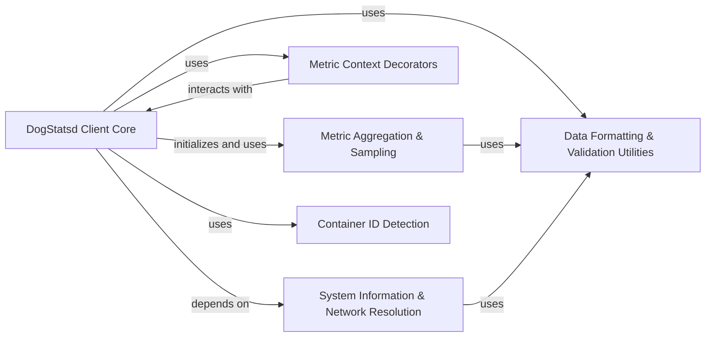

## Component Details

The DogStatsd Client subsystem provides core functionality for sending metrics, events, and service checks to the Datadog Agent via UDP or UDS. This includes initialization, socket management, buffering, flushing, and metric aggregation. It is composed of several interconnected components that handle different aspects of data collection, formatting, and transmission, ensuring efficient and accurate reporting to Datadog.

### DogStatsd Client Core
The primary interface for sending metrics, events, and service checks to the DogStatsd agent. It handles connection management (UDP/UDS sockets), buffering, flushing, and background sending of data. It also manages client-level configurations like constant tags and telemetry.

**Related Classes/Methods**:

- `datadog.initialize` (full file reference)
- <a href="https://github.com/DataDog/datadogpy/blob/master/datadog/dogstatsd/base.py#L146-L1704" target="_blank" rel="noopener noreferrer">`datadog.dogstatsd.base.DogStatsd` (146:1704)</a>
- <a href="https://github.com/DataDog/datadogpy/blob/master/datadog/dogstatsd/base.py#L155-L503" target="_blank" rel="noopener noreferrer">`datadog.dogstatsd.base.DogStatsd:__init__` (155:503)</a>
- <a href="https://github.com/DataDog/datadogpy/blob/master/datadog/dogstatsd/base.py#L923-L941" target="_blank" rel="noopener noreferrer">`datadog.dogstatsd.base.DogStatsd:gauge` (923:941)</a>
- <a href="https://github.com/DataDog/datadogpy/blob/master/datadog/dogstatsd/base.py#L967-L984" target="_blank" rel="noopener noreferrer">`datadog.dogstatsd.base.DogStatsd:count` (967:984)</a>
- <a href="https://github.com/DataDog/datadogpy/blob/master/datadog/dogstatsd/base.py#L1050-L1067" target="_blank" rel="noopener noreferrer">`datadog.dogstatsd.base.DogStatsd:histogram` (1050:1067)</a>
- <a href="https://github.com/DataDog/datadogpy/blob/master/datadog/dogstatsd/base.py#L1431-L1505" target="_blank" rel="noopener noreferrer">`datadog.dogstatsd.base.DogStatsd:event` (1431:1505)</a>
- <a href="https://github.com/DataDog/datadogpy/blob/master/datadog/dogstatsd/base.py#L1507-L1550" target="_blank" rel="noopener noreferrer">`datadog.dogstatsd.base.DogStatsd:service_check` (1507:1550)</a>
- <a href="https://github.com/DataDog/datadogpy/blob/master/datadog/dogstatsd/base.py#L1313-L1326" target="_blank" rel="noopener noreferrer">`datadog.dogstatsd.base.DogStatsd:_send_to_server` (1313:1326)</a>
- <a href="https://github.com/DataDog/datadogpy/blob/master/datadog/dogstatsd/base.py#L1343-L1406" target="_blank" rel="noopener noreferrer">`datadog.dogstatsd.base.DogStatsd:_xmit_packet` (1343:1406)</a>

### Metric Aggregation & Sampling
This component is responsible for collecting and aggregating various metric types (Count, Gauge, Set, Histogram, Distribution, Timing) before they are transmitted. It also manages sampling logic for certain metric types to control data volume.

**Related Classes/Methods**:

- <a href="https://github.com/DataDog/datadogpy/blob/master/datadog/dogstatsd/aggregator.py#L17-L118" target="_blank" rel="noopener noreferrer">`datadog.dogstatsd.aggregator.Aggregator` (17:118)</a>
- <a href="https://github.com/DataDog/datadogpy/blob/master/datadog/dogstatsd/aggregator.py#L18-L35" target="_blank" rel="noopener noreferrer">`datadog.dogstatsd.aggregator.Aggregator:__init__` (18:35)</a>
- <a href="https://github.com/DataDog/datadogpy/blob/master/datadog/dogstatsd/aggregator.py#L37-L46" target="_blank" rel="noopener noreferrer">`datadog.dogstatsd.aggregator.Aggregator:flush_aggregated_metrics` (37:46)</a>
- <a href="https://github.com/DataDog/datadogpy/blob/master/datadog/dogstatsd/aggregator.py#L63-L66" target="_blank" rel="noopener noreferrer">`datadog.dogstatsd.aggregator.Aggregator:count` (63:66)</a>
- <a href="https://github.com/DataDog/datadogpy/blob/master/datadog/dogstatsd/aggregator.py#L68-L71" target="_blank" rel="noopener noreferrer">`datadog.dogstatsd.aggregator.Aggregator:gauge` (68:71)</a>
- <a href="https://github.com/DataDog/datadogpy/blob/master/datadog/dogstatsd/aggregator.py#L93-L96" target="_blank" rel="noopener noreferrer">`datadog.dogstatsd.aggregator.Aggregator:histogram` (93:96)</a>
- <a href="https://github.com/DataDog/datadogpy/blob/master/datadog/dogstatsd/metrics.py#L19-L22" target="_blank" rel="noopener noreferrer">`datadog.dogstatsd.metrics.CountMetric:__init__` (19:22)</a>
- <a href="https://github.com/DataDog/datadogpy/blob/master/datadog/dogstatsd/metrics.py#L29-L32" target="_blank" rel="noopener noreferrer">`datadog.dogstatsd.metrics.GaugeMetric:__init__` (29:32)</a>
- <a href="https://github.com/DataDog/datadogpy/blob/master/datadog/dogstatsd/metrics.py#L39-L45" target="_blank" rel="noopener noreferrer">`datadog.dogstatsd.metrics.SetMetric:__init__` (39:45)</a>
- <a href="https://github.com/DataDog/datadogpy/blob/master/datadog/dogstatsd/metrics.py#L50-L54" target="_blank" rel="noopener noreferrer">`datadog.dogstatsd.metrics.SetMetric:get_data` (50:54)</a>
- <a href="https://github.com/DataDog/datadogpy/blob/master/datadog/dogstatsd/max_sample_metric.py#L28-L39" target="_blank" rel="noopener noreferrer">`datadog.dogstatsd.max_sample_metric.MaxSampleMetric:maybe_keep_sample_work_unsafe` (28:39)</a>
- <a href="https://github.com/DataDog/datadogpy/blob/master/datadog/dogstatsd/max_sample_metric.py#L44-L52" target="_blank" rel="noopener noreferrer">`datadog.dogstatsd.max_sample_metric.MaxSampleMetric:flush` (44:52)</a>
- <a href="https://github.com/DataDog/datadogpy/blob/master/datadog/dogstatsd/max_sample_metric.py#L56-L57" target="_blank" rel="noopener noreferrer">`datadog.dogstatsd.max_sample_metric.HistogramMetric:__init__` (56:57)</a>
- <a href="https://github.com/DataDog/datadogpy/blob/master/datadog/dogstatsd/max_sample_metric.py#L61-L64" target="_blank" rel="noopener noreferrer">`datadog.dogstatsd.max_sample_metric.DistributionMetric:__init__` (61:64)</a>
- <a href="https://github.com/DataDog/datadogpy/blob/master/datadog/dogstatsd/max_sample_metric.py#L68-L69" target="_blank" rel="noopener noreferrer">`datadog.dogstatsd.max_sample_metric.TimingMetric:__init__` (68:69)</a>
- <a href="https://github.com/DataDog/datadogpy/blob/master/datadog/dogstatsd/max_sample_metric_context.py#L21-L36" target="_blank" rel="noopener noreferrer">`datadog.dogstatsd.max_sample_metric_context.MaxSampleMetricContexts:sample` (21:36)</a>

### Metric Context Decorators
Provides Python context managers and decorators (@timed, @distributed) to simplify the process of timing code execution and sending distribution metrics.

**Related Classes/Methods**:

- <a href="https://github.com/DataDog/datadogpy/blob/master/datadog/dogstatsd/context.py#L21-L93" target="_blank" rel="noopener noreferrer">`datadog.dogstatsd.context.TimedContextManagerDecorator` (21:93)</a>
- <a href="https://github.com/DataDog/datadogpy/blob/master/datadog/dogstatsd/context.py#L96-L111" target="_blank" rel="noopener noreferrer">`datadog.dogstatsd.context.DistributedContextManagerDecorator` (96:111)</a>

### System Information & Network Resolution
This component handles the retrieval of system-specific information like hostnames and resolves network routes, particularly for determining the DogStatsd agent's address in dynamic environments (e.g., containers).

**Related Classes/Methods**:

- <a href="https://github.com/DataDog/datadogpy/blob/master/datadog/util/hostname.py#L45-L125" target="_blank" rel="noopener noreferrer">`datadog.util.hostname.get_hostname` (45:125)</a>
- <a href="https://github.com/DataDog/datadogpy/blob/master/datadog/util/hostname.py#L25-L42" target="_blank" rel="noopener noreferrer">`datadog.util.hostname.is_valid_hostname` (25:42)</a>
- <a href="https://github.com/DataDog/datadogpy/blob/master/datadog/util/hostname.py#L185-L190" target="_blank" rel="noopener noreferrer">`datadog.util.hostname.GCE.get_hostname` (185:190)</a>
- <a href="https://github.com/DataDog/datadogpy/blob/master/datadog/util/hostname.py#L301-L305" target="_blank" rel="noopener noreferrer">`datadog.util.hostname.EC2.get_instance_id` (301:305)</a>
- <a href="https://github.com/DataDog/datadogpy/blob/master/datadog/dogstatsd/route.py#L18-L40" target="_blank" rel="noopener noreferrer">`datadog.dogstatsd.route.get_default_route` (18:40)</a>
- <a href="https://github.com/DataDog/datadogpy/blob/master/datadog/dogstatsd/route.py#L12-L15" target="_blank" rel="noopener noreferrer">`datadog.dogstatsd.route.UnresolvableDefaultRoute` (12:15)</a>

### Data Formatting & Validation Utilities
A set of utility functions responsible for formatting metric tags, validating data cardinality, and escaping special characters in event and service check messages to ensure they conform to the DogStatsd protocol. It also includes Python version compatibility checks.

**Related Classes/Methods**:

- <a href="https://github.com/DataDog/datadogpy/blob/master/datadog/util/format.py#L40-L43" target="_blank" rel="noopener noreferrer">`datadog.util.format.normalize_tags` (40:43)</a>
- <a href="https://github.com/DataDog/datadogpy/blob/master/datadog/util/format.py#L46-L53" target="_blank" rel="noopener noreferrer">`datadog.util.format.validate_cardinality` (46:53)</a>
- <a href="https://github.com/DataDog/datadogpy/blob/master/datadog/util/format.py#L36-L37" target="_blank" rel="noopener noreferrer">`datadog.util.format._normalize_tags_with_cache` (36:37)</a>
- <a href="https://github.com/DataDog/datadogpy/blob/master/datadog/util/compat.py#L103-L107" target="_blank" rel="noopener noreferrer">`datadog.util.compat.is_p3k` (103:107)</a>
- <a href="https://github.com/DataDog/datadogpy/blob/master/datadog/util/compat.py#L96-L100" target="_blank" rel="noopener noreferrer">`datadog.util.compat._is_py_version_higher_than` (96:100)</a>
- <a href="https://github.com/DataDog/datadogpy/blob/master/datadog/dogstatsd/base.py#L1424-L1425" target="_blank" rel="noopener noreferrer">`datadog.dogstatsd.base.DogStatsd._escape_event_content` (1424:1425)</a>
- <a href="https://github.com/DataDog/datadogpy/blob/master/datadog/dogstatsd/base.py#L1428-L1429" target="_blank" rel="noopener noreferrer">`datadog.dogstatsd.base.DogStatsd._escape_service_check_message` (1428:1429)</a>

### Container ID Detection
This component is dedicated to automatically detecting and providing the container ID of the running application, which is crucial for Datadog's origin detection feature to enrich metrics with container-specific metadata.

**Related Classes/Methods**:

- <a href="https://github.com/DataDog/datadogpy/blob/master/datadog/dogstatsd/container.py#L17-L111" target="_blank" rel="noopener noreferrer">`datadog.dogstatsd.container.Cgroup` (17:111)</a>
- <a href="https://github.com/DataDog/datadogpy/blob/master/datadog/dogstatsd/container.py#L50-L59" target="_blank" rel="noopener noreferrer">`datadog.dogstatsd.container.Cgroup._is_host_cgroup_namespace` (50:59)</a>
- <a href="https://github.com/DataDog/datadogpy/blob/master/datadog/dogstatsd/container.py#L61-L81" target="_blank" rel="noopener noreferrer">`datadog.dogstatsd.container.Cgroup._read_cgroup_path` (61:81)</a>
- <a href="https://github.com/DataDog/datadogpy/blob/master/datadog/dogstatsd/container.py#L83-L111" target="_blank" rel="noopener noreferrer">`datadog.dogstatsd.container.Cgroup._get_cgroup_from_inode` (83:111)</a>
- <a href="https://github.com/DataDog/datadogpy/blob/master/datadog/dogstatsd/container.py#L11-L14" target="_blank" rel="noopener noreferrer">`datadog.dogstatsd.container.UnresolvableContainerID` (11:14)</a>

### [FAQ](https://github.com/CodeBoarding/GeneratedOnBoardings/tree/main?tab=readme-ov-file#faq)