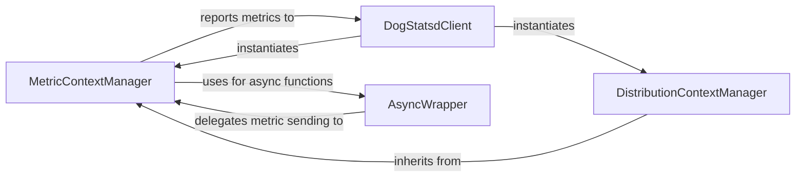

## Component Details

This subsystem provides context managers and decorators for automatically timing code blocks and managing distributed tracing contexts for DogStatsd metrics. It allows developers to easily instrument their code to send timing and distribution metrics to DogStatsd, supporting both synchronous and asynchronous operations. The core functionality revolves around managing the lifecycle of a metric timer and delegating the actual metric submission to the DogStatsd client.

### MetricContextManager
This component provides context management and decorator functionality for timing code execution. It is responsible for starting and stopping timers and delegating the actual metric submission to the DogStatsd client. It supports both regular and asynchronous functions.

**Related Classes/Methods**:

- <a href="https://github.com/DataDog/datadogpy/blob/master/datadog/dogstatsd/context.py#L21-L93" target="_blank" rel="noopener noreferrer">`datadogpy.datadog.dogstatsd.context.TimedContextManagerDecorator` (21:93)</a>
- <a href="https://github.com/DataDog/datadogpy/blob/master/datadog/dogstatsd/context.py#L43-L67" target="_blank" rel="noopener noreferrer">`datadogpy.datadog.dogstatsd.context.TimedContextManagerDecorator:__call__` (43:67)</a>
- <a href="https://github.com/DataDog/datadogpy/blob/master/datadog/dogstatsd/context.py#L69-L73" target="_blank" rel="noopener noreferrer">`datadogpy.datadog.dogstatsd.context.TimedContextManagerDecorator:__enter__` (69:73)</a>
- <a href="https://github.com/DataDog/datadogpy/blob/master/datadog/dogstatsd/context.py#L75-L77" target="_blank" rel="noopener noreferrer">`datadogpy.datadog.dogstatsd.context.TimedContextManagerDecorator:__exit__` (75:77)</a>
- <a href="https://github.com/DataDog/datadogpy/blob/master/datadog/dogstatsd/context.py#L89-L90" target="_blank" rel="noopener noreferrer">`datadogpy.datadog.dogstatsd.context.TimedContextManagerDecorator:start` (89:90)</a>
- <a href="https://github.com/DataDog/datadogpy/blob/master/datadog/dogstatsd/context.py#L92-L93" target="_blank" rel="noopener noreferrer">`datadogpy.datadog.dogstatsd.context.TimedContextManagerDecorator:stop` (92:93)</a>
- <a href="https://github.com/DataDog/datadogpy/blob/master/datadog/dogstatsd/context.py#L79-L87" target="_blank" rel="noopener noreferrer">`datadogpy.datadog.dogstatsd.context.TimedContextManagerDecorator._send` (79:87)</a>

### DistributionContextManager
This component extends the MetricContextManager to specifically handle distribution metrics. It inherits the timing and context management capabilities but directs the metric reporting to the distribution function of the DogStatsd client.

**Related Classes/Methods**:

- <a href="https://github.com/DataDog/datadogpy/blob/master/datadog/dogstatsd/context.py#L96-L111" target="_blank" rel="noopener noreferrer">`datadogpy.datadog.dogstatsd.context.DistributedContextManagerDecorator` (96:111)</a>
- <a href="https://github.com/DataDog/datadogpy/blob/master/datadog/dogstatsd/context.py#L102-L111" target="_blank" rel="noopener noreferrer">`datadogpy.datadog.dogstatsd.context.DistributedContextManagerDecorator:__init__` (102:111)</a>

### DogStatsdClient
This is the core client component responsible for initializing the DogStatsd connection, managing buffering and aggregation of metrics, and providing methods for sending various types of metrics (gauge, count, histogram, timing, distribution), events, and service checks. It also handles socket communication and telemetry.

**Related Classes/Methods**:

- <a href="https://github.com/DataDog/datadogpy/blob/master/datadog/dogstatsd/base.py#L146-L1704" target="_blank" rel="noopener noreferrer">`datadogpy.datadog.dogstatsd.base.DogStatsd` (146:1704)</a>
- <a href="https://github.com/DataDog/datadogpy/blob/master/datadog/dogstatsd/base.py#L1106-L1138" target="_blank" rel="noopener noreferrer">`datadogpy.datadog.dogstatsd.base.DogStatsd:timed` (1106:1138)</a>
- <a href="https://github.com/DataDog/datadogpy/blob/master/datadog/dogstatsd/base.py#L1140-L1166" target="_blank" rel="noopener noreferrer">`datadogpy.datadog.dogstatsd.base.DogStatsd:distributed` (1140:1166)</a>
- <a href="https://github.com/DataDog/datadogpy/blob/master/datadog/dogstatsd/base.py#L1088-L1104" target="_blank" rel="noopener noreferrer">`datadogpy.datadog.dogstatsd.base.DogStatsd:timing` (1088:1104)</a>
- <a href="https://github.com/DataDog/datadogpy/blob/master/datadog/dogstatsd/base.py#L1069-L1086" target="_blank" rel="noopener noreferrer">`datadogpy.datadog.dogstatsd.base.DogStatsd:distribution` (1069:1086)</a>
- <a href="https://github.com/DataDog/datadogpy/blob/master/datadog/dogstatsd/base.py#L1215-L1255" target="_blank" rel="noopener noreferrer">`datadogpy.datadog.dogstatsd.base.DogStatsd._report` (1215:1255)</a>
- <a href="https://github.com/DataDog/datadogpy/blob/master/datadog/dogstatsd/base.py#L1313-L1326" target="_blank" rel="noopener noreferrer">`datadogpy.datadog.dogstatsd.base.DogStatsd._send_to_server` (1313:1326)</a>
- <a href="https://github.com/DataDog/datadogpy/blob/master/datadog/dogstatsd/base.py#L1408-L1416" target="_blank" rel="noopener noreferrer">`datadogpy.datadog.dogstatsd.base.DogStatsd._send_to_buffer` (1408:1416)</a>
- <a href="https://github.com/DataDog/datadogpy/blob/master/datadog/dogstatsd/base.py#L901-L909" target="_blank" rel="noopener noreferrer">`datadogpy.datadog.dogstatsd.base.DogStatsd.flush_buffered_metrics` (901:909)</a>
- <a href="https://github.com/DataDog/datadogpy/blob/master/datadog/dogstatsd/base.py#L911-L921" target="_blank" rel="noopener noreferrer">`datadogpy.datadog.dogstatsd.base.DogStatsd.flush_aggregated_metrics` (911:921)</a>

### AsyncWrapper
This component provides a specific wrapper for asynchronous (coroutine) functions when they are decorated for timing. It ensures that the timing logic correctly awaits the wrapped coroutine and then sends the metric.

**Related Classes/Methods**:

- <a href="https://github.com/DataDog/datadogpy/blob/master/datadog/dogstatsd/context_async.py#L45-L48" target="_blank" rel="noopener noreferrer">`datadogpy.datadog.dogstatsd.context_async._get_wrapped_co` (45:48)</a>

### [FAQ](https://github.com/CodeBoarding/GeneratedOnBoardings/tree/main?tab=readme-ov-file#faq)