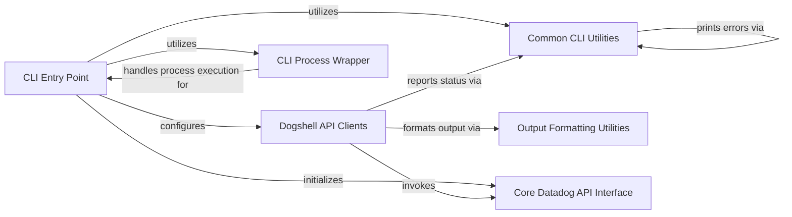

## Component Details

This graph illustrates the architecture of the Datadog command-line interface (dogshell) subsystem. The main flow begins with the `CLI Entry Point`, which parses command-line arguments, loads configuration, and initializes the core Datadog API. It then dispatches commands to various `Dogshell API Clients`, each responsible for interacting with a specific Datadog API resource (e.g., monitors, events, dashboards). These clients, in turn, invoke the `Core Datadog API Interface` to perform the actual API calls. Throughout this process, `Common CLI Utilities` are used for error reporting and warnings, and `Output Formatting Utilities` ensure that API responses are presented in a human-readable format. The `CLI Process Wrapper` handles external process execution, supporting functionalities like event creation from process output.

### CLI Entry Point
This component serves as the main entry point for the Datadog command-line interface. It initializes the Datadog API, loads configuration, and sets up the command parsers for various Datadog services.

**Related Classes/Methods**:

- `datadog.dogshell:main` (full file reference)

### Dogshell API Clients
Provides various client classes for interacting with specific Datadog API resources via the command-line interface, encapsulating logic for CRUD operations on different Datadog services.

**Related Classes/Methods**:

- <a href="https://github.com/DataDog/datadogpy/blob/master/datadog/dogshell/downtime.py#L67-L76" target="_blank" rel="noopener noreferrer">`datadog.dogshell.downtime.DowntimeClient:_schedule_downtime` (67:76)</a>
- <a href="https://github.com/DataDog/datadogpy/blob/master/datadog/dogshell/downtime.py#L79-L90" target="_blank" rel="noopener noreferrer">`datadog.dogshell.downtime.DowntimeClient:_update_downtime` (79:90)</a>
- <a href="https://github.com/DataDog/datadogpy/blob/master/datadog/dogshell/downtime.py#L93-L98" target="_blank" rel="noopener noreferrer">`datadog.dogshell.downtime.DowntimeClient:_cancel_downtime` (93:98)</a>
- <a href="https://github.com/DataDog/datadogpy/blob/master/datadog/dogshell/downtime.py#L101-L110" target="_blank" rel="noopener noreferrer">`datadog.dogshell.downtime.DowntimeClient:_show_downtime` (101:110)</a>
- <a href="https://github.com/DataDog/datadogpy/blob/master/datadog/dogshell/downtime.py#L113-L122" target="_blank" rel="noopener noreferrer">`datadog.dogshell.downtime.DowntimeClient:_show_all_downtime` (113:122)</a>
- <a href="https://github.com/DataDog/datadogpy/blob/master/datadog/dogshell/downtime.py#L125-L132" target="_blank" rel="noopener noreferrer">`datadog.dogshell.downtime.DowntimeClient:_cancel_downtime_by_scope` (125:132)</a>
- <a href="https://github.com/DataDog/datadogpy/blob/master/datadog/dogshell/host.py#L40-L49" target="_blank" rel="noopener noreferrer">`datadog.dogshell.host.HostClient:_mute` (40:49)</a>
- <a href="https://github.com/DataDog/datadogpy/blob/master/datadog/dogshell/host.py#L52-L61" target="_blank" rel="noopener noreferrer">`datadog.dogshell.host.HostClient:_unmute` (52:61)</a>
- <a href="https://github.com/DataDog/datadogpy/blob/master/datadog/dogshell/tag.py#L48-L62" target="_blank" rel="noopener noreferrer">`datadog.dogshell.tag.TagClient:_add` (48:62)</a>
- <a href="https://github.com/DataDog/datadogpy/blob/master/datadog/dogshell/tag.py#L65-L79" target="_blank" rel="noopener noreferrer">`datadog.dogshell.tag.TagClient:_replace` (65:79)</a>
- <a href="https://github.com/DataDog/datadogpy/blob/master/datadog/dogshell/tag.py#L82-L112" target="_blank" rel="noopener noreferrer">`datadog.dogshell.tag.TagClient:_show` (82:112)</a>
- <a href="https://github.com/DataDog/datadogpy/blob/master/datadog/dogshell/tag.py#L115-L120" target="_blank" rel="noopener noreferrer">`datadog.dogshell.tag.TagClient:_detach` (115:120)</a>
- <a href="https://github.com/DataDog/datadogpy/blob/master/datadog/dogshell/service_level_objective.py#L178-L233" target="_blank" rel="noopener noreferrer">`datadog.dogshell.service_level_objective.ServiceLevelObjectiveClient:_create` (178:233)</a>
- <a href="https://github.com/DataDog/datadogpy/blob/master/datadog/dogshell/service_level_objective.py#L236-L246" target="_blank" rel="noopener noreferrer">`datadog.dogshell.service_level_objective.ServiceLevelObjectiveClient:_file_create` (236:246)</a>
- <a href="https://github.com/DataDog/datadogpy/blob/master/datadog/dogshell/service_level_objective.py#L249-L302" target="_blank" rel="noopener noreferrer">`datadog.dogshell.service_level_objective.ServiceLevelObjectiveClient:_update` (249:302)</a>
- <a href="https://github.com/DataDog/datadogpy/blob/master/datadog/dogshell/service_level_objective.py#L305-L316" target="_blank" rel="noopener noreferrer">`datadog.dogshell.service_level_objective.ServiceLevelObjectiveClient:_file_update` (305:316)</a>
- <a href="https://github.com/DataDog/datadogpy/blob/master/datadog/dogshell/service_level_objective.py#L319-L332" target="_blank" rel="noopener noreferrer">`datadog.dogshell.service_level_objective.ServiceLevelObjectiveClient:_show` (319:332)</a>
- <a href="https://github.com/DataDog/datadogpy/blob/master/datadog/dogshell/service_level_objective.py#L335-L352" target="_blank" rel="noopener noreferrer">`datadog.dogshell.service_level_objective.ServiceLevelObjectiveClient:_show_all` (335:352)</a>
- <a href="https://github.com/DataDog/datadogpy/blob/master/datadog/dogshell/service_level_objective.py#L355-L365" target="_blank" rel="noopener noreferrer">`datadog.dogshell.service_level_objective.ServiceLevelObjectiveClient:_delete` (355:365)</a>
- <a href="https://github.com/DataDog/datadogpy/blob/master/datadog/dogshell/service_level_objective.py#L368-L378" target="_blank" rel="noopener noreferrer">`datadog.dogshell.service_level_objective.ServiceLevelObjectiveClient:_delete_many` (368:378)</a>
- <a href="https://github.com/DataDog/datadogpy/blob/master/datadog/dogshell/service_level_objective.py#L381-L394" target="_blank" rel="noopener noreferrer">`datadog.dogshell.service_level_objective.ServiceLevelObjectiveClient:_delete_timeframe` (381:394)</a>
- <a href="https://github.com/DataDog/datadogpy/blob/master/datadog/dogshell/service_level_objective.py#L397-L408" target="_blank" rel="noopener noreferrer">`datadog.dogshell.service_level_objective.ServiceLevelObjectiveClient:_can_delete` (397:408)</a>
- <a href="https://github.com/DataDog/datadogpy/blob/master/datadog/dogshell/service_level_objective.py#L411-L422" target="_blank" rel="noopener noreferrer">`datadog.dogshell.service_level_objective.ServiceLevelObjectiveClient:_history` (411:422)</a>
- <a href="https://github.com/DataDog/datadogpy/blob/master/datadog/dogshell/comment.py#L43-L69" target="_blank" rel="noopener noreferrer">`datadog.dogshell.comment.CommentClient:_post` (43:69)</a>
- <a href="https://github.com/DataDog/datadogpy/blob/master/datadog/dogshell/comment.py#L72-L98" target="_blank" rel="noopener noreferrer">`datadog.dogshell.comment.CommentClient:_update` (72:98)</a>
- <a href="https://github.com/DataDog/datadogpy/blob/master/datadog/dogshell/comment.py#L101-L128" target="_blank" rel="noopener noreferrer">`datadog.dogshell.comment.CommentClient:_reply` (101:128)</a>
- <a href="https://github.com/DataDog/datadogpy/blob/master/datadog/dogshell/comment.py#L131-L152" target="_blank" rel="noopener noreferrer">`datadog.dogshell.comment.CommentClient:_show` (131:152)</a>
- <a href="https://github.com/DataDog/datadogpy/blob/master/datadog/dogshell/service_check.py#L35-L55" target="_blank" rel="noopener noreferrer">`datadog.dogshell.service_check.ServiceCheckClient:_check` (35:55)</a>
- <a href="https://github.com/DataDog/datadogpy/blob/master/datadog/dogshell/monitor.py#L16-L474" target="_blank" rel="noopener noreferrer">`datadog.dogshell.monitor.MonitorClient` (16:474)</a>
- <a href="https://github.com/DataDog/datadogpy/blob/master/datadog/dogshell/monitor.py#L171-L208" target="_blank" rel="noopener noreferrer">`datadog.dogshell.monitor.MonitorClient:_post` (171:208)</a>
- <a href="https://github.com/DataDog/datadogpy/blob/master/datadog/dogshell/monitor.py#L211-L238" target="_blank" rel="noopener noreferrer">`datadog.dogshell.monitor.MonitorClient:_file_post` (211:238)</a>
- <a href="https://github.com/DataDog/datadogpy/blob/master/datadog/dogshell/monitor.py#L241-L291" target="_blank" rel="noopener noreferrer">`datadog.dogshell.monitor.MonitorClient:_update` (241:291)</a>
- <a href="https://github.com/DataDog/datadogpy/blob/master/datadog/dogshell/monitor.py#L294-L323" target="_blank" rel="noopener noreferrer">`datadog.dogshell.monitor.MonitorClient:_file_update` (294:323)</a>
- <a href="https://github.com/DataDog/datadogpy/blob/master/datadog/dogshell/monitor.py#L326-L339" target="_blank" rel="noopener noreferrer">`datadog.dogshell.monitor.MonitorClient:_show` (326:339)</a>
- <a href="https://github.com/DataDog/datadogpy/blob/master/datadog/dogshell/monitor.py#L342-L374" target="_blank" rel="noopener noreferrer">`datadog.dogshell.monitor.MonitorClient:_show_all` (342:374)</a>
- <a href="https://github.com/DataDog/datadogpy/blob/master/datadog/dogshell/monitor.py#L377-L383" target="_blank" rel="noopener noreferrer">`datadog.dogshell.monitor.MonitorClient:_delete` (377:383)</a>
- <a href="https://github.com/DataDog/datadogpy/blob/master/datadog/dogshell/monitor.py#L390-L399" target="_blank" rel="noopener noreferrer">`datadog.dogshell.monitor.MonitorClient:_mute_all` (390:399)</a>
- <a href="https://github.com/DataDog/datadogpy/blob/master/datadog/dogshell/monitor.py#L402-L407" target="_blank" rel="noopener noreferrer">`datadog.dogshell.monitor.MonitorClient:_unmute_all` (402:407)</a>
- <a href="https://github.com/DataDog/datadogpy/blob/master/datadog/dogshell/monitor.py#L410-L419" target="_blank" rel="noopener noreferrer">`datadog.dogshell.monitor.MonitorClient:_mute` (410:419)</a>
- <a href="https://github.com/DataDog/datadogpy/blob/master/datadog/dogshell/monitor.py#L422-L430" target="_blank" rel="noopener noreferrer">`datadog.dogshell.monitor.MonitorClient:_unmute` (422:430)</a>
- <a href="https://github.com/DataDog/datadogpy/blob/master/datadog/dogshell/monitor.py#L433-L440" target="_blank" rel="noopener noreferrer">`datadog.dogshell.monitor.MonitorClient:_can_delete` (433:440)</a>
- <a href="https://github.com/DataDog/datadogpy/blob/master/datadog/dogshell/monitor.py#L443-L474" target="_blank" rel="noopener noreferrer">`datadog.dogshell.monitor.MonitorClient:_validate` (443:474)</a>
- <a href="https://github.com/DataDog/datadogpy/blob/master/datadog/dogshell/dashboard_list.py#L141-L153" target="_blank" rel="noopener noreferrer">`datadog.dogshell.dashboard_list.DashboardListClient:_post` (141:153)</a>
- <a href="https://github.com/DataDog/datadogpy/blob/master/datadog/dogshell/dashboard_list.py#L156-L169" target="_blank" rel="noopener noreferrer">`datadog.dogshell.dashboard_list.DashboardListClient:_update` (156:169)</a>
- <a href="https://github.com/DataDog/datadogpy/blob/master/datadog/dogshell/dashboard_list.py#L172-L184" target="_blank" rel="noopener noreferrer">`datadog.dogshell.dashboard_list.DashboardListClient:_show` (172:184)</a>
- <a href="https://github.com/DataDog/datadogpy/blob/master/datadog/dogshell/dashboard_list.py#L187-L198" target="_blank" rel="noopener noreferrer">`datadog.dogshell.dashboard_list.DashboardListClient:_show_all` (187:198)</a>
- <a href="https://github.com/DataDog/datadogpy/blob/master/datadog/dogshell/dashboard_list.py#L201-L213" target="_blank" rel="noopener noreferrer">`datadog.dogshell.dashboard_list.DashboardListClient:_delete` (201:213)</a>
- <a href="https://github.com/DataDog/datadogpy/blob/master/datadog/dogshell/dashboard_list.py#L216-L228" target="_blank" rel="noopener noreferrer">`datadog.dogshell.dashboard_list.DashboardListClient:_show_dashboards` (216:228)</a>
- <a href="https://github.com/DataDog/datadogpy/blob/master/datadog/dogshell/dashboard_list.py#L231-L243" target="_blank" rel="noopener noreferrer">`datadog.dogshell.dashboard_list.DashboardListClient:_show_dashboards_v2` (231:243)</a>
- <a href="https://github.com/DataDog/datadogpy/blob/master/datadog/dogshell/dashboard_list.py#L246-L259" target="_blank" rel="noopener noreferrer">`datadog.dogshell.dashboard_list.DashboardListClient:_add_dashboards` (246:259)</a>
- <a href="https://github.com/DataDog/datadogpy/blob/master/datadog/dogshell/dashboard_list.py#L262-L275" target="_blank" rel="noopener noreferrer">`datadog.dogshell.dashboard_list.DashboardListClient:_add_dashboards_v2` (262:275)</a>
- <a href="https://github.com/DataDog/datadogpy/blob/master/datadog/dogshell/dashboard_list.py#L278-L291" target="_blank" rel="noopener noreferrer">`datadog.dogshell.dashboard_list.DashboardListClient:_update_dashboards` (278:291)</a>
- <a href="https://github.com/DataDog/datadogpy/blob/master/datadog/dogshell/dashboard_list.py#L294-L307" target="_blank" rel="noopener noreferrer">`datadog.dogshell.dashboard_list.DashboardListClient:_update_dashboards_v2` (294:307)</a>
- <a href="https://github.com/DataDog/datadogpy/blob/master/datadog/dogshell/dashboard_list.py#L310-L323" target="_blank" rel="noopener noreferrer">`datadog.dogshell.dashboard_list.DashboardListClient:_delete_dashboards` (310:323)</a>
- <a href="https://github.com/DataDog/datadogpy/blob/master/datadog/dogshell/dashboard_list.py#L326-L339" target="_blank" rel="noopener noreferrer">`datadog.dogshell.dashboard_list.DashboardListClient:_delete_dashboards_v2` (326:339)</a>
- <a href="https://github.com/DataDog/datadogpy/blob/master/datadog/dogshell/dashboard.py#L91-L117" target="_blank" rel="noopener noreferrer">`datadog.dogshell.dashboard.DashboardClient:_post` (91:117)</a>
- <a href="https://github.com/DataDog/datadogpy/blob/master/datadog/dogshell/dashboard.py#L120-L146" target="_blank" rel="noopener noreferrer">`datadog.dogshell.dashboard.DashboardClient:_update` (120:146)</a>
- <a href="https://github.com/DataDog/datadogpy/blob/master/datadog/dogshell/dashboard.py#L149-L159" target="_blank" rel="noopener noreferrer">`datadog.dogshell.dashboard.DashboardClient:_show` (149:159)</a>
- <a href="https://github.com/DataDog/datadogpy/blob/master/datadog/dogshell/dashboard.py#L162-L167" target="_blank" rel="noopener noreferrer">`datadog.dogshell.dashboard.DashboardClient:_delete` (162:167)</a>
- <a href="https://github.com/DataDog/datadogpy/blob/master/datadog/dogshell/hosts.py#L69-L88" target="_blank" rel="noopener noreferrer">`datadog.dogshell.hosts.HostsClient:_list` (69:88)</a>
- <a href="https://github.com/DataDog/datadogpy/blob/master/datadog/dogshell/hosts.py#L91-L100" target="_blank" rel="noopener noreferrer">`datadog.dogshell.hosts.HostsClient:_totals` (91:100)</a>
- <a href="https://github.com/DataDog/datadogpy/blob/master/datadog/dogshell/timeboard.py#L118-L119" target="_blank" rel="noopener noreferrer">`datadog.dogshell.timeboard.TimeboardClient:_pull` (118:119)</a>
- <a href="https://github.com/DataDog/datadogpy/blob/master/datadog/dogshell/timeboard.py#L122-L156" target="_blank" rel="noopener noreferrer">`datadog.dogshell.timeboard.TimeboardClient:_pull_all` (122:156)</a>
- <a href="https://github.com/DataDog/datadogpy/blob/master/datadog/dogshell/timeboard.py#L159-L178" target="_blank" rel="noopener noreferrer">`datadog.dogshell.timeboard.TimeboardClient:_new_file` (159:178)</a>
- <a href="https://github.com/DataDog/datadogpy/blob/master/datadog/dogshell/timeboard.py#L181-L204" target="_blank" rel="noopener noreferrer">`datadog.dogshell.timeboard.TimeboardClient:_write_dash_to_file` (181:204)</a>
- <a href="https://github.com/DataDog/datadogpy/blob/master/datadog/dogshell/timeboard.py#L207-L253" target="_blank" rel="noopener noreferrer">`datadog.dogshell.timeboard.TimeboardClient:_push` (207:253)</a>
- <a href="https://github.com/DataDog/datadogpy/blob/master/datadog/dogshell/timeboard.py#L256-L271" target="_blank" rel="noopener noreferrer">`datadog.dogshell.timeboard.TimeboardClient:_post` (256:271)</a>
- <a href="https://github.com/DataDog/datadogpy/blob/master/datadog/dogshell/timeboard.py#L274-L294" target="_blank" rel="noopener noreferrer">`datadog.dogshell.timeboard.TimeboardClient:_update` (274:294)</a>
- <a href="https://github.com/DataDog/datadogpy/blob/master/datadog/dogshell/timeboard.py#L297-L310" target="_blank" rel="noopener noreferrer">`datadog.dogshell.timeboard.TimeboardClient:_show` (297:310)</a>
- <a href="https://github.com/DataDog/datadogpy/blob/master/datadog/dogshell/timeboard.py#L313-L330" target="_blank" rel="noopener noreferrer">`datadog.dogshell.timeboard.TimeboardClient:_show_all` (313:330)</a>
- <a href="https://github.com/DataDog/datadogpy/blob/master/datadog/dogshell/timeboard.py#L333-L338" target="_blank" rel="noopener noreferrer">`datadog.dogshell.timeboard.TimeboardClient:_delete` (333:338)</a>
- <a href="https://github.com/DataDog/datadogpy/blob/master/datadog/dogshell/metric.py#L43-L72" target="_blank" rel="noopener noreferrer">`datadog.dogshell.metric.MetricClient:_post` (43:72)</a>
- <a href="https://github.com/DataDog/datadogpy/blob/master/datadog/dogshell/screenboard.py#L116-L117" target="_blank" rel="noopener noreferrer">`datadog.dogshell.screenboard.ScreenboardClient:_pull` (116:117)</a>
- <a href="https://github.com/DataDog/datadogpy/blob/master/datadog/dogshell/screenboard.py#L121-L152" target="_blank" rel="noopener noreferrer">`datadog.dogshell.screenboard.ScreenboardClient:_push` (121:152)</a>
- <a href="https://github.com/DataDog/datadogpy/blob/master/datadog/dogshell/screenboard.py#L155-L175" target="_blank" rel="noopener noreferrer">`datadog.dogshell.screenboard.ScreenboardClient:_write_screen_to_file` (155:175)</a>
- <a href="https://github.com/DataDog/datadogpy/blob/master/datadog/dogshell/screenboard.py#L178-L199" target="_blank" rel="noopener noreferrer">`datadog.dogshell.screenboard.ScreenboardClient:_post` (178:199)</a>
- <a href="https://github.com/DataDog/datadogpy/blob/master/datadog/dogshell/screenboard.py#L202-L224" target="_blank" rel="noopener noreferrer">`datadog.dogshell.screenboard.ScreenboardClient:_update` (202:224)</a>
- <a href="https://github.com/DataDog/datadogpy/blob/master/datadog/dogshell/screenboard.py#L233-L246" target="_blank" rel="noopener noreferrer">`datadog.dogshell.screenboard.ScreenboardClient:_show` (233:246)</a>
- <a href="https://github.com/DataDog/datadogpy/blob/master/datadog/dogshell/screenboard.py#L249-L255" target="_blank" rel="noopener noreferrer">`datadog.dogshell.screenboard.ScreenboardClient:_delete` (249:255)</a>
- <a href="https://github.com/DataDog/datadogpy/blob/master/datadog/dogshell/screenboard.py#L258-L266" target="_blank" rel="noopener noreferrer">`datadog.dogshell.screenboard.ScreenboardClient:_share` (258:266)</a>
- <a href="https://github.com/DataDog/datadogpy/blob/master/datadog/dogshell/screenboard.py#L269-L277" target="_blank" rel="noopener noreferrer">`datadog.dogshell.screenboard.ScreenboardClient:_revoke` (269:277)</a>
- <a href="https://github.com/DataDog/datadogpy/blob/master/datadog/dogshell/screenboard.py#L280-L298" target="_blank" rel="noopener noreferrer">`datadog.dogshell.screenboard.ScreenboardClient:_new_file` (280:298)</a>
- <a href="https://github.com/DataDog/datadogpy/blob/master/datadog/dogshell/security_monitoring.py#L157-L161" target="_blank" rel="noopener noreferrer">`datadog.dogshell.security_monitoring.SecurityMonitoringClient:_show_rule` (157:161)</a>
- <a href="https://github.com/DataDog/datadogpy/blob/master/datadog/dogshell/security_monitoring.py#L164-L175" target="_blank" rel="noopener noreferrer">`datadog.dogshell.security_monitoring.SecurityMonitoringClient:_show_all_rules` (164:175)</a>
- <a href="https://github.com/DataDog/datadogpy/blob/master/datadog/dogshell/security_monitoring.py#L178-L192" target="_blank" rel="noopener noreferrer">`datadog.dogshell.security_monitoring.SecurityMonitoringClient:_create_rule` (178:192)</a>
- <a href="https://github.com/DataDog/datadogpy/blob/master/datadog/dogshell/security_monitoring.py#L195-L209" target="_blank" rel="noopener noreferrer">`datadog.dogshell.security_monitoring.SecurityMonitoringClient:_update_rule` (195:209)</a>
- <a href="https://github.com/DataDog/datadogpy/blob/master/datadog/dogshell/security_monitoring.py#L212-L219" target="_blank" rel="noopener noreferrer">`datadog.dogshell.security_monitoring.SecurityMonitoringClient:_delete_rule` (212:219)</a>
- <a href="https://github.com/DataDog/datadogpy/blob/master/datadog/dogshell/security_monitoring.py#L222-L244" target="_blank" rel="noopener noreferrer">`datadog.dogshell.security_monitoring.SecurityMonitoringClient:_list_signals` (222:244)</a>
- <a href="https://github.com/DataDog/datadogpy/blob/master/datadog/dogshell/security_monitoring.py#L247-L254" target="_blank" rel="noopener noreferrer">`datadog.dogshell.security_monitoring.SecurityMonitoringClient:_get_signal` (247:254)</a>
- <a href="https://github.com/DataDog/datadogpy/blob/master/datadog/dogshell/security_monitoring.py#L257-L264" target="_blank" rel="noopener noreferrer">`datadog.dogshell.security_monitoring.SecurityMonitoringClient:_change_triage_state` (257:264)</a>
- <a href="https://github.com/DataDog/datadogpy/blob/master/datadog/dogshell/search.py#L25-L43" target="_blank" rel="noopener noreferrer">`datadog.dogshell.search.SearchClient:_query` (25:43)</a>
- <a href="https://github.com/DataDog/datadogpy/blob/master/datadog/dogshell/event.py#L117-L157" target="_blank" rel="noopener noreferrer">`datadog.dogshell.event.EventClient:_post` (117:157)</a>
- <a href="https://github.com/DataDog/datadogpy/blob/master/datadog/dogshell/event.py#L160-L171" target="_blank" rel="noopener noreferrer">`datadog.dogshell.event.EventClient:_show` (160:171)</a>
- <a href="https://github.com/DataDog/datadogpy/blob/master/datadog/dogshell/event.py#L174-L201" target="_blank" rel="noopener noreferrer">`datadog.dogshell.event.EventClient:_stream` (174:201)</a>
- <a href="https://github.com/DataDog/datadogpy/blob/master/datadog/dogshell/event.py#L32-L33" target="_blank" rel="noopener noreferrer">`datadog.dogshell.event:print_event` (32:33)</a>
- <a href="https://github.com/DataDog/datadogpy/blob/master/datadog/dogshell/event.py#L36-L37" target="_blank" rel="noopener noreferrer">`datadog.dogshell.event:prettyprint_event_details` (36:37)</a>
- <a href="https://github.com/DataDog/datadogpy/blob/master/datadog/dogshell/event.py#L40-L41" target="_blank" rel="noopener noreferrer">`datadog.dogshell.event:print_event_details` (40:41)</a>

### Common CLI Utilities
This component provides shared utility functions for the command-line interface, including reporting warnings and errors to the user, printing error messages, and handling the loading of dogshell configuration.

**Related Classes/Methods**:

- <a href="https://github.com/DataDog/datadogpy/blob/master/datadog/dogshell/common.py#L33-L42" target="_blank" rel="noopener noreferrer">`datadog.dogshell.common.report_warnings` (33:42)</a>
- <a href="https://github.com/DataDog/datadogpy/blob/master/datadog/dogshell/common.py#L21-L30" target="_blank" rel="noopener noreferrer">`datadog.dogshell.common.report_errors` (21:30)</a>
- <a href="https://github.com/DataDog/datadogpy/blob/master/datadog/dogshell/common.py#L13-L18" target="_blank" rel="noopener noreferrer">`datadog.dogshell.common.print_err` (13:18)</a>
- <a href="https://github.com/DataDog/datadogpy/blob/master/datadog/dogshell/common.py#L45-L122" target="_blank" rel="noopener noreferrer">`datadog.dogshell.common.DogshellConfig` (45:122)</a>

### Output Formatting Utilities
This component is responsible for formatting the output of API responses, primarily converting data structures into human-readable JSON format for display in the command-line interface.

**Related Classes/Methods**:

- <a href="https://github.com/DataDog/datadogpy/blob/master/datadog/util/format.py#L17-L18" target="_blank" rel="noopener noreferrer">`datadog.util.format.pretty_json` (17:18)</a>

### Core Datadog API Interface
This component represents the underlying Python client for interacting directly with the Datadog API. It provides methods for various Datadog services like Downtime, Security Monitoring Rules, and Signals.

**Related Classes/Methods**:

- `datadog.api` (full file reference)
- <a href="https://github.com/DataDog/datadogpy/blob/master/datadog/api/security_monitoring_rules.py#L18-L93" target="_blank" rel="noopener noreferrer">`datadog.api.security_monitoring_rules.SecurityMonitoringRule` (18:93)</a>
- <a href="https://github.com/DataDog/datadogpy/blob/master/datadog/api/security_monitoring_signals.py#L16-L84" target="_blank" rel="noopener noreferrer">`datadog.api.security_monitoring_signals.SecurityMonitoringSignal` (16:84)</a>
- `datadog.initialize` (full file reference)

### CLI Process Wrapper
This component provides utilities for wrapping external process execution within the CLI, including handling timeouts, reading output, and building event bodies from process information.

**Related Classes/Methods**:

- <a href="https://github.com/DataDog/datadogpy/blob/master/datadog/dogshell/wrap.py#L90-L102" target="_blank" rel="noopener noreferrer">`datadog.dogshell.wrap.poll_proc` (90:102)</a>
- <a href="https://github.com/DataDog/datadogpy/blob/master/datadog/dogshell/wrap.py#L105-L166" target="_blank" rel="noopener noreferrer">`datadog.dogshell.wrap.execute` (105:166)</a>
- <a href="https://github.com/DataDog/datadogpy/blob/master/datadog/dogshell/wrap.py#L192-L232" target="_blank" rel="noopener noreferrer">`datadog.dogshell.wrap.build_event_body` (192:232)</a>
- <a href="https://github.com/DataDog/datadogpy/blob/master/datadog/dogshell/wrap.py#L252-L404" target="_blank" rel="noopener noreferrer">`datadog.dogshell.wrap.parse_options` (252:404)</a>
- <a href="https://github.com/DataDog/datadogpy/blob/master/datadog/dogshell/wrap.py#L47-L48" target="_blank" rel="noopener noreferrer">`datadog.dogshell.wrap.Timeout` (47:48)</a>
- <a href="https://github.com/DataDog/datadogpy/blob/master/datadog/dogshell/wrap.py#L51-L87" target="_blank" rel="noopener noreferrer">`datadog.dogshell.wrap.OutputReader` (51:87)</a>
- <a href="https://github.com/DataDog/datadogpy/blob/master/datadog/dogshell/wrap.py#L169-L189" target="_blank" rel="noopener noreferrer">`datadog.dogshell.wrap.trim_text` (169:189)</a>

### [FAQ](https://github.com/CodeBoarding/GeneratedOnBoardings/tree/main?tab=readme-ov-file#faq)