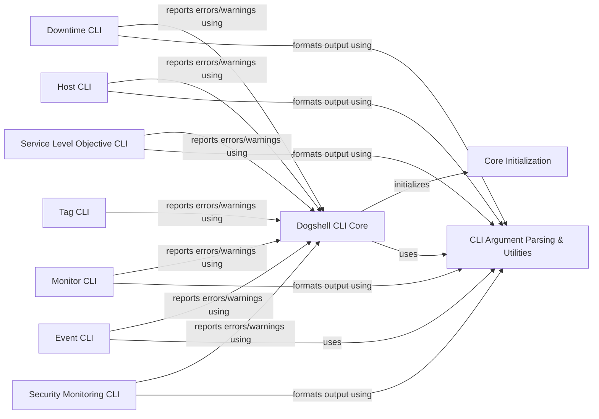

## Component Details

The Dogshell CLI Core acts as the central orchestrator for the `dogshell` command-line application. It is responsible for parsing command-line arguments, loading configuration settings, handling error and warning reporting, and then dispatching the parsed commands to the appropriate specialized CLI clients (e.g., Downtime CLI, Host CLI, Tag CLI, Service Level Objective CLI, Monitor CLI, Event CLI, Security Monitoring CLI). It initializes the core Datadog client and leverages utility functions for argument parsing and output formatting.

### Dogshell CLI Core
The main entry point for the `dogshell` command-line application, handling argument parsing, configuration loading, error reporting, and dispatching commands to specific CLI clients.

**Related Classes/Methods**:

- <a href="https://github.com/DataDog/datadogpy/blob/master/datadog/dogshell/wrap.py#L407-L514" target="_blank" rel="noopener noreferrer">`datadogpy.datadog.dogshell.wrap:main` (407:514)</a>
- <a href="https://github.com/DataDog/datadogpy/blob/master/datadog/dogshell/wrap.py#L252-L404" target="_blank" rel="noopener noreferrer">`datadogpy.datadog.dogshell.wrap:parse_options` (252:404)</a>
- <a href="https://github.com/DataDog/datadogpy/blob/master/datadog/dogshell/wrap.py#L105-L166" target="_blank" rel="noopener noreferrer">`datadogpy.datadog.dogshell.wrap:execute` (105:166)</a>
- <a href="https://github.com/DataDog/datadogpy/blob/master/datadog/dogshell/wrap.py#L90-L102" target="_blank" rel="noopener noreferrer">`datadogpy.datadog.dogshell.wrap:poll_proc` (90:102)</a>
- <a href="https://github.com/DataDog/datadogpy/blob/master/datadog/dogshell/wrap.py#L192-L232" target="_blank" rel="noopener noreferrer">`datadogpy.datadog.dogshell.wrap:build_event_body` (192:232)</a>
- <a href="https://github.com/DataDog/datadogpy/blob/master/datadog/dogshell/common.py#L13-L18" target="_blank" rel="noopener noreferrer">`datadogpy.datadog.dogshell.common:print_err` (13:18)</a>
- <a href="https://github.com/DataDog/datadogpy/blob/master/datadog/dogshell/common.py#L21-L30" target="_blank" rel="noopener noreferrer">`datadogpy.datadog.dogshell.common:report_errors` (21:30)</a>
- <a href="https://github.com/DataDog/datadogpy/blob/master/datadog/dogshell/common.py#L33-L42" target="_blank" rel="noopener noreferrer">`datadogpy.datadog.dogshell.common:report_warnings` (33:42)</a>
- <a href="https://github.com/DataDog/datadogpy/blob/master/datadog/dogshell/common.py#L46-L122" target="_blank" rel="noopener noreferrer">`datadogpy.datadog.dogshell.common.DogshellConfig:load` (46:122)</a>

### CLI Argument Parsing & Utilities
This component contains general utility functions primarily used for parsing command-line arguments and handling date/time conversions across various `dogshell` commands. It also includes compatibility utilities for different Python versions and JSON formatting.

**Related Classes/Methods**:

- <a href="https://github.com/DataDog/datadogpy/blob/master/datadog/util/cli.py#L12-L16" target="_blank" rel="noopener noreferrer">`datadogpy.datadog.util.cli:comma_list` (12:16)</a>
- <a href="https://github.com/DataDog/datadogpy/blob/master/datadog/util/cli.py#L19-L20" target="_blank" rel="noopener noreferrer">`datadogpy.datadog.util.cli:comma_set` (19:20)</a>
- <a href="https://github.com/DataDog/datadogpy/blob/master/datadog/util/cli.py#L23-L27" target="_blank" rel="noopener noreferrer">`datadogpy.datadog.util.cli:comma_list_or_empty` (23:27)</a>
- <a href="https://github.com/DataDog/datadogpy/blob/master/datadog/util/cli.py#L48-L55" target="_blank" rel="noopener noreferrer">`datadogpy.datadog.util.cli:list_of_ints_and_strs` (48:55)</a>
- <a href="https://github.com/DataDog/datadogpy/blob/master/datadog/util/cli.py#L58-L59" target="_blank" rel="noopener noreferrer">`datadogpy.datadog.util.cli:set_of_ints` (58:59)</a>
- <a href="https://github.com/DataDog/datadogpy/blob/master/datadog/util/cli.py#L74-L75" target="_blank" rel="noopener noreferrer">`datadogpy.datadog.util.cli:parse_date_as_epoch_timestamp` (74:75)</a>
- <a href="https://github.com/DataDog/datadogpy/blob/master/datadog/util/cli.py#L83-L152" target="_blank" rel="noopener noreferrer">`datadogpy.datadog.util.cli:parse_date` (83:152)</a>
- <a href="https://github.com/DataDog/datadogpy/blob/master/datadog/util/compat.py#L103-L107" target="_blank" rel="noopener noreferrer">`datadogpy.datadog.util.compat.is_p3k` (103:107)</a>
- <a href="https://github.com/DataDog/datadogpy/blob/master/datadog/util/format.py#L17-L18" target="_blank" rel="noopener noreferrer">`datadogpy.datadog.util.format.pretty_json` (17:18)</a>

### Core Initialization
This component is responsible for the initial setup and configuration of the Datadog client. It handles tasks such as resolving hostnames, managing DogStatsd socket connections, and enabling/disabling aggregation. It also interacts with system-level configurations to determine hostname and operating system details.

**Related Classes/Methods**:

- `datadog:initialize` (full file reference)
- <a href="https://github.com/DataDog/datadogpy/blob/master/datadog/dogstatsd/base.py#L721-L733" target="_blank" rel="noopener noreferrer">`datadog.dogstatsd.base.DogStatsd.resolve_host` (721:733)</a>
- <a href="https://github.com/DataDog/datadogpy/blob/master/datadog/dogstatsd/base.py#L1179-L1196" target="_blank" rel="noopener noreferrer">`datadog.dogstatsd.base.DogStatsd.close_socket` (1179:1196)</a>
- <a href="https://github.com/DataDog/datadogpy/blob/master/datadog/dogstatsd/base.py#L695-L707" target="_blank" rel="noopener noreferrer">`datadog.dogstatsd.base.DogStatsd.disable_aggregation` (695:707)</a>
- <a href="https://github.com/DataDog/datadogpy/blob/master/datadog/dogstatsd/base.py#L709-L718" target="_blank" rel="noopener noreferrer">`datadog.dogstatsd.base.DogStatsd.enable_aggregation` (709:718)</a>
- <a href="https://github.com/DataDog/datadogpy/blob/master/datadog/util/config.py#L106-L130" target="_blank" rel="noopener noreferrer">`datadog.util.config.get_config` (106:130)</a>
- <a href="https://github.com/DataDog/datadogpy/blob/master/datadog/util/config.py#L24-L37" target="_blank" rel="noopener noreferrer">`datadog.util.config.get_os` (24:37)</a>
- <a href="https://github.com/DataDog/datadogpy/blob/master/datadog/util/hostname.py#L45-L125" target="_blank" rel="noopener noreferrer">`datadog.util.hostname.get_hostname` (45:125)</a>
- <a href="https://github.com/DataDog/datadogpy/blob/master/datadog/util/hostname.py#L25-L42" target="_blank" rel="noopener noreferrer">`datadog.util.hostname.is_valid_hostname` (25:42)</a>
- <a href="https://github.com/DataDog/datadogpy/blob/master/datadog/util/hostname.py#L185-L190" target="_blank" rel="noopener noreferrer">`datadog.util.hostname.GCE.get_hostname` (185:190)</a>
- <a href="https://github.com/DataDog/datadogpy/blob/master/datadog/util/hostname.py#L301-L305" target="_blank" rel="noopener noreferrer">`datadog.util.hostname.EC2.get_instance_id` (301:305)</a>
- <a href="https://github.com/DataDog/datadogpy/blob/master/datadog/util/hostname.py#L152-L182" target="_blank" rel="noopener noreferrer">`datadog.util.hostname.GCE._get_metadata` (152:182)</a>
- <a href="https://github.com/DataDog/datadogpy/blob/master/datadog/util/hostname.py#L243-L298" target="_blank" rel="noopener noreferrer">`datadog.util.hostname.EC2.get_metadata` (243:298)</a>
- `datadog.util.hostname.get_hostname._get_hostname_unix` (full file reference)

### Downtime CLI
This component provides command-line functionalities for managing Datadog downtimes. It allows users to schedule, update, cancel, and view existing downtimes.

**Related Classes/Methods**:

- <a href="https://github.com/DataDog/datadogpy/blob/master/datadog/dogshell/downtime.py#L15-L132" target="_blank" rel="noopener noreferrer">`datadog.dogshell.downtime.DowntimeClient` (15:132)</a>
- <a href="https://github.com/DataDog/datadogpy/blob/master/datadog/dogshell/downtime.py#L67-L76" target="_blank" rel="noopener noreferrer">`datadog.dogshell.downtime.DowntimeClient:_schedule_downtime` (67:76)</a>
- <a href="https://github.com/DataDog/datadogpy/blob/master/datadog/dogshell/downtime.py#L79-L90" target="_blank" rel="noopener noreferrer">`datadog.dogshell.downtime.DowntimeClient:_update_downtime` (79:90)</a>
- <a href="https://github.com/DataDog/datadogpy/blob/master/datadog/dogshell/downtime.py#L93-L98" target="_blank" rel="noopener noreferrer">`datadog.dogshell.downtime.DowntimeClient:_cancel_downtime` (93:98)</a>
- <a href="https://github.com/DataDog/datadogpy/blob/master/datadog/dogshell/downtime.py#L101-L110" target="_blank" rel="noopener noreferrer">`datadog.dogshell.downtime.DowntimeClient:_show_downtime` (101:110)</a>
- <a href="https://github.com/DataDog/datadogpy/blob/master/datadog/dogshell/downtime.py#L113-L122" target="_blank" rel="noopener noreferrer">`datadog.dogshell.downtime.DowntimeClient:_show_all_downtime` (113:122)</a>

### Host CLI
This component offers command-line tools for managing hosts within Datadog. It supports operations such as muting and unmuting hosts, listing all hosts, and retrieving host totals.

**Related Classes/Methods**:

- <a href="https://github.com/DataDog/datadogpy/blob/master/datadog/dogshell/host.py#L15-L61" target="_blank" rel="noopener noreferrer">`datadog.dogshell.host.HostClient` (15:61)</a>
- <a href="https://github.com/DataDog/datadogpy/blob/master/datadog/dogshell/host.py#L40-L49" target="_blank" rel="noopener noreferrer">`datadog.dogshell.host.HostClient:_mute` (40:49)</a>
- <a href="https://github.com/DataDog/datadogpy/blob/master/datadog/dogshell/host.py#L52-L61" target="_blank" rel="noopener noreferrer">`datadog.dogshell.host.HostClient:_unmute` (52:61)</a>
- <a href="https://github.com/DataDog/datadogpy/blob/master/datadog/dogshell/hosts.py#L16-L100" target="_blank" rel="noopener noreferrer">`datadog.dogshell.hosts.HostsClient` (16:100)</a>
- <a href="https://github.com/DataDog/datadogpy/blob/master/datadog/dogshell/hosts.py#L69-L88" target="_blank" rel="noopener noreferrer">`datadog.dogshell.hosts.HostsClient:_list` (69:88)</a>
- <a href="https://github.com/DataDog/datadogpy/blob/master/datadog/dogshell/hosts.py#L91-L100" target="_blank" rel="noopener noreferrer">`datadog.dogshell.hosts.HostsClient:_totals` (91:100)</a>

### Tag CLI
This component enables command-line operations for managing tags associated with Datadog resources. Users can add, replace, show, and detach tags.

**Related Classes/Methods**:

- <a href="https://github.com/DataDog/datadogpy/blob/master/datadog/dogshell/tag.py#L12-L120" target="_blank" rel="noopener noreferrer">`datadog.dogshell.tag.TagClient` (12:120)</a>
- <a href="https://github.com/DataDog/datadogpy/blob/master/datadog/dogshell/tag.py#L48-L62" target="_blank" rel="noopener noreferrer">`datadog.dogshell.tag.TagClient:_add` (48:62)</a>
- <a href="https://github.com/DataDog/datadogpy/blob/master/datadog/dogshell/tag.py#L65-L79" target="_blank" rel="noopener noreferrer">`datadog.dogshell.tag.TagClient:_replace` (65:79)</a>
- <a href="https://github.com/DataDog/datadogpy/blob/master/datadog/dogshell/tag.py#L82-L112" target="_blank" rel="noopener noreferrer">`datadog.dogshell.tag.TagClient:_show` (82:112)</a>
- <a href="https://github.com/DataDog/datadogpy/blob/master/datadog/dogshell/tag.py#L115-L120" target="_blank" rel="noopener noreferrer">`datadog.dogshell.tag.TagClient:_detach` (115:120)</a>

### Service Level Objective CLI
This component provides command-line tools for managing Service Level Objectives (SLOs) in Datadog. It supports creating, updating, showing, and deleting SLOs, including operations from files and managing multiple SLOs.

**Related Classes/Methods**:

- <a href="https://github.com/DataDog/datadogpy/blob/master/datadog/dogshell/service_level_objective.py#L22-L426" target="_blank" rel="noopener noreferrer">`datadog.dogshell.service_level_objective.ServiceLevelObjectiveClient` (22:426)</a>
- <a href="https://github.com/DataDog/datadogpy/blob/master/datadog/dogshell/service_level_objective.py#L178-L233" target="_blank" rel="noopener noreferrer">`datadog.dogshell.service_level_objective.ServiceLevelObjectiveClient:_create` (178:233)</a>
- <a href="https://github.com/DataDog/datadogpy/blob/master/datadog/dogshell/service_level_objective.py#L236-L246" target="_blank" rel="noopener noreferrer">`datadog.dogshell.service_level_objective.ServiceLevelObjectiveClient:_file_create` (236:246)</a>
- <a href="https://github.com/DataDog/datadogpy/blob/master/datadog/dogshell/service_level_objective.py#L249-L302" target="_blank" rel="noopener noreferrer">`datadog.dogshell.service_level_objective.ServiceLevelObjectiveClient:_update` (249:302)</a>
- <a href="https://github.com/DataDog/datadogpy/blob/master/datadog/dogshell/service_level_objective.py#L305-L316" target="_blank" rel="noopener noreferrer">`datadog.dogshell.service_level_objective.ServiceLevelObjectiveClient:_file_update` (305:316)</a>
- <a href="https://github.com/DataDog/datadogpy/blob/master/datadog/dogshell/service_level_objective.py#L319-L332" target="_blank" rel="noopener noreferrer">`datadog.dogshell.service_level_objective.ServiceLevelObjectiveClient:_show` (319:332)</a>
- <a href="https://github.com/DataDog/datadogpy/blob/master/datadog/dogshell/service_level_objective.py#L335-L352" target="_blank" rel="noopener noreferrer">`datadog.dogshell.service_level_objective.ServiceLevelObjectiveClient:_show_all` (335:352)</a>
- <a href="https://github.com/DataDog/datadogpy/blob/master/datadog/dogshell/service_level_objective.py#L355-L365" target="_blank" rel="noopener noreferrer">`datadog.dogshell.service_level_objective.ServiceLevelObjectiveClient:_delete` (355:365)</a>
- <a href="https://github.com/DataDog/datadogpy/blob/master/datadog/dogshell/service_level_objective.py#L368-L378" target="_blank" rel="noopener noreferrer">`datadog.dogshell.service_level_objective.ServiceLevelObjectiveClient:_delete_many` (368:378)</a>
- <a href="https://github.com/DataDog/datadogpy/blob/master/datadog/dogshell/service_level_objective.py#L381-L394" target="_blank" rel="noopener noreferrer">`datadog.dogshell.service_level_objective.ServiceLevelObjectiveClient:_delete_timeframe` (381:394)</a>
- <a href="https://github.com/DataDog/datadogpy/blob/master/datadog/dogshell/service_level_objective.py#L397-L408" target="_blank" rel="noopener noreferrer">`datadog.dogshell.service_level_objective.ServiceLevelObjectiveClient:_can_delete` (397:408)</a>
- <a href="https://github.com/DataDog/datadogpy/blob/master/datadog/dogshell/service_level_objective.py#L411-L422" target="_blank" rel="noopener noreferrer">`datadog.dogshell.service_level_objective.ServiceLevelObjectiveClient:_history` (411:422)</a>

### Monitor CLI
This component manages Datadog monitors through the command-line interface. It supports a wide range of operations including creating, updating, showing, and deleting monitors, as well as muting and unmuting them.

**Related Classes/Methods**:

- <a href="https://github.com/DataDog/datadogpy/blob/master/datadog/dogshell/monitor.py#L16-L474" target="_blank" rel="noopener noreferrer">`datadog.dogshell.monitor.MonitorClient` (16:474)</a>
- <a href="https://github.com/DataDog/datadogpy/blob/master/datadog/dogshell/monitor.py#L171-L208" target="_blank" rel="noopener noreferrer">`datadog.dogshell.monitor.MonitorClient:_post` (171:208)</a>
- <a href="https://github.com/DataDog/datadogpy/blob/master/datadog/dogshell/monitor.py#L211-L238" target="_blank" rel="noopener noreferrer">`datadog.dogshell.monitor.MonitorClient:_file_post` (211:238)</a>
- <a href="https://github.com/DataDog/datadogpy/blob/master/datadog/dogshell/monitor.py#L241-L291" target="_blank" rel="noopener noreferrer">`datadog.dogshell.monitor.MonitorClient:_update` (241:291)</a>
- <a href="https://github.com/DataDog/datadogpy/blob/master/datadog/dogshell/monitor.py#L294-L323" target="_blank" rel="noopener noreferrer">`datadog.dogshell.monitor.MonitorClient:_file_update` (294:323)</a>
- <a href="https://github.com/DataDog/datadogpy/blob/master/datadog/dogshell/monitor.py#L326-L339" target="_blank" rel="noopener noreferrer">`datadog.dogshell.monitor.MonitorClient:_show` (326:339)</a>
- <a href="https://github.com/DataDog/datadogpy/blob/master/datadog/dogshell/monitor.py#L342-L374" target="_blank" rel="noopener noreferrer">`datadog.dogshell.monitor.MonitorClient:_show_all` (342:374)</a>
- <a href="https://github.com/DataDog/datadogpy/blob/master/datadog/dogshell/monitor.py#L386-L387" target="_blank" rel="noopener noreferrer">`datadog.dogshell.monitor.MonitorClient._escape` (386:387)</a>
- <a href="https://github.com/DataDog/datadogpy/blob/master/datadog/dogshell/monitor.py#L377-L383" target="_blank" rel="noopener noreferrer">`datadog.dogshell.monitor.MonitorClient:_delete` (377:383)</a>
- <a href="https://github.com/DataDog/datadogpy/blob/master/datadog/dogshell/monitor.py#L390-L399" target="_blank" rel="noopener noreferrer">`datadog.dogshell.monitor.MonitorClient:_mute_all` (390:399)</a>
- <a href="https://github.com/DataDog/datadogpy/blob/master/datadog/dogshell/monitor.py#L402-L407" target="_blank" rel="noopener noreferrer">`datadog.dogshell.monitor.MonitorClient:_unmute_all` (402:407)</a>
- <a href="https://github.com/DataDog/datadogpy/blob/master/datadog/dogshell/monitor.py#L410-L419" target="_blank" rel="noopener noreferrer">`datadog.dogshell.monitor.MonitorClient:_mute` (410:419)</a>
- <a href="https://github.com/DataDog/datadogpy/blob/master/datadog/dogshell/monitor.py#L422-L430" target="_blank" rel="noopener noreferrer">`datadog.dogshell.monitor.MonitorClient:_unmute` (422:430)</a>

### Event CLI
This component provides command-line tools for managing events in Datadog. It supports posting new events, showing details of existing events, and streaming events.

**Related Classes/Methods**:

- <a href="https://github.com/DataDog/datadogpy/blob/master/datadog/dogshell/event.py#L67-L201" target="_blank" rel="noopener noreferrer">`datadog.dogshell.event.EventClient` (67:201)</a>
- <a href="https://github.com/DataDog/datadogpy/blob/master/datadog/dogshell/event.py#L32-L33" target="_blank" rel="noopener noreferrer">`datadog.dogshell.event:print_event` (32:33)</a>
- <a href="https://github.com/DataDog/datadogpy/blob/master/datadog/dogshell/event.py#L19-L29" target="_blank" rel="noopener noreferrer">`datadog.dogshell.event:prettyprint_event` (19:29)</a>
- <a href="https://github.com/DataDog/datadogpy/blob/master/datadog/dogshell/event.py#L36-L37" target="_blank" rel="noopener noreferrer">`datadog.dogshell.event:prettyprint_event_details` (36:37)</a>
- <a href="https://github.com/DataDog/datadogpy/blob/master/datadog/dogshell/event.py#L40-L41" target="_blank" rel="noopener noreferrer">`datadog.dogshell.event:print_event_details` (40:41)</a>
- <a href="https://github.com/DataDog/datadogpy/blob/master/datadog/dogshell/event.py#L117-L157" target="_blank" rel="noopener noreferrer">`datadog.dogshell.event.EventClient:_post` (117:157)</a>
- <a href="https://github.com/DataDog/datadogpy/blob/master/datadog/dogshell/event.py#L160-L171" target="_blank" rel="noopener noreferrer">`datadog.dogshell.event.EventClient:_show` (160:171)</a>
- <a href="https://github.com/DataDog/datadogpy/blob/master/datadog/dogshell/event.py#L174-L201" target="_blank" rel="noopener noreferrer">`datadog.dogshell.event.EventClient:_stream` (174:201)</a>
- <a href="https://github.com/DataDog/datadogpy/blob/master/datadog/dogshell/event.py#L44-L64" target="_blank" rel="noopener noreferrer">`datadog.dogshell.event.parse_time` (44:64)</a>

### Security Monitoring CLI
This component provides command-line tools for managing security monitoring rules and signals in Datadog. It allows users to show, create, update, and delete rules, as well as list, get, and change the triage state of signals.

**Related Classes/Methods**:

- <a href="https://github.com/DataDog/datadogpy/blob/master/datadog/dogshell/security_monitoring.py#L48-L264" target="_blank" rel="noopener noreferrer">`datadog.dogshell.security_monitoring.SecurityMonitoringClient` (48:264)</a>
- <a href="https://github.com/DataDog/datadogpy/blob/master/datadog/dogshell/security_monitoring.py#L20-L45" target="_blank" rel="noopener noreferrer">`datadog.dogshell.security_monitoring:api_cmd` (20:45)</a>
- <a href="https://github.com/DataDog/datadogpy/blob/master/datadog/dogshell/security_monitoring.py#L157-L161" target="_blank" rel="noopener noreferrer">`datadog.dogshell.security_monitoring.SecurityMonitoringClient:_show_rule` (157:161)</a>
- <a href="https://github.com/DataDog/datadogpy/blob/master/datadog/dogshell/security_monitoring.py#L164-L175" target="_blank" rel="noopener noreferrer">`datadog.dogshell.security_monitoring.SecurityMonitoringClient:_show_all_rules` (164:175)</a>
- <a href="https://github.com/DataDog/datadogpy/blob/master/datadog/dogshell/security_monitoring.py#L178-L192" target="_blank" rel="noopener noreferrer">`datadog.dogshell.security_monitoring.SecurityMonitoringClient:_create_rule` (178:192)</a>
- <a href="https://github.com/DataDog/datadogpy/blob/master/datadog/dogshell/security_monitoring.py#L195-L209" target="_blank" rel="noopener noreferrer">`datadog.dogshell.security_monitoring.SecurityMonitoringClient:_update_rule` (195:209)</a>
- <a href="https://github.com/DataDog/datadogpy/blob/master/datadog/dogshell/security_monitoring.py#L212-L219" target="_blank" rel="noopener noreferrer">`datadog.dogshell.security_monitoring.SecurityMonitoringClient:_delete_rule` (212:219)</a>
- <a href="https://github.com/DataDog/datadogpy/blob/master/datadog/dogshell/security_monitoring.py#L222-L244" target="_blank" rel="noopener noreferrer">`datadog.dogshell.security_monitoring.SecurityMonitoringClient:_list_signals` (222:244)</a>
- <a href="https://github.com/DataDog/datadogpy/blob/master/datadog/dogshell/security_monitoring.py#L247-L254" target="_blank" rel="noopener noreferrer">`datadog.dogshell.security_monitoring.SecurityMonitoringClient:_get_signal` (247:254)</a>
- <a href="https://github.com/DataDog/datadogpy/blob/master/datadog/dogshell/security_monitoring.py#L257-L264" target="_blank" rel="noopener noreferrer">`datadog.dogshell.security_monitoring.SecurityMonitoringClient:_change_triage_state` (257:264)</a>
- <a href="https://github.com/DataDog/datadogpy/blob/master/datadog/api/security_monitoring_rules.py#L46-L55" target="_blank" rel="noopener noreferrer">`datadog.api.security_monitoring_rules.SecurityMonitoringRule.get` (46:55)</a>
- <a href="https://github.com/DataDog/datadogpy/blob/master/datadog/api/security_monitoring_rules.py#L34-L43" target="_blank" rel="noopener noreferrer">`datadog.api.security_monitoring_rules.SecurityMonitoringRule.get_all` (34:43)</a>
- <a href="https://github.com/DataDog/datadogpy/blob/master/datadog/api/security_monitoring_rules.py#L58-L67" target="_blank" rel="noopener noreferrer">`datadog.api.security_monitoring_rules.SecurityMonitoringRule.create` (58:67)</a>
- <a href="https://github.com/DataDog/datadogpy/blob/master/datadog/api/security_monitoring_rules.py#L70-L81" target="_blank" rel="noopener noreferrer">`datadog.api.security_monitoring_rules.SecurityMonitoringRule.update` (70:81)</a>
- <a href="https://github.com/DataDog/datadogpy/blob/master/datadog/api/security_monitoring_rules.py#L84-L93" target="_blank" rel="noopener noreferrer">`datadog.api.security_monitoring_rules.SecurityMonitoringRule.delete` (84:93)</a>
- <a href="https://github.com/DataDog/datadogpy/blob/master/datadog/api/security_monitoring_signals.py#L42-L58" target="_blank" rel="noopener noreferrer">`datadog.api.security_monitoring_signals.SecurityMonitoringSignal.get_all` (42:58)</a>
- <a href="https://github.com/DataDog/datadogpy/blob/master/datadog/api/security_monitoring_signals.py#L30-L39" target="_blank" rel="noopener noreferrer">`datadog.api.security_monitoring_signals.SecurityMonitoringSignal.get` (30:39)</a>
- <a href="https://github.com/DataDog/datadogpy/blob/master/datadog/api/security_monitoring_signals.py#L61-L84" target="_blank" rel="noopener noreferrer">`datadog.api.security_monitoring_signals.SecurityMonitoringSignal.change_triage_state` (61:84)</a>

### [FAQ](https://github.com/CodeBoarding/GeneratedOnBoardings/tree/main?tab=readme-ov-file#faq)