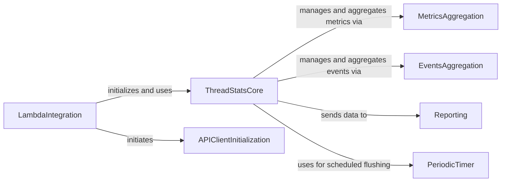

## Component Details

This subsystem provides specific integration for Datadog ThreadStats within AWS Lambda environments. Its main purpose is to enable automatic metric collection and manage the lifecycle of the ThreadStats client in a serverless context. The core flow involves a Lambda decorator that initializes a ThreadStats client, collects metrics and events during the Lambda function's execution, and then flushes these aggregated metrics and events to the Datadog API upon completion.

### LambdaIntegration
This component provides a decorator for AWS Lambda functions to automatically initialize and flush Datadog metrics. It manages the lifecycle of metric collection within a Lambda execution context, ensuring metrics are sent to Datadog.

**Related Classes/Methods**:

- <a href="https://github.com/DataDog/datadogpy/blob/master/datadog/threadstats/aws_lambda.py#L22-L77" target="_blank" rel="noopener noreferrer">`datadogpy.datadog.threadstats.aws_lambda._LambdaDecorator` (22:77)</a>
- <a href="https://github.com/DataDog/datadogpy/blob/master/datadog/threadstats/aws_lambda.py#L71-L77" target="_blank" rel="noopener noreferrer">`datadogpy.datadog.threadstats.aws_lambda._LambdaDecorator:__call__` (71:77)</a>
- <a href="https://github.com/DataDog/datadogpy/blob/master/datadog/threadstats/aws_lambda.py#L35-L50" target="_blank" rel="noopener noreferrer">`datadogpy.datadog.threadstats.aws_lambda._LambdaDecorator:_enter` (35:50)</a>
- <a href="https://github.com/DataDog/datadogpy/blob/master/datadog/threadstats/aws_lambda.py#L53-L69" target="_blank" rel="noopener noreferrer">`datadogpy.datadog.threadstats.aws_lambda._LambdaDecorator:_close` (53:69)</a>
- <a href="https://github.com/DataDog/datadogpy/blob/master/datadog/threadstats/aws_lambda.py#L84-L90" target="_blank" rel="noopener noreferrer">`datadogpy.datadog.threadstats.aws_lambda:_get_lambda_stats` (84:90)</a>
- <a href="https://github.com/DataDog/datadogpy/blob/master/datadog/threadstats/aws_lambda.py#L93-L95" target="_blank" rel="noopener noreferrer">`datadogpy.datadog.threadstats.aws_lambda:lambda_metric` (93:95)</a>

### ThreadStatsCore
This is the core component for collecting and managing application metrics. It provides methods for various metric types (gauge, increment, histogram, distribution, timing, event) and handles the flushing mechanism, either in a separate thread, greenlet, or manually.

**Related Classes/Methods**:

- <a href="https://github.com/DataDog/datadogpy/blob/master/datadog/threadstats/base.py#L41-L511" target="_blank" rel="noopener noreferrer">`datadogpy.datadog.threadstats.base.ThreadStats` (41:511)</a>

### MetricsAggregation
This component is responsible for aggregating various types of metrics (counters, gauges, histograms, distributions, timings, sets) before they are flushed. It manages the roll-up of metric data.

**Related Classes/Methods**:

- <a href="https://github.com/DataDog/datadogpy/blob/master/datadog/threadstats/metrics.py#L171-L203" target="_blank" rel="noopener noreferrer">`datadogpy.datadog.threadstats.metrics.MetricsAggregator` (171:203)</a>

### EventsAggregation
This component handles the aggregation of events before they are sent to Datadog.

**Related Classes/Methods**:

- <a href="https://github.com/DataDog/datadogpy/blob/master/datadog/threadstats/events.py#L11-L27" target="_blank" rel="noopener noreferrer">`datadogpy.datadog.threadstats.events.EventsAggregator` (11:27)</a>

### Reporting
This component is responsible for sending the aggregated metrics and events to the Datadog API. It handles the actual HTTP communication.

**Related Classes/Methods**:

- <a href="https://github.com/DataDog/datadogpy/blob/master/datadog/threadstats/reporters.py#L17-L29" target="_blank" rel="noopener noreferrer">`datadogpy.datadog.threadstats.reporters.HttpReporter` (17:29)</a>

### PeriodicTimer
This component provides a mechanism for scheduling periodic tasks, used by ThreadStatsCore for automatic flushing in a separate thread.

**Related Classes/Methods**:

- <a href="https://github.com/DataDog/datadogpy/blob/master/datadog/threadstats/periodic_timer.py#L13-L36" target="_blank" rel="noopener noreferrer">`datadogpy.datadog.threadstats.periodic_timer.PeriodicTimer` (13:36)</a>

### APIClientInitialization
This component handles the asynchronous initialization of the Datadog API client, specifically to pre-establish TLS connections and reduce latency for subsequent metric submissions.

**Related Classes/Methods**:

- <a href="https://github.com/DataDog/datadogpy/blob/master/datadog/threadstats/aws_lambda.py#L98-L111" target="_blank" rel="noopener noreferrer">`datadogpy.datadog.threadstats.aws_lambda._init_api_client` (98:111)</a>

### [FAQ](https://github.com/CodeBoarding/GeneratedOnBoardings/tree/main?tab=readme-ov-file#faq)