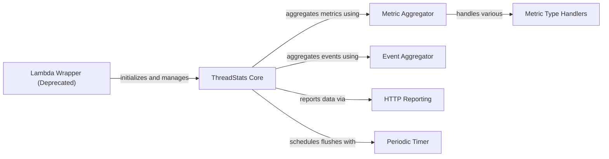

## Component Details

This graph illustrates the architecture of the `ThreadStats Client` subsystem. The core functionality revolves around the `ThreadStats Core` component, which acts as the central hub for collecting and managing metrics and events. It interacts with `Metric Aggregator` and `Event Aggregator` to process and store different types of data. The `Metric Aggregator` further utilizes `Metric Type Handlers` to manage specific metric types like histograms, gauges, and counters. For reporting, the `ThreadStats Core` sends aggregated data to the `HTTP Reporting` component, which handles the communication with the Datadog API. Automated flushing of metrics is managed by the `Periodic Timer` component, which is scheduled by the `ThreadStats Core`. Additionally, a `Lambda Wrapper (Deprecated)` component is present, which historically initialized and managed the `ThreadStats Core` in AWS Lambda environments, ensuring proper metric flushing at the end of function execution.

### ThreadStats Core
The central component for collecting and managing application metrics and events. It provides an API for users to submit various metric types and events, and orchestrates their aggregation and flushing to Datadog. It can be configured to flush metrics in a separate thread, greenlet, or manually.

**Related Classes/Methods**:

- <a href="https://github.com/DataDog/datadogpy/blob/master/datadog/threadstats/base.py#L41-L511" target="_blank" rel="noopener noreferrer">`datadogpy.datadog.threadstats.base.ThreadStats` (41:511)</a>
- <a href="https://github.com/DataDog/datadogpy/blob/master/datadog/threadstats/base.py#L85-L164" target="_blank" rel="noopener noreferrer">`datadogpy.datadog.threadstats.base.ThreadStats:start` (85:164)</a>
- <a href="https://github.com/DataDog/datadogpy/blob/master/datadog/threadstats/base.py#L166-L172" target="_blank" rel="noopener noreferrer">`datadogpy.datadog.threadstats.base.ThreadStats:stop` (166:172)</a>
- <a href="https://github.com/DataDog/datadogpy/blob/master/datadog/threadstats/base.py#L174-L212" target="_blank" rel="noopener noreferrer">`datadogpy.datadog.threadstats.base.ThreadStats:event` (174:212)</a>
- <a href="https://github.com/DataDog/datadogpy/blob/master/datadog/threadstats/base.py#L214-L228" target="_blank" rel="noopener noreferrer">`datadogpy.datadog.threadstats.base.ThreadStats:gauge` (214:228)</a>
- <a href="https://github.com/DataDog/datadogpy/blob/master/datadog/threadstats/base.py#L230-L241" target="_blank" rel="noopener noreferrer">`datadogpy.datadog.threadstats.base.ThreadStats:set` (230:241)</a>
- <a href="https://github.com/DataDog/datadogpy/blob/master/datadog/threadstats/base.py#L243-L255" target="_blank" rel="noopener noreferrer">`datadogpy.datadog.threadstats.base.ThreadStats:increment` (243:255)</a>
- <a href="https://github.com/DataDog/datadogpy/blob/master/datadog/threadstats/base.py#L257-L268" target="_blank" rel="noopener noreferrer">`datadogpy.datadog.threadstats.base.ThreadStats:decrement` (257:268)</a>
- <a href="https://github.com/DataDog/datadogpy/blob/master/datadog/threadstats/base.py#L270-L282" target="_blank" rel="noopener noreferrer">`datadogpy.datadog.threadstats.base.ThreadStats:histogram` (270:282)</a>
- <a href="https://github.com/DataDog/datadogpy/blob/master/datadog/threadstats/base.py#L284-L296" target="_blank" rel="noopener noreferrer">`datadogpy.datadog.threadstats.base.ThreadStats:distribution` (284:296)</a>
- <a href="https://github.com/DataDog/datadogpy/blob/master/datadog/threadstats/base.py#L298-L307" target="_blank" rel="noopener noreferrer">`datadogpy.datadog.threadstats.base.ThreadStats:timing` (298:307)</a>
- <a href="https://github.com/DataDog/datadogpy/blob/master/datadog/threadstats/base.py#L310-L335" target="_blank" rel="noopener noreferrer">`datadogpy.datadog.threadstats.base.ThreadStats:timer` (310:335)</a>
- <a href="https://github.com/DataDog/datadogpy/blob/master/datadog/threadstats/base.py#L337-L365" target="_blank" rel="noopener noreferrer">`datadogpy.datadog.threadstats.base.ThreadStats:timed` (337:365)</a>
- <a href="https://github.com/DataDog/datadogpy/blob/master/datadog/threadstats/base.py#L367-L418" target="_blank" rel="noopener noreferrer">`datadogpy.datadog.threadstats.base.ThreadStats:flush` (367:418)</a>
- <a href="https://github.com/DataDog/datadogpy/blob/master/datadog/threadstats/base.py#L420-L458" target="_blank" rel="noopener noreferrer">`datadogpy.datadog.threadstats.base.ThreadStats:_get_aggregate_metrics_and_dists` (420:458)</a>
- <a href="https://github.com/DataDog/datadogpy/blob/master/datadog/threadstats/base.py#L460-L463" target="_blank" rel="noopener noreferrer">`datadogpy.datadog.threadstats.base.ThreadStats:_get_aggregate_events` (460:463)</a>
- <a href="https://github.com/DataDog/datadogpy/blob/master/datadog/threadstats/base.py#L465-L487" target="_blank" rel="noopener noreferrer">`datadogpy.datadog.threadstats.base.ThreadStats:_start_flush_thread` (465:487)</a>
- <a href="https://github.com/DataDog/datadogpy/blob/master/datadog/threadstats/base.py#L489-L511" target="_blank" rel="noopener noreferrer">`datadogpy.datadog.threadstats.base.ThreadStats:_start_flush_greenlet` (489:511)</a>

### Metric Type Handlers
These classes define how individual metric types (like Histogram, Gauge, Counter, Set, Distribution, Timing) process and store their points before aggregation. They also define how these individual metrics are flushed into a format suitable for reporting.

**Related Classes/Methods**:

- <a href="https://github.com/DataDog/datadogpy/blob/master/datadog/threadstats/metrics.py#L104-L159" target="_blank" rel="noopener noreferrer">`datadogpy.datadog.threadstats.metrics.Histogram` (104:159)</a>
- <a href="https://github.com/DataDog/datadogpy/blob/master/datadog/threadstats/metrics.py#L122-L130" target="_blank" rel="noopener noreferrer">`datadogpy.datadog.threadstats.metrics.Histogram:add_point` (122:130)</a>
- <a href="https://github.com/DataDog/datadogpy/blob/master/datadog/threadstats/metrics.py#L132-L155" target="_blank" rel="noopener noreferrer">`datadogpy.datadog.threadstats.metrics.Histogram:flush` (132:155)</a>
- <a href="https://github.com/DataDog/datadogpy/blob/master/datadog/threadstats/metrics.py#L157-L159" target="_blank" rel="noopener noreferrer">`datadogpy.datadog.threadstats.metrics.Histogram.average` (157:159)</a>
- <a href="https://github.com/DataDog/datadogpy/blob/master/datadog/threadstats/metrics.py#L31-L46" target="_blank" rel="noopener noreferrer">`datadogpy.datadog.threadstats.metrics.Set` (31:46)</a>
- <a href="https://github.com/DataDog/datadogpy/blob/master/datadog/threadstats/metrics.py#L49-L64" target="_blank" rel="noopener noreferrer">`datadogpy.datadog.threadstats.metrics.Gauge` (49:64)</a>
- <a href="https://github.com/DataDog/datadogpy/blob/master/datadog/threadstats/metrics.py#L67-L83" target="_blank" rel="noopener noreferrer">`datadogpy.datadog.threadstats.metrics.Counter` (67:83)</a>
- <a href="https://github.com/DataDog/datadogpy/blob/master/datadog/threadstats/metrics.py#L86-L101" target="_blank" rel="noopener noreferrer">`datadogpy.datadog.threadstats.metrics.Distribution` (86:101)</a>
- <a href="https://github.com/DataDog/datadogpy/blob/master/datadog/threadstats/metrics.py#L162-L168" target="_blank" rel="noopener noreferrer">`datadogpy.datadog.threadstats.metrics.Timing` (162:168)</a>

### Metric Aggregator
Responsible for collecting and rolling up various types of metrics over defined time intervals. It manages instances of individual metric handlers and orchestrates their flushing to produce aggregated metric data.

**Related Classes/Methods**:

- <a href="https://github.com/DataDog/datadogpy/blob/master/datadog/threadstats/metrics.py#L171-L203" target="_blank" rel="noopener noreferrer">`datadogpy.datadog.threadstats.metrics.MetricsAggregator` (171:203)</a>
- <a href="https://github.com/DataDog/datadogpy/blob/master/datadog/threadstats/metrics.py#L181-L188" target="_blank" rel="noopener noreferrer">`datadogpy.datadog.threadstats.metrics.MetricsAggregator.add_point` (181:188)</a>
- <a href="https://github.com/DataDog/datadogpy/blob/master/datadog/threadstats/metrics.py#L190-L203" target="_blank" rel="noopener noreferrer">`datadogpy.datadog.threadstats.metrics.MetricsAggregator.flush` (190:203)</a>

### Event Aggregator
A simple aggregator that collects events and holds them in memory until a flush operation is triggered. It prepares the collected events for submission to the Datadog API.

**Related Classes/Methods**:

- <a href="https://github.com/DataDog/datadogpy/blob/master/datadog/threadstats/events.py#L11-L27" target="_blank" rel="noopener noreferrer">`datadogpy.datadog.threadstats.events.EventsAggregator` (11:27)</a>
- <a href="https://github.com/DataDog/datadogpy/blob/master/datadog/threadstats/events.py#L19-L22" target="_blank" rel="noopener noreferrer">`datadogpy.datadog.threadstats.events.EventsAggregator:add_event` (19:22)</a>
- <a href="https://github.com/DataDog/datadogpy/blob/master/datadog/threadstats/events.py#L24-L27" target="_blank" rel="noopener noreferrer">`datadogpy.datadog.threadstats.events.EventsAggregator:flush` (24:27)</a>

### HTTP Reporting
Handles the actual transmission of aggregated metrics, distributions, and events to the Datadog API. It uses the Datadog API client to send the prepared payloads, optionally compressing them.

**Related Classes/Methods**:

- <a href="https://github.com/DataDog/datadogpy/blob/master/datadog/threadstats/reporters.py#L17-L29" target="_blank" rel="noopener noreferrer">`datadogpy.datadog.threadstats.reporters.HttpReporter` (17:29)</a>
- <a href="https://github.com/DataDog/datadogpy/blob/master/datadog/threadstats/reporters.py#L24-L25" target="_blank" rel="noopener noreferrer">`datadogpy.datadog.threadstats.reporters.HttpReporter.flush_metrics` (24:25)</a>
- <a href="https://github.com/DataDog/datadogpy/blob/master/datadog/threadstats/reporters.py#L21-L22" target="_blank" rel="noopener noreferrer">`datadogpy.datadog.threadstats.reporters.HttpReporter.flush_distributions` (21:22)</a>
- <a href="https://github.com/DataDog/datadogpy/blob/master/datadog/threadstats/reporters.py#L27-L29" target="_blank" rel="noopener noreferrer">`datadogpy.datadog.threadstats.reporters.HttpReporter.flush_events` (27:29)</a>

### Lambda Wrapper (Deprecated)
A deprecated decorator and utility functions designed for AWS Lambda environments. It automatically initializes the ThreadStats client and ensures that metrics are flushed at the end of a Lambda function's execution, handling API key setup and asynchronous client initialization.

**Related Classes/Methods**:

- <a href="https://github.com/DataDog/datadogpy/blob/master/datadog/threadstats/aws_lambda.py#L22-L77" target="_blank" rel="noopener noreferrer">`datadogpy.datadog.threadstats.aws_lambda._LambdaDecorator` (22:77)</a>
- <a href="https://github.com/DataDog/datadogpy/blob/master/datadog/threadstats/aws_lambda.py#L35-L50" target="_blank" rel="noopener noreferrer">`datadogpy.datadog.threadstats.aws_lambda._LambdaDecorator:_enter` (35:50)</a>
- <a href="https://github.com/DataDog/datadogpy/blob/master/datadog/threadstats/aws_lambda.py#L53-L69" target="_blank" rel="noopener noreferrer">`datadogpy.datadog.threadstats.aws_lambda._LambdaDecorator:_close` (53:69)</a>
- <a href="https://github.com/DataDog/datadogpy/blob/master/datadog/threadstats/aws_lambda.py#L71-L77" target="_blank" rel="noopener noreferrer">`datadogpy.datadog.threadstats.aws_lambda._LambdaDecorator:__call__` (71:77)</a>
- <a href="https://github.com/DataDog/datadogpy/blob/master/datadog/threadstats/aws_lambda.py#L84-L90" target="_blank" rel="noopener noreferrer">`datadogpy.datadog.threadstats.aws_lambda:_get_lambda_stats` (84:90)</a>
- <a href="https://github.com/DataDog/datadogpy/blob/master/datadog/threadstats/aws_lambda.py#L93-L95" target="_blank" rel="noopener noreferrer">`datadogpy.datadog.threadstats.aws_lambda:lambda_metric` (93:95)</a>

### Periodic Timer
A utility class that runs a specified function periodically in a separate thread. It is used by the ThreadStats Core to automate the flushing process at regular intervals.

**Related Classes/Methods**:

- <a href="https://github.com/DataDog/datadogpy/blob/master/datadog/threadstats/periodic_timer.py#L13-L36" target="_blank" rel="noopener noreferrer">`datadogpy.datadog.threadstats.periodic_timer.PeriodicTimer` (13:36)</a>
- <a href="https://github.com/DataDog/datadogpy/blob/master/datadog/threadstats/periodic_timer.py#L25-L26" target="_blank" rel="noopener noreferrer">`datadogpy.datadog.threadstats.periodic_timer.PeriodicTimer.end` (25:26)</a>

### [FAQ](https://github.com/CodeBoarding/GeneratedOnBoardings/tree/main?tab=readme-ov-file#faq)