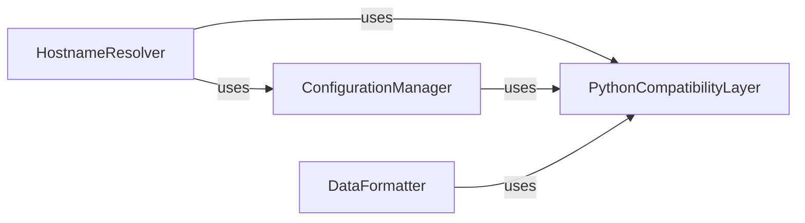

## Component Details

This graph illustrates the core utility components of the `datadogpy` library, focusing on how they collaborate to manage system hostnames, handle configuration files, ensure Python version compatibility, and format data for API interactions. The `HostnameResolver` identifies the system's unique identifier, relying on `ConfigurationManager` for settings and `PythonCompatibilityLayer` for cross-version compatibility. The `ConfigurationManager` is responsible for parsing agent configurations, also leveraging the `PythonCompatibilityLayer` for file I/O and parsing. Finally, the `DataFormatter` prepares various data types, such as tags and time series, for submission to the Datadog API, utilizing the `PythonCompatibilityLayer` for efficient caching mechanisms.

### HostnameResolver
This component is responsible for determining the canonical hostname of the system. It attempts to retrieve the hostname from various sources, including the agent configuration, OS-specific methods (like 'hostname -f' on Unix), and cloud provider metadata services (Google Cloud Engine and Amazon EC2). It also includes logic for validating hostnames.

**Related Classes/Methods**:

- <a href="https://github.com/DataDog/datadogpy/blob/master/datadog/util/hostname.py#L45-L125" target="_blank" rel="noopener noreferrer">`datadogpy.datadog.util.hostname:get_hostname` (45:125)</a>
- <a href="https://github.com/DataDog/datadogpy/blob/master/datadog/util/hostname.py#L185-L190" target="_blank" rel="noopener noreferrer">`datadogpy.datadog.util.hostname.GCE:get_hostname` (185:190)</a>
- <a href="https://github.com/DataDog/datadogpy/blob/master/datadog/util/hostname.py#L201-L240" target="_blank" rel="noopener noreferrer">`datadogpy.datadog.util.hostname.EC2:get_tags` (201:240)</a>
- <a href="https://github.com/DataDog/datadogpy/blob/master/datadog/util/hostname.py#L301-L305" target="_blank" rel="noopener noreferrer">`datadogpy.datadog.util.hostname.EC2:get_instance_id` (301:305)</a>
- <a href="https://github.com/DataDog/datadogpy/blob/master/datadog/util/hostname.py#L25-L42" target="_blank" rel="noopener noreferrer">`datadogpy.datadog.util.hostname:is_valid_hostname` (25:42)</a>
- <a href="https://github.com/DataDog/datadogpy/blob/master/datadog/util/hostname.py#L152-L182" target="_blank" rel="noopener noreferrer">`datadogpy.datadog.util.hostname.GCE._get_metadata` (152:182)</a>
- <a href="https://github.com/DataDog/datadogpy/blob/master/datadog/util/hostname.py#L243-L298" target="_blank" rel="noopener noreferrer">`datadogpy.datadog.util.hostname.EC2.get_metadata` (243:298)</a>
- <a href="https://github.com/DataDog/datadogpy/blob/master/datadog/util/hostname.py#L129-L141" target="_blank" rel="noopener noreferrer">`datadogpy.datadog.util.hostname.get_hostname._get_hostname_unix` (129:141)</a>

### ConfigurationManager
This component handles the loading and parsing of the Datadog agent's configuration file (datadog.conf). It determines the correct configuration file path based on the operating system and provides methods to read configuration options.

**Related Classes/Methods**:

- <a href="https://github.com/DataDog/datadogpy/blob/master/datadog/util/config.py#L40-L45" target="_blank" rel="noopener noreferrer">`datadogpy.datadog.util.config:skip_leading_wsp` (40:45)</a>
- <a href="https://github.com/DataDog/datadogpy/blob/master/datadog/util/config.py#L66-L71" target="_blank" rel="noopener noreferrer">`datadogpy.datadog.util.config:_windows_config_path` (66:71)</a>
- <a href="https://github.com/DataDog/datadogpy/blob/master/datadog/util/config.py#L74-L78" target="_blank" rel="noopener noreferrer">`datadogpy.datadog.util.config:_unix_config_path` (74:78)</a>
- <a href="https://github.com/DataDog/datadogpy/blob/master/datadog/util/config.py#L81-L86" target="_blank" rel="noopener noreferrer">`datadogpy.datadog.util.config:_mac_config_path` (81:86)</a>
- <a href="https://github.com/DataDog/datadogpy/blob/master/datadog/util/config.py#L89-L103" target="_blank" rel="noopener noreferrer">`datadogpy.datadog.util.config:get_config_path` (89:103)</a>
- <a href="https://github.com/DataDog/datadogpy/blob/master/datadog/util/config.py#L106-L130" target="_blank" rel="noopener noreferrer">`datadogpy.datadog.util.config:get_config` (106:130)</a>
- <a href="https://github.com/DataDog/datadogpy/blob/master/datadog/util/config.py#L24-L37" target="_blank" rel="noopener noreferrer">`datadogpy.datadog.util.config:get_os` (24:37)</a>
- <a href="https://github.com/DataDog/datadogpy/blob/master/datadog/util/config.py#L16-L17" target="_blank" rel="noopener noreferrer">`datadogpy.datadog.util.config.CfgNotFound` (16:17)</a>
- <a href="https://github.com/DataDog/datadogpy/blob/master/datadog/util/config.py#L20-L21" target="_blank" rel="noopener noreferrer">`datadogpy.datadog.util.config.PathNotFound` (20:21)</a>

### PythonCompatibilityLayer
This component provides a set of utility functions and conditional imports to ensure the `datadogpy` library functions correctly across different Python versions (specifically Python 2.x and Python 3.x). It includes helpers for version checks, string/IO handling, and iterator compatibility.

**Related Classes/Methods**:

- <a href="https://github.com/DataDog/datadogpy/blob/master/datadog/util/compat.py#L103-L107" target="_blank" rel="noopener noreferrer">`datadogpy.datadog.util.compat:is_p3k` (103:107)</a>
- <a href="https://github.com/DataDog/datadogpy/blob/master/datadog/util/compat.py#L110-L114" target="_blank" rel="noopener noreferrer">`datadogpy.datadog.util.compat:is_higher_py32` (110:114)</a>
- <a href="https://github.com/DataDog/datadogpy/blob/master/datadog/util/compat.py#L117-L121" target="_blank" rel="noopener noreferrer">`datadogpy.datadog.util.compat:is_higher_py35` (117:121)</a>
- <a href="https://github.com/DataDog/datadogpy/blob/master/datadog/util/compat.py#L131-L145" target="_blank" rel="noopener noreferrer">`datadogpy.datadog.util.compat:conditional_lru_cache` (131:145)</a>
- <a href="https://github.com/DataDog/datadogpy/blob/master/datadog/util/compat.py#L96-L100" target="_blank" rel="noopener noreferrer">`datadogpy.datadog.util.compat:_is_py_version_higher_than` (96:100)</a>
- <a href="https://github.com/DataDog/datadogpy/blob/master/datadog/util/compat.py#L48-L49" target="_blank" rel="noopener noreferrer">`datadogpy.datadog.util.compat:iteritems` (48:49)</a>
- <a href="https://github.com/DataDog/datadogpy/blob/master/datadog/util/compat.py#L39-L39" target="_blank" rel="noopener noreferrer">`datadogpy.datadog.util.compat:url_lib` (39:39)</a>
- <a href="https://github.com/DataDog/datadogpy/blob/master/datadog/util/compat.py#L40-L40" target="_blank" rel="noopener noreferrer">`datadogpy.datadog.util.compat:configparser` (40:40)</a>

### DataFormatter
This component provides utility functions for formatting various data types, including normalizing tags, pretty-printing JSON, validating cardinality, formatting time series points, and constructing URLs. It ensures data adheres to expected formats for interaction with the Datadog API.

**Related Classes/Methods**:

- <a href="https://github.com/DataDog/datadogpy/blob/master/datadog/util/format.py#L40-L43" target="_blank" rel="noopener noreferrer">`datadogpy.datadog.util.format:normalize_tags` (40:43)</a>
- <a href="https://github.com/DataDog/datadogpy/blob/master/datadog/util/format.py#L17-L18" target="_blank" rel="noopener noreferrer">`datadogpy.datadog.util.format:pretty_json` (17:18)</a>
- <a href="https://github.com/DataDog/datadogpy/blob/master/datadog/util/format.py#L46-L53" target="_blank" rel="noopener noreferrer">`datadogpy.datadog.util.format:validate_cardinality` (46:53)</a>
- <a href="https://github.com/DataDog/datadogpy/blob/master/datadog/util/format.py#L21-L22" target="_blank" rel="noopener noreferrer">`datadogpy.datadog.util.format:construct_url` (21:22)</a>
- <a href="https://github.com/DataDog/datadogpy/blob/master/datadog/util/format.py#L29-L32" target="_blank" rel="noopener noreferrer">`datadogpy.datadog.util.format:force_to_epoch_seconds` (29:32)</a>
- <a href="https://github.com/DataDog/datadogpy/blob/master/datadog/util/format.py#L36-L37" target="_blank" rel="noopener noreferrer">`datadogpy.datadog.util.format._normalize_tags_with_cache` (36:37)</a>
- <a href="https://github.com/DataDog/datadogpy/blob/master/datadog/util/format.py#L25-L26" target="_blank" rel="noopener noreferrer">`datadogpy.datadog.util.format:construct_path` (25:26)</a>

### [FAQ](https://github.com/CodeBoarding/GeneratedOnBoardings/tree/main?tab=readme-ov-file#faq)