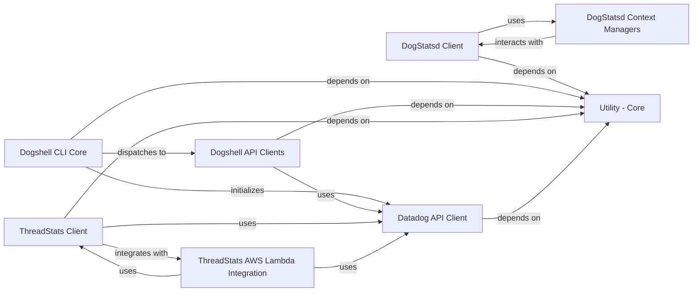

## Component Details

The `datadogpy` library provides Python clients for interacting with Datadog services. It primarily consists of two main data reporting mechanisms: the `DogStatsd Client` for sending metrics, events, and service checks to a local Datadog Agent via UDP/UDS, and the `Datadog API Client` for direct HTTP API interactions. Additionally, it offers a `ThreadStats Client` for asynchronous metric reporting, especially useful in serverless environments like AWS Lambda, and a `Dogshell CLI` for command-line management of Datadog resources. Core utility components support these functionalities by handling hostname resolution, configuration, compatibility, and data formatting.

### DogStatsd Client
Provides core functionality for sending metrics, events, and service checks to the Datadog Agent via UDP or UDS, including initialization, socket management, buffering, flushing, and metric aggregation.

**Related Classes/Methods**:

- <a href="https://github.com/DataDog/datadogpy/blob/master/datadog/dogstatsd/base.py#L146-L1704" target="_blank" rel="noopener noreferrer">`datadogpy.datadog.dogstatsd.base.DogStatsd` (146:1704)</a>
- <a href="https://github.com/DataDog/datadogpy/blob/master/datadog/dogstatsd/base.py#L155-L503" target="_blank" rel="noopener noreferrer">`datadogpy.datadog.dogstatsd.base.DogStatsd:__init__` (155:503)</a>
- <a href="https://github.com/DataDog/datadogpy/blob/master/datadog/dogstatsd/base.py#L923-L941" target="_blank" rel="noopener noreferrer">`datadogpy.datadog.dogstatsd.base.DogStatsd:gauge` (923:941)</a>
- <a href="https://github.com/DataDog/datadogpy/blob/master/datadog/dogstatsd/base.py#L967-L984" target="_blank" rel="noopener noreferrer">`datadogpy.datadog.dogstatsd.base.DogStatsd:count` (967:984)</a>
- <a href="https://github.com/DataDog/datadogpy/blob/master/datadog/dogstatsd/base.py#L1050-L1067" target="_blank" rel="noopener noreferrer">`datadogpy.datadog.dogstatsd.base.DogStatsd:histogram` (1050:1067)</a>
- <a href="https://github.com/DataDog/datadogpy/blob/master/datadog/dogstatsd/base.py#L1431-L1505" target="_blank" rel="noopener noreferrer">`datadogpy.datadog.dogstatsd.base.DogStatsd:event` (1431:1505)</a>
- <a href="https://github.com/DataDog/datadogpy/blob/master/datadog/dogstatsd/base.py#L1507-L1550" target="_blank" rel="noopener noreferrer">`datadogpy.datadog.dogstatsd.base.DogStatsd:service_check` (1507:1550)</a>
- <a href="https://github.com/DataDog/datadogpy/blob/master/datadog/dogstatsd/base.py#L1313-L1326" target="_blank" rel="noopener noreferrer">`datadogpy.datadog.dogstatsd.base.DogStatsd:_send_to_server` (1313:1326)</a>
- <a href="https://github.com/DataDog/datadogpy/blob/master/datadog/dogstatsd/base.py#L1343-L1406" target="_blank" rel="noopener noreferrer">`datadogpy.datadog.dogstatsd.base.DogStatsd:_xmit_packet` (1343:1406)</a>
- <a href="https://github.com/DataDog/datadogpy/blob/master/datadog/dogstatsd/aggregator.py#L17-L118" target="_blank" rel="noopener noreferrer">`datadogpy.datadog.dogstatsd.aggregator.Aggregator` (17:118)</a>
- <a href="https://github.com/DataDog/datadogpy/blob/master/datadog/dogstatsd/aggregator.py#L18-L35" target="_blank" rel="noopener noreferrer">`datadogpy.datadog.dogstatsd.aggregator.Aggregator:__init__` (18:35)</a>
- <a href="https://github.com/DataDog/datadogpy/blob/master/datadog/dogstatsd/aggregator.py#L37-L46" target="_blank" rel="noopener noreferrer">`datadogpy.datadog.dogstatsd.aggregator.Aggregator:flush_aggregated_metrics` (37:46)</a>
- <a href="https://github.com/DataDog/datadogpy/blob/master/datadog/dogstatsd/aggregator.py#L63-L66" target="_blank" rel="noopener noreferrer">`datadogpy.datadog.dogstatsd.aggregator.Aggregator:count` (63:66)</a>
- <a href="https://github.com/DataDog/datadogpy/blob/master/datadog/dogstatsd/aggregator.py#L68-L71" target="_blank" rel="noopener noreferrer">`datadogpy.datadog.dogstatsd.aggregator.Aggregator:gauge` (68:71)</a>
- <a href="https://github.com/DataDog/datadogpy/blob/master/datadog/dogstatsd/aggregator.py#L93-L96" target="_blank" rel="noopener noreferrer">`datadogpy.datadog.dogstatsd.aggregator.Aggregator:histogram` (93:96)</a>
- <a href="https://github.com/DataDog/datadogpy/blob/master/datadog/dogstatsd/metrics.py#L19-L22" target="_blank" rel="noopener noreferrer">`datadogpy.datadog.dogstatsd.metrics.CountMetric:__init__` (19:22)</a>
- <a href="https://github.com/DataDog/datadogpy/blob/master/datadog/dogstatsd/metrics.py#L29-L32" target="_blank" rel="noopener noreferrer">`datadogpy.datadog.dogstatsd.metrics.GaugeMetric:__init__` (29:32)</a>
- <a href="https://github.com/DataDog/datadogpy/blob/master/datadog/dogstatsd/metrics.py#L39-L45" target="_blank" rel="noopener noreferrer">`datadogpy.datadog.dogstatsd.metrics.SetMetric:__init__` (39:45)</a>
- <a href="https://github.com/DataDog/datadogpy/blob/master/datadog/dogstatsd/metrics.py#L50-L54" target="_blank" rel="noopener noreferrer">`datadogpy.datadog.dogstatsd.metrics.SetMetric:get_data` (50:54)</a>
- <a href="https://github.com/DataDog/datadogpy/blob/master/datadog/dogstatsd/max_sample_metric.py#L28-L39" target="_blank" rel="noopener noreferrer">`datadogpy.datadog.dogstatsd.max_sample_metric.MaxSampleMetric:maybe_keep_sample_work_unsafe` (28:39)</a>
- <a href="https://github.com/DataDog/datadogpy/blob/master/datadog/dogstatsd/max_sample_metric.py#L44-L52" target="_blank" rel="noopener noreferrer">`datadogpy.datadog.dogstatsd.max_sample_metric.MaxSampleMetric:flush` (44:52)</a>
- <a href="https://github.com/DataDog/datadogpy/blob/master/datadog/dogstatsd/max_sample_metric.py#L56-L57" target="_blank" rel="noopener noreferrer">`datadogpy.datadog.dogstatsd.max_sample_metric.HistogramMetric:__init__` (56:57)</a>
- <a href="https://github.com/DataDog/datadogpy/blob/master/datadog/dogstatsd/max_sample_metric.py#L61-L64" target="_blank" rel="noopener noreferrer">`datadogpy.datadog.dogstatsd.max_sample_metric.DistributionMetric:__init__` (61:64)</a>
- <a href="https://github.com/DataDog/datadogpy/blob/master/datadog/dogstatsd/max_sample_metric.py#L68-L69" target="_blank" rel="noopener noreferrer">`datadogpy.datadog.dogstatsd.max_sample_metric.TimingMetric:__init__` (68:69)</a>
- <a href="https://github.com/DataDog/datadogpy/blob/master/datadog/dogstatsd/max_sample_metric_context.py#L21-L36" target="_blank" rel="noopener noreferrer">`datadogpy.datadog.dogstatsd.max_sample_metric_context.MaxSampleMetricContexts:sample` (21:36)</a>
- `datadogpy.datadog:initialize` (full file reference)

### DogStatsd Context Managers
Provides context managers and decorators for automatically timing code blocks and managing distributed tracing contexts for DogStatsd metrics.

**Related Classes/Methods**:

- <a href="https://github.com/DataDog/datadogpy/blob/master/datadog/dogstatsd/context.py#L21-L93" target="_blank" rel="noopener noreferrer">`datadogpy.datadog.dogstatsd.context.TimedContextManagerDecorator` (21:93)</a>
- <a href="https://github.com/DataDog/datadogpy/blob/master/datadog/dogstatsd/context.py#L43-L67" target="_blank" rel="noopener noreferrer">`datadogpy.datadog.dogstatsd.context.TimedContextManagerDecorator:__call__` (43:67)</a>
- <a href="https://github.com/DataDog/datadogpy/blob/master/datadog/dogstatsd/context.py#L69-L73" target="_blank" rel="noopener noreferrer">`datadogpy.datadog.dogstatsd.context.TimedContextManagerDecorator:__enter__` (69:73)</a>
- <a href="https://github.com/DataDog/datadogpy/blob/master/datadog/dogstatsd/context.py#L75-L77" target="_blank" rel="noopener noreferrer">`datadogpy.datadog.dogstatsd.context.TimedContextManagerDecorator:__exit__` (75:77)</a>
- <a href="https://github.com/DataDog/datadogpy/blob/master/datadog/dogstatsd/context.py#L89-L90" target="_blank" rel="noopener noreferrer">`datadogpy.datadog.dogstatsd.context.TimedContextManagerDecorator:start` (89:90)</a>
- <a href="https://github.com/DataDog/datadogpy/blob/master/datadog/dogstatsd/context.py#L92-L93" target="_blank" rel="noopener noreferrer">`datadogpy.datadog.dogstatsd.context.TimedContextManagerDecorator:stop` (92:93)</a>
- <a href="https://github.com/DataDog/datadogpy/blob/master/datadog/dogstatsd/context.py#L102-L111" target="_blank" rel="noopener noreferrer">`datadogpy.datadog.dogstatsd.context.DistributedContextManagerDecorator:__init__` (102:111)</a>

### Dogshell CLI Core
The main entry point for the `dogshell` command-line application, handling argument parsing, configuration loading, error reporting, and dispatching commands to specific CLI clients.

**Related Classes/Methods**:

- <a href="https://github.com/DataDog/datadogpy/blob/master/datadog/dogshell/wrap.py#L407-L514" target="_blank" rel="noopener noreferrer">`datadogpy.datadog.dogshell.wrap:main` (407:514)</a>
- <a href="https://github.com/DataDog/datadogpy/blob/master/datadog/dogshell/wrap.py#L252-L404" target="_blank" rel="noopener noreferrer">`datadogpy.datadog.dogshell.wrap:parse_options` (252:404)</a>
- <a href="https://github.com/DataDog/datadogpy/blob/master/datadog/dogshell/wrap.py#L105-L166" target="_blank" rel="noopener noreferrer">`datadogpy.datadog.dogshell.wrap:execute` (105:166)</a>
- <a href="https://github.com/DataDog/datadogpy/blob/master/datadog/dogshell/wrap.py#L90-L102" target="_blank" rel="noopener noreferrer">`datadogpy.datadog.dogshell.wrap:poll_proc` (90:102)</a>
- <a href="https://github.com/DataDog/datadogpy/blob/master/datadog/dogshell/wrap.py#L192-L232" target="_blank" rel="noopener noreferrer">`datadogpy.datadog.dogshell.wrap:build_event_body` (192:232)</a>
- <a href="https://github.com/DataDog/datadogpy/blob/master/datadog/dogshell/common.py#L13-L18" target="_blank" rel="noopener noreferrer">`datadogpy.datadog.dogshell.common:print_err` (13:18)</a>
- <a href="https://github.com/DataDog/datadogpy/blob/master/datadog/dogshell/common.py#L21-L30" target="_blank" rel="noopener noreferrer">`datadogpy.datadog.dogshell.common:report_errors` (21:30)</a>
- <a href="https://github.com/DataDog/datadogpy/blob/master/datadog/dogshell/common.py#L33-L42" target="_blank" rel="noopener noreferrer">`datadogpy.datadog.dogshell.common:report_warnings` (33:42)</a>
- <a href="https://github.com/DataDog/datadogpy/blob/master/datadog/dogshell/common.py#L46-L122" target="_blank" rel="noopener noreferrer">`datadogpy.datadog.dogshell.common.DogshellConfig:load` (46:122)</a>
- <a href="https://github.com/DataDog/datadogpy/blob/master/datadog/util/cli.py#L12-L16" target="_blank" rel="noopener noreferrer">`datadogpy.datadog.util.cli:comma_list` (12:16)</a>
- <a href="https://github.com/DataDog/datadogpy/blob/master/datadog/util/cli.py#L19-L20" target="_blank" rel="noopener noreferrer">`datadogpy.datadog.util.cli:comma_set` (19:20)</a>
- <a href="https://github.com/DataDog/datadogpy/blob/master/datadog/util/cli.py#L23-L27" target="_blank" rel="noopener noreferrer">`datadogpy.datadog.util.cli:comma_list_or_empty` (23:27)</a>
- <a href="https://github.com/DataDog/datadogpy/blob/master/datadog/util/cli.py#L48-L55" target="_blank" rel="noopener noreferrer">`datadogpy.datadog.util.cli:list_of_ints_and_strs` (48:55)</a>
- <a href="https://github.com/DataDog/datadogpy/blob/master/datadog/util/cli.py#L58-L59" target="_blank" rel="noopener noreferrer">`datadogpy.datadog.util.cli:set_of_ints` (58:59)</a>
- <a href="https://github.com/DataDog/datadogpy/blob/master/datadog/util/cli.py#L74-L75" target="_blank" rel="noopener noreferrer">`datadogpy.datadog.util.cli:parse_date_as_epoch_timestamp` (74:75)</a>
- <a href="https://github.com/DataDog/datadogpy/blob/master/datadog/util/cli.py#L83-L152" target="_blank" rel="noopener noreferrer">`datadogpy.datadog.util.cli:parse_date` (83:152)</a>

### Dogshell API Clients
Provides various client classes for interacting with specific Datadog API resources via the command-line interface, encapsulating logic for CRUD operations on different Datadog services.

**Related Classes/Methods**:

- <a href="https://github.com/DataDog/datadogpy/blob/master/datadog/dogshell/downtime.py#L67-L76" target="_blank" rel="noopener noreferrer">`datadogpy.datadog.dogshell.downtime.DowntimeClient:_schedule_downtime` (67:76)</a>
- <a href="https://github.com/DataDog/datadogpy/blob/master/datadog/dogshell/downtime.py#L79-L90" target="_blank" rel="noopener noreferrer">`datadogpy.datadog.dogshell.downtime.DowntimeClient:_update_downtime` (79:90)</a>
- <a href="https://github.com/DataDog/datadogpy/blob/master/datadog/dogshell/downtime.py#L93-L98" target="_blank" rel="noopener noreferrer">`datadogpy.datadog.dogshell.downtime.DowntimeClient:_cancel_downtime` (93:98)</a>
- <a href="https://github.com/DataDog/datadogpy/blob/master/datadog/dogshell/downtime.py#L101-L110" target="_blank" rel="noopener noreferrer">`datadogpy.datadog.dogshell.downtime.DowntimeClient:_show_downtime` (101:110)</a>
- <a href="https://github.com/DataDog/datadogpy/blob/master/datadog/dogshell/downtime.py#L113-L122" target="_blank" rel="noopener noreferrer">`datadogpy.datadog.dogshell.downtime.DowntimeClient:_show_all_downtime` (113:122)</a>
- <a href="https://github.com/DataDog/datadogpy/blob/master/datadog/dogshell/downtime.py#L125-L132" target="_blank" rel="noopener noreferrer">`datadogpy.datadog.dogshell.downtime.DowntimeClient:_cancel_downtime_by_scope` (125:132)</a>
- <a href="https://github.com/DataDog/datadogpy/blob/master/datadog/dogshell/host.py#L40-L49" target="_blank" rel="noopener noreferrer">`datadogpy.datadog.dogshell.host.HostClient:_mute` (40:49)</a>
- <a href="https://github.com/DataDog/datadogpy/blob/master/datadog/dogshell/host.py#L52-L61" target="_blank" rel="noopener noreferrer">`datadogpy.datadog.dogshell.host.HostClient:_unmute` (52:61)</a>
- <a href="https://github.com/DataDog/datadogpy/blob/master/datadog/dogshell/tag.py#L48-L62" target="_blank" rel="noopener noreferrer">`datadogpy.datadog.dogshell.tag.TagClient:_add` (48:62)</a>
- <a href="https://github.com/DataDog/datadogpy/blob/master/datadog/dogshell/tag.py#L65-L79" target="_blank" rel="noopener noreferrer">`datadogpy.datadog.dogshell.tag.TagClient:_replace` (65:79)</a>
- <a href="https://github.com/DataDog/datadogpy/blob/master/datadog/dogshell/tag.py#L82-L112" target="_blank" rel="noopener noreferrer">`datadogpy.datadog.dogshell.tag.TagClient:_show` (82:112)</a>
- <a href="https://github.com/DataDog/datadogpy/blob/master/datadog/dogshell/tag.py#L115-L120" target="_blank" rel="noopener noreferrer">`datadogpy.datadog.dogshell.tag.TagClient:_detach` (115:120)</a>
- <a href="https://github.com/DataDog/datadogpy/blob/master/datadog/dogshell/service_level_objective.py#L178-L233" target="_blank" rel="noopener noreferrer">`datadogpy.datadog.dogshell.service_level_objective.ServiceLevelObjectiveClient:_create` (178:233)</a>
- <a href="https://github.com/DataDog/datadogpy/blob/master/datadog/dogshell/service_level_objective.py#L236-L246" target="_blank" rel="noopener noreferrer">`datadogpy.datadog.dogshell.service_level_objective.ServiceLevelObjectiveClient:_file_create` (236:246)</a>
- <a href="https://github.com/DataDog/datadogpy/blob/master/datadog/dogshell/service_level_objective.py#L249-L302" target="_blank" rel="noopener noreferrer">`datadogpy.datadog.dogshell.service_level_objective.ServiceLevelObjectiveClient:_update` (249:302)</a>
- <a href="https://github.com/DataDog/datadogpy/blob/master/datadog/dogshell/service_level_objective.py#L305-L316" target="_blank" rel="noopener noreferrer">`datadogpy.datadog.dogshell.service_level_objective.ServiceLevelObjectiveClient:_file_update` (305:316)</a>
- <a href="https://github.com/DataDog/datadogpy/blob/master/datadog/dogshell/service_level_objective.py#L319-L332" target="_blank" rel="noopener noreferrer">`datadogpy.datadog.dogshell.service_level_objective.ServiceLevelObjectiveClient:_show` (319:332)</a>
- <a href="https://github.com/DataDog/datadogpy/blob/master/datadog/dogshell/service_level_objective.py#L335-L352" target="_blank" rel="noopener noreferrer">`datadogpy.datadog.dogshell.service_level_objective.ServiceLevelObjectiveClient:_show_all` (335:352)</a>
- <a href="https://github.com/DataDog/datadogpy/blob/master/datadog/dogshell/service_level_objective.py#L355-L365" target="_blank" rel="noopener noreferrer">`datadogpy.datadog.dogshell.service_level_objective.ServiceLevelObjectiveClient:_delete` (355:365)</a>
- <a href="https://github.com/DataDog/datadogpy/blob/master/datadog/dogshell/service_level_objective.py#L368-L378" target="_blank" rel="noopener noreferrer">`datadogpy.datadog.dogshell.service_level_objective.ServiceLevelObjectiveClient:_delete_many` (368:378)</a>
- <a href="https://github.com/DataDog/datadogpy/blob/master/datadog/dogshell/service_level_objective.py#L381-L394" target="_blank" rel="noopener noreferrer">`datadogpy.datadog.dogshell.service_level_objective.ServiceLevelObjectiveClient:_delete_timeframe` (381:394)</a>
- <a href="https://github.com/DataDog/datadogpy/blob/master/datadog/dogshell/service_level_objective.py#L397-L408" target="_blank" rel="noopener noreferrer">`datadogpy.datadog.dogshell.service_level_objective.ServiceLevelObjectiveClient:_can_delete` (397:408)</a>
- <a href="https://github.com/DataDog/datadogpy/blob/master/datadog/dogshell/service_level_objective.py#L411-L422" target="_blank" rel="noopener noreferrer">`datadogpy.datadog.dogshell.service_level_objective.ServiceLevelObjectiveClient:_history` (411:422)</a>
- <a href="https://github.com/DataDog/datadogpy/blob/master/datadog/dogshell/comment.py#L43-L69" target="_blank" rel="noopener noreferrer">`datadogpy.datadog.dogshell.comment.CommentClient:_post` (43:69)</a>
- <a href="https://github.com/DataDog/datadogpy/blob/master/datadog/dogshell/comment.py#L72-L98" target="_blank" rel="noopener noreferrer">`datadogpy.datadog.dogshell.comment.CommentClient:_update` (72:98)</a>
- <a href="https://github.com/DataDog/datadogpy/blob/master/datadog/dogshell/comment.py#L101-L128" target="_blank" rel="noopener noreferrer">`datadogpy.datadog.dogshell.comment.CommentClient:_reply` (101:128)</a>
- <a href="https://github.com/DataDog/datadogpy/blob/master/datadog/dogshell/comment.py#L131-L152" target="_blank" rel="noopener noreferrer">`datadogpy.datadog.dogshell.comment.CommentClient:_show` (131:152)</a>
- <a href="https://github.com/DataDog/datadogpy/blob/master/datadog/dogshell/service_check.py#L35-L55" target="_blank" rel="noopener noreferrer">`datadogpy.datadog.dogshell.service_check.ServiceCheckClient:_check` (35:55)</a>
- <a href="https://github.com/DataDog/datadogpy/blob/master/datadog/dogshell/monitor.py#L16-L474" target="_blank" rel="noopener noreferrer">`datadogpy.datadog.dogshell.monitor.MonitorClient` (16:474)</a>
- <a href="https://github.com/DataDog/datadogpy/blob/master/datadog/dogshell/monitor.py#L171-L208" target="_blank" rel="noopener noreferrer">`datadogpy.datadog.dogshell.monitor.MonitorClient:_post` (171:208)</a>
- <a href="https://github.com/DataDog/datadogpy/blob/master/datadog/dogshell/monitor.py#L211-L238" target="_blank" rel="noopener noreferrer">`datadogpy.datadog.dogshell.monitor.MonitorClient:_file_post` (211:238)</a>
- <a href="https://github.com/DataDog/datadogpy/blob/master/datadog/dogshell/monitor.py#L241-L291" target="_blank" rel="noopener noreferrer">`datadogpy.datadog.dogshell.monitor.MonitorClient:_update` (241:291)</a>
- <a href="https://github.com/DataDog/datadogpy/blob/master/datadog/dogshell/monitor.py#L294-L323" target="_blank" rel="noopener noreferrer">`datadogpy.datadog.dogshell.monitor.MonitorClient:_file_update` (294:323)</a>
- <a href="https://github.com/DataDog/datadogpy/blob/master/datadog/dogshell/monitor.py#L326-L339" target="_blank" rel="noopener noreferrer">`datadogpy.datadog.dogshell.monitor.MonitorClient:_show` (326:339)</a>
- <a href="https://github.com/DataDog/datadogpy/blob/master/datadog/dogshell/monitor.py#L342-L374" target="_blank" rel="noopener noreferrer">`datadogpy.datadog.dogshell.monitor.MonitorClient:_show_all` (342:374)</a>
- <a href="https://github.com/DataDog/datadogpy/blob/master/datadog/dogshell/monitor.py#L377-L383" target="_blank" rel="noopener noreferrer">`datadogpy.datadog.dogshell.monitor.MonitorClient:_delete` (377:383)</a>
- <a href="https://github.com/DataDog/datadogpy/blob/master/datadog/dogshell/monitor.py#L390-L399" target="_blank" rel="noopener noreferrer">`datadogpy.datadog.dogshell.monitor.MonitorClient:_mute_all` (390:399)</a>
- <a href="https://github.com/DataDog/datadogpy/blob/master/datadog/dogshell/monitor.py#L402-L407" target="_blank" rel="noopener noreferrer">`datadogpy.datadog.dogshell.monitor.MonitorClient:_unmute_all` (402:407)</a>
- <a href="https://github.com/DataDog/datadogpy/blob/master/datadog/dogshell/monitor.py#L410-L419" target="_blank" rel="noopener noreferrer">`datadogpy.datadog.dogshell.monitor.MonitorClient:_mute` (410:419)</a>
- <a href="https://github.com/DataDog/datadogpy/blob/master/datadog/dogshell/monitor.py#L422-L430" target="_blank" rel="noopener noreferrer">`datadogpy.datadog.dogshell.monitor.MonitorClient:_unmute` (422:430)</a>
- <a href="https://github.com/DataDog/datadogpy/blob/master/datadog/dogshell/monitor.py#L433-L440" target="_blank" rel="noopener noreferrer">`datadogpy.datadog.dogshell.monitor.MonitorClient:_can_delete` (433:440)</a>
- <a href="https://github.com/DataDog/datadogpy/blob/master/datadog/dogshell/monitor.py#L443-L474" target="_blank" rel="noopener noreferrer">`datadogpy.datadog.dogshell.monitor.MonitorClient:_validate` (443:474)</a>
- <a href="https://github.com/DataDog/datadogpy/blob/master/datadog/dogshell/dashboard_list.py#L141-L153" target="_blank" rel="noopener noreferrer">`datadogpy.datadog.dogshell.dashboard_list.DashboardListClient:_post` (141:153)</a>
- <a href="https://github.com/DataDog/datadogpy/blob/master/datadog/dogshell/dashboard_list.py#L156-L169" target="_blank" rel="noopener noreferrer">`datadogpy.datadog.dogshell.dashboard_list.DashboardListClient:_update` (156:169)</a>
- <a href="https://github.com/DataDog/datadogpy/blob/master/datadog/dogshell/dashboard_list.py#L172-L184" target="_blank" rel="noopener noreferrer">`datadogpy.datadog.dogshell.dashboard_list.DashboardListClient:_show` (172:184)</a>
- <a href="https://github.com/DataDog/datadogpy/blob/master/datadog/dogshell/dashboard_list.py#L187-L198" target="_blank" rel="noopener noreferrer">`datadogpy.datadog.dogshell.dashboard_list.DashboardListClient:_show_all` (187:198)</a>
- <a href="https://github.com/DataDog/datadogpy/blob/master/datadog/dogshell/dashboard_list.py#L201-L213" target="_blank" rel="noopener noreferrer">`datadogpy.datadog.dogshell.dashboard_list.DashboardListClient:_delete` (201:213)</a>
- <a href="https://github.com/DataDog/datadogpy/blob/master/datadog/dogshell/dashboard_list.py#L216-L228" target="_blank" rel="noopener noreferrer">`datadogpy.datadog.dogshell.dashboard_list.DashboardListClient:_show_dashboards` (216:228)</a>
- <a href="https://github.com/DataDog/datadogpy/blob/master/datadog/dogshell/dashboard_list.py#L231-L243" target="_blank" rel="noopener noreferrer">`datadogpy.datadog.dogshell.dashboard_list.DashboardListClient:_show_dashboards_v2` (231:243)</a>
- <a href="https://github.com/DataDog/datadogpy/blob/master/datadog/dogshell/dashboard_list.py#L246-L259" target="_blank" rel="noopener noreferrer">`datadogpy.datadog.dogshell.dashboard_list.DashboardListClient:_add_dashboards` (246:259)</a>
- <a href="https://github.com/DataDog/datadogpy/blob/master/datadog/dogshell/dashboard_list.py#L262-L275" target="_blank" rel="noopener noreferrer">`datadogpy.datadog.dogshell.dashboard_list.DashboardListClient:_add_dashboards_v2` (262:275)</a>
- <a href="https://github.com/DataDog/datadogpy/blob/master/datadog/dogshell/dashboard_list.py#L278-L291" target="_blank" rel="noopener noreferrer">`datadogpy.datadog.dogshell.dashboard_list.DashboardListClient:_update_dashboards` (278:291)</a>
- <a href="https://github.com/DataDog/datadogpy/blob/master/datadog/dogshell/dashboard_list.py#L294-L307" target="_blank" rel="noopener noreferrer">`datadogpy.datadog.dogshell.dashboard_list.DashboardListClient:_update_dashboards_v2` (294:307)</a>
- <a href="https://github.com/DataDog/datadogpy/blob/master/datadog/dogshell/dashboard_list.py#L310-L323" target="_blank" rel="noopener noreferrer">`datadogpy.datadog.dogshell.dashboard_list.DashboardListClient:_delete_dashboards` (310:323)</a>
- <a href="https://github.com/DataDog/datadogpy/blob/master/datadog/dogshell/dashboard_list.py#L326-L339" target="_blank" rel="noopener noreferrer">`datadogpy.datadog.dogshell.dashboard_list.DashboardListClient:_delete_dashboards_v2` (326:339)</a>
- <a href="https://github.com/DataDog/datadogpy/blob/master/datadog/dogshell/dashboard.py#L91-L117" target="_blank" rel="noopener noreferrer">`datadogpy.datadog.dogshell.dashboard.DashboardClient:_post` (91:117)</a>
- <a href="https://github.com/DataDog/datadogpy/blob/master/datadog/dogshell/dashboard.py#L120-L146" target="_blank" rel="noopener noreferrer">`datadogpy.datadog.dogshell.dashboard.DashboardClient:_update` (120:146)</a>
- <a href="https://github.com/DataDog/datadogpy/blob/master/datadog/dogshell/dashboard.py#L149-L159" target="_blank" rel="noopener noreferrer">`datadogpy.datadog.dogshell.dashboard.DashboardClient:_show` (149:159)</a>
- <a href="https://github.com/DataDog/datadogpy/blob/master/datadog/dogshell/dashboard.py#L162-L167" target="_blank" rel="noopener noreferrer">`datadogpy.datadog.dogshell.dashboard.DashboardClient:_delete` (162:167)</a>
- <a href="https://github.com/DataDog/datadogpy/blob/master/datadog/dogshell/hosts.py#L69-L88" target="_blank" rel="noopener noreferrer">`datadogpy.datadog.dogshell.hosts.HostsClient:_list` (69:88)</a>
- <a href="https://github.com/DataDog/datadogpy/blob/master/datadog/dogshell/hosts.py#L91-L100" target="_blank" rel="noopener noreferrer">`datadogpy.datadog.dogshell.hosts.HostsClient:_totals` (91:100)</a>
- <a href="https://github.com/DataDog/datadogpy/blob/master/datadog/dogshell/timeboard.py#L118-L119" target="_blank" rel="noopener noreferrer">`datadogpy.datadog.dogshell.timeboard.TimeboardClient:_pull` (118:119)</a>
- <a href="https://github.com/DataDog/datadogpy/blob/master/datadog/dogshell/timeboard.py#L122-L156" target="_blank" rel="noopener noreferrer">`datadogpy.datadog.dogshell.timeboard.TimeboardClient:_pull_all` (122:156)</a>
- <a href="https://github.com/DataDog/datadogpy/blob/master/datadog/dogshell/timeboard.py#L159-L178" target="_blank" rel="noopener noreferrer">`datadogpy.datadog.dogshell.timeboard.TimeboardClient:_new_file` (159:178)</a>
- <a href="https://github.com/DataDog/datadogpy/blob/master/datadog/dogshell/timeboard.py#L181-L204" target="_blank" rel="noopener noreferrer">`datadogpy.datadog.dogshell.timeboard.TimeboardClient:_write_dash_to_file` (181:204)</a>
- <a href="https://github.com/DataDog/datadogpy/blob/master/datadog/dogshell/timeboard.py#L207-L253" target="_blank" rel="noopener noreferrer">`datadogpy.datadog.dogshell.timeboard.TimeboardClient:_push` (207:253)</a>
- <a href="https://github.com/DataDog/datadogpy/blob/master/datadog/dogshell/timeboard.py#L256-L271" target="_blank" rel="noopener noreferrer">`datadogpy.datadog.dogshell.timeboard.TimeboardClient:_post` (256:271)</a>
- <a href="https://github.com/DataDog/datadogpy/blob/master/datadog/dogshell/timeboard.py#L274-L294" target="_blank" rel="noopener noreferrer">`datadogpy.datadog.dogshell.timeboard.TimeboardClient:_update` (274:294)</a>
- <a href="https://github.com/DataDog/datadogpy/blob/master/datadog/dogshell/timeboard.py#L297-L310" target="_blank" rel="noopener noreferrer">`datadogpy.datadog.dogshell.timeboard.TimeboardClient:_show` (297:310)</a>
- <a href="https://github.com/DataDog/datadogpy/blob/master/datadog/dogshell/timeboard.py#L313-L330" target="_blank" rel="noopener noreferrer">`datadogpy.datadog.dogshell.timeboard.TimeboardClient:_show_all` (313:330)</a>
- <a href="https://github.com/DataDog/datadogpy/blob/master/datadog/dogshell/timeboard.py#L333-L338" target="_blank" rel="noopener noreferrer">`datadogpy.datadog.dogshell.timeboard.TimeboardClient:_delete` (333:338)</a>
- <a href="https://github.com/DataDog/datadogpy/blob/master/datadog/dogshell/metric.py#L43-L72" target="_blank" rel="noopener noreferrer">`datadogpy.datadog.dogshell.metric.MetricClient:_post` (43:72)</a>
- <a href="https://github.com/DataDog/datadogpy/blob/master/datadog/dogshell/screenboard.py#L116-L117" target="_blank" rel="noopener noreferrer">`datadogpy.datadog.dogshell.screenboard.ScreenboardClient:_pull` (116:117)</a>
- <a href="https://github.com/DataDog/datadogpy/blob/master/datadog/dogshell/screenboard.py#L121-L152" target="_blank" rel="noopener noreferrer">`datadogpy.datadog.dogshell.screenboard.ScreenboardClient:_push` (121:152)</a>
- <a href="https://github.com/DataDog/datadogpy/blob/master/datadog/dogshell/screenboard.py#L155-L175" target="_blank" rel="noopener noreferrer">`datadogpy.datadog.dogshell.screenboard.ScreenboardClient:_write_screen_to_file` (155:175)</a>
- <a href="https://github.com/DataDog/datadogpy/blob/master/datadog/dogshell/screenboard.py#L178-L199" target="_blank" rel="noopener noreferrer">`datadogpy.datadog.dogshell.screenboard.ScreenboardClient:_post` (178:199)</a>
- <a href="https://github.com/DataDog/datadogpy/blob/master/datadog/dogshell/screenboard.py#L202-L224" target="_blank" rel="noopener noreferrer">`datadogpy.datadog.dogshell.screenboard.ScreenboardClient:_update` (202:224)</a>
- <a href="https://github.com/DataDog/datadogpy/blob/master/datadog/dogshell/screenboard.py#L233-L246" target="_blank" rel="noopener noreferrer">`datadogpy.datadog.dogshell.screenboard.ScreenboardClient:_show` (233:246)</a>
- <a href="https://github.com/DataDog/datadogpy/blob/master/datadog/dogshell/screenboard.py#L249-L255" target="_blank" rel="noopener noreferrer">`datadogpy.datadog.dogshell.screenboard.ScreenboardClient:_delete` (249:255)</a>
- <a href="https://github.com/DataDog/datadogpy/blob/master/datadog/dogshell/screenboard.py#L258-L266" target="_blank" rel="noopener noreferrer">`datadogpy.datadog.dogshell.screenboard.ScreenboardClient:_share` (258:266)</a>
- <a href="https://github.com/DataDog/datadogpy/blob/master/datadog/dogshell/screenboard.py#L269-L277" target="_blank" rel="noopener noreferrer">`datadogpy.datadog.dogshell.screenboard.ScreenboardClient:_revoke` (269:277)</a>
- <a href="https://github.com/DataDog/datadogpy/blob/master/datadog/dogshell/screenboard.py#L280-L298" target="_blank" rel="noopener noreferrer">`datadogpy.datadog.dogshell.screenboard.ScreenboardClient:_new_file` (280:298)</a>
- <a href="https://github.com/DataDog/datadogpy/blob/master/datadog/dogshell/security_monitoring.py#L157-L161" target="_blank" rel="noopener noreferrer">`datadogpy.datadog.dogshell.security_monitoring.SecurityMonitoringClient:_show_rule` (157:161)</a>
- <a href="https://github.com/DataDog/datadogpy/blob/master/datadog/dogshell/security_monitoring.py#L164-L175" target="_blank" rel="noopener noreferrer">`datadogpy.datadog.dogshell.security_monitoring.SecurityMonitoringClient:_show_all_rules` (164:175)</a>
- <a href="https://github.com/DataDog/datadogpy/blob/master/datadog/dogshell/security_monitoring.py#L178-L192" target="_blank" rel="noopener noreferrer">`datadogpy.datadog.dogshell.security_monitoring.SecurityMonitoringClient:_create_rule` (178:192)</a>
- <a href="https://github.com/DataDog/datadogpy/blob/master/datadog/dogshell/security_monitoring.py#L195-L209" target="_blank" rel="noopener noreferrer">`datadogpy.datadog.dogshell.security_monitoring.SecurityMonitoringClient:_update_rule` (195:209)</a>
- <a href="https://github.com/DataDog/datadogpy/blob/master/datadog/dogshell/security_monitoring.py#L212-L219" target="_blank" rel="noopener noreferrer">`datadogpy.datadog.dogshell.security_monitoring.SecurityMonitoringClient:_delete_rule` (212:219)</a>
- <a href="https://github.com/DataDog/datadogpy/blob/master/datadog/dogshell/security_monitoring.py#L222-L244" target="_blank" rel="noopener noreferrer">`datadogpy.datadog.dogshell.security_monitoring.SecurityMonitoringClient:_list_signals` (222:244)</a>
- <a href="https://github.com/DataDog/datadogpy/blob/master/datadog/dogshell/security_monitoring.py#L247-L254" target="_blank" rel="noopener noreferrer">`datadogpy.datadog.dogshell.security_monitoring.SecurityMonitoringClient:_get_signal` (247:254)</a>
- <a href="https://github.com/DataDog/datadogpy/blob/master/datadog/dogshell/security_monitoring.py#L257-L264" target="_blank" rel="noopener noreferrer">`datadogpy.datadog.dogshell.security_monitoring.SecurityMonitoringClient:_change_triage_state` (257:264)</a>
- <a href="https://github.com/DataDog/datadogpy/blob/master/datadog/dogshell/search.py#L25-L43" target="_blank" rel="noopener noreferrer">`datadogpy.datadog.dogshell.search.SearchClient:_query` (25:43)</a>
- <a href="https://github.com/DataDog/datadogpy/blob/master/datadog/dogshell/event.py#L117-L157" target="_blank" rel="noopener noreferrer">`datadogpy.datadog.dogshell.event.EventClient:_post` (117:157)</a>
- <a href="https://github.com/DataDog/datadogpy/blob/master/datadog/dogshell/event.py#L160-L171" target="_blank" rel="noopener noreferrer">`datadogpy.datadog.dogshell.event.EventClient:_show` (160:171)</a>
- <a href="https://github.com/DataDog/datadogpy/blob/master/datadog/dogshell/event.py#L174-L201" target="_blank" rel="noopener noreferrer">`datadogpy.datadog.dogshell.event.EventClient:_stream` (174:201)</a>
- <a href="https://github.com/DataDog/datadogpy/blob/master/datadog/dogshell/event.py#L32-L33" target="_blank" rel="noopener noreferrer">`datadogpy.datadog.dogshell.event:print_event` (32:33)</a>
- <a href="https://github.com/DataDog/datadogpy/blob/master/datadog/dogshell/event.py#L36-L37" target="_blank" rel="noopener noreferrer">`datadogpy.datadog.dogshell.event:prettyprint_event_details` (36:37)</a>
- <a href="https://github.com/DataDog/datadogpy/blob/master/datadog/dogshell/event.py#L40-L41" target="_blank" rel="noopener noreferrer">`datadogpy.datadog.dogshell.event:print_event_details` (40:41)</a>

### ThreadStats Client
A client for sending metrics and events in multi-threaded or asynchronous environments, managing flushing and reporting of aggregated data, particularly useful for serverless functions.

**Related Classes/Methods**:

- <a href="https://github.com/DataDog/datadogpy/blob/master/datadog/threadstats/base.py#L41-L511" target="_blank" rel="noopener noreferrer">`datadogpy.datadog.threadstats.base.ThreadStats` (41:511)</a>
- <a href="https://github.com/DataDog/datadogpy/blob/master/datadog/threadstats/base.py#L85-L164" target="_blank" rel="noopener noreferrer">`datadogpy.datadog.threadstats.base.ThreadStats:start` (85:164)</a>
- <a href="https://github.com/DataDog/datadogpy/blob/master/datadog/threadstats/base.py#L166-L172" target="_blank" rel="noopener noreferrer">`datadogpy.datadog.threadstats.base.ThreadStats:stop` (166:172)</a>
- <a href="https://github.com/DataDog/datadogpy/blob/master/datadog/threadstats/base.py#L174-L212" target="_blank" rel="noopener noreferrer">`datadogpy.datadog.threadstats.base.ThreadStats:event` (174:212)</a>
- <a href="https://github.com/DataDog/datadogpy/blob/master/datadog/threadstats/base.py#L214-L228" target="_blank" rel="noopener noreferrer">`datadogpy.datadog.threadstats.base.ThreadStats:gauge` (214:228)</a>
- <a href="https://github.com/DataDog/datadogpy/blob/master/datadog/threadstats/base.py#L230-L241" target="_blank" rel="noopener noreferrer">`datadogpy.datadog.threadstats.base.ThreadStats:set` (230:241)</a>
- <a href="https://github.com/DataDog/datadogpy/blob/master/datadog/threadstats/base.py#L243-L255" target="_blank" rel="noopener noreferrer">`datadogpy.datadog.threadstats.base.ThreadStats:increment` (243:255)</a>
- <a href="https://github.com/DataDog/datadogpy/blob/master/datadog/threadstats/base.py#L257-L268" target="_blank" rel="noopener noreferrer">`datadogpy.datadog.threadstats.base.ThreadStats:decrement` (257:268)</a>
- <a href="https://github.com/DataDog/datadogpy/blob/master/datadog/threadstats/base.py#L270-L282" target="_blank" rel="noopener noreferrer">`datadogpy.datadog.threadstats.base.ThreadStats:histogram` (270:282)</a>
- <a href="https://github.com/DataDog/datadogpy/blob/master/datadog/threadstats/base.py#L284-L296" target="_blank" rel="noopener noreferrer">`datadogpy.datadog.threadstats.base.ThreadStats:distribution` (284:296)</a>
- <a href="https://github.com/DataDog/datadogpy/blob/master/datadog/threadstats/base.py#L298-L307" target="_blank" rel="noopener noreferrer">`datadogpy.datadog.threadstats.base.ThreadStats:timing` (298:307)</a>
- <a href="https://github.com/DataDog/datadogpy/blob/master/datadog/threadstats/base.py#L310-L335" target="_blank" rel="noopener noreferrer">`datadogpy.datadog.threadstats.base.ThreadStats:timer` (310:335)</a>
- <a href="https://github.com/DataDog/datadogpy/blob/master/datadog/threadstats/base.py#L337-L365" target="_blank" rel="noopener noreferrer">`datadogpy.datadog.threadstats.base.ThreadStats:timed` (337:365)</a>
- <a href="https://github.com/DataDog/datadogpy/blob/master/datadog/threadstats/base.py#L367-L418" target="_blank" rel="noopener noreferrer">`datadogpy.datadog.threadstats.base.ThreadStats:flush` (367:418)</a>
- <a href="https://github.com/DataDog/datadogpy/blob/master/datadog/threadstats/base.py#L420-L458" target="_blank" rel="noopener noreferrer">`datadogpy.datadog.threadstats.base.ThreadStats:_get_aggregate_metrics_and_dists` (420:458)</a>
- <a href="https://github.com/DataDog/datadogpy/blob/master/datadog/threadstats/base.py#L460-L463" target="_blank" rel="noopener noreferrer">`datadogpy.datadog.threadstats.base.ThreadStats:_get_aggregate_events` (460:463)</a>
- <a href="https://github.com/DataDog/datadogpy/blob/master/datadog/threadstats/base.py#L465-L487" target="_blank" rel="noopener noreferrer">`datadogpy.datadog.threadstats.base.ThreadStats:_start_flush_thread` (465:487)</a>
- <a href="https://github.com/DataDog/datadogpy/blob/master/datadog/threadstats/base.py#L489-L511" target="_blank" rel="noopener noreferrer">`datadogpy.datadog.threadstats.base.ThreadStats:_start_flush_greenlet` (489:511)</a>
- <a href="https://github.com/DataDog/datadogpy/blob/master/datadog/threadstats/metrics.py#L109-L120" target="_blank" rel="noopener noreferrer">`datadogpy.datadog.threadstats.metrics.Histogram:__init__` (109:120)</a>
- <a href="https://github.com/DataDog/datadogpy/blob/master/datadog/threadstats/metrics.py#L122-L130" target="_blank" rel="noopener noreferrer">`datadogpy.datadog.threadstats.metrics.Histogram:add_point` (122:130)</a>
- <a href="https://github.com/DataDog/datadogpy/blob/master/datadog/threadstats/metrics.py#L132-L155" target="_blank" rel="noopener noreferrer">`datadogpy.datadog.threadstats.metrics.Histogram:flush` (132:155)</a>
- <a href="https://github.com/DataDog/datadogpy/blob/master/datadog/threadstats/events.py#L19-L22" target="_blank" rel="noopener noreferrer">`datadogpy.datadog.threadstats.events.EventsAggregator:add_event` (19:22)</a>

### ThreadStats AWS Lambda Integration
Provides specific integration for Datadog ThreadStats within AWS Lambda environments, enabling automatic metric collection and handling the lifecycle of the ThreadStats client in a serverless context.

**Related Classes/Methods**:

- <a href="https://github.com/DataDog/datadogpy/blob/master/datadog/threadstats/aws_lambda.py#L22-L77" target="_blank" rel="noopener noreferrer">`datadogpy.datadog.threadstats.aws_lambda._LambdaDecorator` (22:77)</a>
- <a href="https://github.com/DataDog/datadogpy/blob/master/datadog/threadstats/aws_lambda.py#L71-L77" target="_blank" rel="noopener noreferrer">`datadogpy.datadog.threadstats.aws_lambda._LambdaDecorator:__call__` (71:77)</a>
- <a href="https://github.com/DataDog/datadogpy/blob/master/datadog/threadstats/aws_lambda.py#L35-L50" target="_blank" rel="noopener noreferrer">`datadogpy.datadog.threadstats.aws_lambda._LambdaDecorator:_enter` (35:50)</a>
- <a href="https://github.com/DataDog/datadogpy/blob/master/datadog/threadstats/aws_lambda.py#L53-L69" target="_blank" rel="noopener noreferrer">`datadogpy.datadog.threadstats.aws_lambda._LambdaDecorator:_close` (53:69)</a>
- <a href="https://github.com/DataDog/datadogpy/blob/master/datadog/threadstats/aws_lambda.py#L84-L90" target="_blank" rel="noopener noreferrer">`datadogpy.datadog.threadstats.aws_lambda:_get_lambda_stats` (84:90)</a>
- <a href="https://github.com/DataDog/datadogpy/blob/master/datadog/threadstats/aws_lambda.py#L93-L95" target="_blank" rel="noopener noreferrer">`datadogpy.datadog.threadstats.aws_lambda:lambda_metric` (93:95)</a>

### Datadog API Client
The foundational component for all interactions with the Datadog HTTP API, managing API key authentication, request submission, error handling, retry logic, and providing interfaces for various Datadog API endpoints.

**Related Classes/Methods**:

- <a href="https://github.com/DataDog/datadogpy/blob/master/datadog/api/api_client.py#L21-L290" target="_blank" rel="noopener noreferrer">`datadogpy.datadog.api.api_client.APIClient` (21:290)</a>
- <a href="https://github.com/DataDog/datadogpy/blob/master/datadog/api/api_client.py#L48-L236" target="_blank" rel="noopener noreferrer">`datadogpy.datadog.api.api_client.APIClient:submit` (48:236)</a>
- <a href="https://github.com/DataDog/datadogpy/blob/master/datadog/api/api_client.py#L38-L45" target="_blank" rel="noopener noreferrer">`datadogpy.datadog.api.api_client.APIClient:_get_http_client` (38:45)</a>
- <a href="https://github.com/DataDog/datadogpy/blob/master/datadog/api/api_client.py#L239-L280" target="_blank" rel="noopener noreferrer">`datadogpy.datadog.api.api_client.APIClient:_should_submit` (239:280)</a>
- <a href="https://github.com/DataDog/datadogpy/blob/master/datadog/api/http_client.py#L81-L126" target="_blank" rel="noopener noreferrer">`datadogpy.datadog.api.http_client.RequestClient` (81:126)</a>
- <a href="https://github.com/DataDog/datadogpy/blob/master/datadog/api/http_client.py#L91-L126" target="_blank" rel="noopener noreferrer">`datadogpy.datadog.api.http_client.RequestClient:request` (91:126)</a>
- <a href="https://github.com/DataDog/datadogpy/blob/master/datadog/api/http_client.py#L129-L183" target="_blank" rel="noopener noreferrer">`datadogpy.datadog.api.http_client.URLFetchClient` (129:183)</a>
- <a href="https://github.com/DataDog/datadogpy/blob/master/datadog/api/http_client.py#L135-L170" target="_blank" rel="noopener noreferrer">`datadogpy.datadog.api.http_client.URLFetchClient:request` (135:170)</a>
- <a href="https://github.com/DataDog/datadogpy/blob/master/datadog/api/http_client.py#L173-L183" target="_blank" rel="noopener noreferrer">`datadogpy.datadog.api.http_client.URLFetchClient:raise_on_status` (173:183)</a>
- <a href="https://github.com/DataDog/datadogpy/blob/master/datadog/api/http_client.py#L186-L235" target="_blank" rel="noopener noreferrer">`datadogpy.datadog.api.http_client.Urllib3Client` (186:235)</a>
- <a href="https://github.com/DataDog/datadogpy/blob/master/datadog/api/http_client.py#L195-L225" target="_blank" rel="noopener noreferrer">`datadogpy.datadog.api.http_client.Urllib3Client:request` (195:225)</a>
- <a href="https://github.com/DataDog/datadogpy/blob/master/datadog/api/http_client.py#L228-L235" target="_blank" rel="noopener noreferrer">`datadogpy.datadog.api.http_client.Urllib3Client:raise_on_status` (228:235)</a>
- <a href="https://github.com/DataDog/datadogpy/blob/master/datadog/api/resources.py#L17-L50" target="_blank" rel="noopener noreferrer">`datadogpy.datadog.api.resources.CreateableAPIResource:create` (17:50)</a>
- <a href="https://github.com/DataDog/datadogpy/blob/master/datadog/api/resources.py#L59-L92" target="_blank" rel="noopener noreferrer">`datadogpy.datadog.api.resources.SendableAPIResource:send` (59:92)</a>
- <a href="https://github.com/DataDog/datadogpy/blob/master/datadog/api/resources.py#L101-L119" target="_blank" rel="noopener noreferrer">`datadogpy.datadog.api.resources.UpdatableAPIResource:update` (101:119)</a>
- <a href="https://github.com/DataDog/datadogpy/blob/master/datadog/api/resources.py#L128-L155" target="_blank" rel="noopener noreferrer">`datadogpy.datadog.api.resources.CustomUpdatableAPIResource:update` (128:155)</a>
- <a href="https://github.com/DataDog/datadogpy/blob/master/datadog/api/resources.py#L164-L176" target="_blank" rel="noopener noreferrer">`datadogpy.datadog.api.resources.DeletableAPIResource:delete` (164:176)</a>
- <a href="https://github.com/DataDog/datadogpy/blob/master/datadog/api/resources.py#L185-L200" target="_blank" rel="noopener noreferrer">`datadogpy.datadog.api.resources.GetableAPIResource:get` (185:200)</a>
- <a href="https://github.com/DataDog/datadogpy/blob/master/datadog/api/resources.py#L209-L220" target="_blank" rel="noopener noreferrer">`datadogpy.datadog.api.resources.ListableAPIResource:get_all` (209:220)</a>
- <a href="https://github.com/DataDog/datadogpy/blob/master/datadog/api/resources.py#L229-L247" target="_blank" rel="noopener noreferrer">`datadogpy.datadog.api.resources.ListableAPISubResource:get_items` (229:247)</a>
- <a href="https://github.com/DataDog/datadogpy/blob/master/datadog/api/resources.py#L256-L279" target="_blank" rel="noopener noreferrer">`datadogpy.datadog.api.resources.AddableAPISubResource:add_items` (256:279)</a>
- <a href="https://github.com/DataDog/datadogpy/blob/master/datadog/api/resources.py#L288-L311" target="_blank" rel="noopener noreferrer">`datadogpy.datadog.api.resources.UpdatableAPISubResource:update_items` (288:311)</a>
- <a href="https://github.com/DataDog/datadogpy/blob/master/datadog/api/resources.py#L320-L343" target="_blank" rel="noopener noreferrer">`datadogpy.datadog.api.resources.DeletableAPISubResource:delete_items` (320:343)</a>
- <a href="https://github.com/DataDog/datadogpy/blob/master/datadog/api/resources.py#L352-L363" target="_blank" rel="noopener noreferrer">`datadogpy.datadog.api.resources.SearchableAPIResource:_search` (352:363)</a>
- <a href="https://github.com/DataDog/datadogpy/blob/master/datadog/api/resources.py#L372-L407" target="_blank" rel="noopener noreferrer">`datadogpy.datadog.api.resources.ActionAPIResource:_trigger_class_action` (372:407)</a>
- <a href="https://github.com/DataDog/datadogpy/blob/master/datadog/api/resources.py#L410-L436" target="_blank" rel="noopener noreferrer">`datadogpy.datadog.api.resources.ActionAPIResource:_trigger_action` (410:436)</a>
- <a href="https://github.com/DataDog/datadogpy/blob/master/datadog/api/resources.py#L445-L468" target="_blank" rel="noopener noreferrer">`datadogpy.datadog.api.resources.UpdatableAPISyntheticsSubResource:update_synthetics_items` (445:468)</a>
- <a href="https://github.com/DataDog/datadogpy/blob/master/datadog/api/resources.py#L477-L495" target="_blank" rel="noopener noreferrer">`datadogpy.datadog.api.resources.UpdatableAPISyntheticsResource:update_synthetics` (477:495)</a>
- <a href="https://github.com/DataDog/datadogpy/blob/master/datadog/api/resources.py#L504-L539" target="_blank" rel="noopener noreferrer">`datadogpy.datadog.api.resources.ActionAPISyntheticsResource:_trigger_synthetics_class_action` (504:539)</a>
- <a href="https://github.com/DataDog/datadogpy/blob/master/datadog/api/metrics.py#L22-L39" target="_blank" rel="noopener noreferrer">`datadogpy.datadog.api.metrics.Metric:list` (22:39)</a>
- <a href="https://github.com/DataDog/datadogpy/blob/master/datadog/api/metrics.py#L54-L111" target="_blank" rel="noopener noreferrer">`datadogpy.datadog.api.metrics.Metric:send` (54:111)</a>
- <a href="https://github.com/DataDog/datadogpy/blob/master/datadog/api/metrics.py#L114-L147" target="_blank" rel="noopener noreferrer">`datadogpy.datadog.api.metrics.Metric:query` (114:147)</a>
- <a href="https://github.com/DataDog/datadogpy/blob/master/datadog/api/distributions.py#L15-L45" target="_blank" rel="noopener noreferrer">`datadogpy.datadog.api.distributions.Distribution:send` (15:45)</a>
- <a href="https://github.com/DataDog/datadogpy/blob/master/datadog/api/tags.py#L21-L36" target="_blank" rel="noopener noreferrer">`datadogpy.datadog.api.tags.Tag:create` (21:36)</a>
- <a href="https://github.com/DataDog/datadogpy/blob/master/datadog/api/tags.py#L39-L54" target="_blank" rel="noopener noreferrer">`datadogpy.datadog.api.tags.Tag:update` (39:54)</a>
- <a href="https://github.com/DataDog/datadogpy/blob/master/datadog/api/gcp_integration.py#L16-L22" target="_blank" rel="noopener noreferrer">`datadogpy.datadog.api.gcp_integration.GcpIntegration:list` (16:22)</a>
- <a href="https://github.com/DataDog/datadogpy/blob/master/datadog/api/gcp_integration.py#L25-L34" target="_blank" rel="noopener noreferrer">`datadogpy.datadog.api.gcp_integration.GcpIntegration:delete` (25:34)</a>
- <a href="https://github.com/DataDog/datadogpy/blob/master/datadog/api/gcp_integration.py#L37-L67" target="_blank" rel="noopener noreferrer">`datadogpy.datadog.api.gcp_integration.GcpIntegration:create` (37:67)</a>
- <a href="https://github.com/DataDog/datadogpy/blob/master/datadog/api/gcp_integration.py#L70-L93" target="_blank" rel="noopener noreferrer">`datadogpy.datadog.api.gcp_integration.GcpIntegration:update` (70:93)</a>
- <a href="https://github.com/DataDog/datadogpy/blob/master/datadog/api/security_monitoring_rules.py#L34-L43" target="_blank" rel="noopener noreferrer">`datadogpy.datadog.api.security_monitoring_rules.SecurityMonitoringRule:get_all` (34:43)</a>
- <a href="https://github.com/DataDog/datadogpy/blob/master/datadog/api/security_monitoring_rules.py#L46-L55" target="_blank" rel="noopener noreferrer">`datadogpy.datadog.api.security_monitoring_rules.SecurityMonitoringRule:get` (46:55)</a>
- <a href="https://github.com/DataDog/datadogpy/blob/master/datadog/api/security_monitoring_rules.py#L58-L67" target="_blank" rel="noopener noreferrer">`datadogpy.datadog.api.security_monitoring_rules.SecurityMonitoringRule:create` (58:67)</a>
- <a href="https://github.com/DataDog/datadogpy/blob/master/datadog/api/security_monitoring_rules.py#L70-L81" target="_blank" rel="noopener noreferrer">`datadogpy.datadog.api.security_monitoring_rules.SecurityMonitoringRule:update` (70:81)</a>
- <a href="https://github.com/DataDog/datadogpy/blob/master/datadog/api/security_monitoring_rules.py#L84-L93" target="_blank" rel="noopener noreferrer">`datadogpy.datadog.api.security_monitoring_rules.SecurityMonitoringRule:delete` (84:93)</a>
- <a href="https://github.com/DataDog/datadogpy/blob/master/datadog/api/monitors.py#L14-L157" target="_blank" rel="noopener noreferrer">`datadogpy.datadog.api.monitors.Monitor` (14:157)</a>
- <a href="https://github.com/DataDog/datadogpy/blob/master/datadog/api/monitors.py#L29-L45" target="_blank" rel="noopener noreferrer">`datadogpy.datadog.api.monitors.Monitor:get` (29:45)</a>
- <a href="https://github.com/DataDog/datadogpy/blob/master/datadog/api/monitors.py#L48-L72" target="_blank" rel="noopener noreferrer">`datadogpy.datadog.api.monitors.Monitor:get_all` (48:72)</a>
- <a href="https://github.com/DataDog/datadogpy/blob/master/datadog/api/monitors.py#L75-L88" target="_blank" rel="noopener noreferrer">`datadogpy.datadog.api.monitors.Monitor:mute` (75:88)</a>
- <a href="https://github.com/DataDog/datadogpy/blob/master/datadog/api/monitors.py#L91-L103" target="_blank" rel="noopener noreferrer">`datadogpy.datadog.api.monitors.Monitor:unmute` (91:103)</a>
- <a href="https://github.com/DataDog/datadogpy/blob/master/datadog/api/monitors.py#L106-L112" target="_blank" rel="noopener noreferrer">`datadogpy.datadog.api.monitors.Monitor:mute_all` (106:112)</a>
- <a href="https://github.com/DataDog/datadogpy/blob/master/datadog/api/monitors.py#L115-L121" target="_blank" rel="noopener noreferrer">`datadogpy.datadog.api.monitors.Monitor:unmute_all` (115:121)</a>
- <a href="https://github.com/DataDog/datadogpy/blob/master/datadog/api/monitors.py#L124-L130" target="_blank" rel="noopener noreferrer">`datadogpy.datadog.api.monitors.Monitor:search` (124:130)</a>
- <a href="https://github.com/DataDog/datadogpy/blob/master/datadog/api/monitors.py#L133-L139" target="_blank" rel="noopener noreferrer">`datadogpy.datadog.api.monitors.Monitor:search_groups` (133:139)</a>
- <a href="https://github.com/DataDog/datadogpy/blob/master/datadog/api/monitors.py#L142-L148" target="_blank" rel="noopener noreferrer">`datadogpy.datadog.api.monitors.Monitor:can_delete` (142:148)</a>
- <a href="https://github.com/DataDog/datadogpy/blob/master/datadog/api/monitors.py#L151-L157" target="_blank" rel="noopener noreferrer">`datadogpy.datadog.api.monitors.Monitor:validate` (151:157)</a>
- <a href="https://github.com/DataDog/datadogpy/blob/master/datadog/api/users.py#L30-L50" target="_blank" rel="noopener noreferrer">`datadogpy.datadog.api.users.User:invite` (30:50)</a>
- <a href="https://github.com/DataDog/datadogpy/blob/master/datadog/api/screenboards.py#L29-L38" target="_blank" rel="noopener noreferrer">`datadogpy.datadog.api.screenboards.Screenboard:share` (29:38)</a>
- <a href="https://github.com/DataDog/datadogpy/blob/master/datadog/api/screenboards.py#L41-L50" target="_blank" rel="noopener noreferrer">`datadogpy.datadog.api.screenboards.Screenboard:revoke` (41:50)</a>
- <a href="https://github.com/DataDog/datadogpy/blob/master/datadog/api/events.py#L18-L69" target="_blank" rel="noopener noreferrer">`datadogpy.datadog.api.events.Event:create` (18:69)</a>
- <a href="https://github.com/DataDog/datadogpy/blob/master/datadog/api/events.py#L72-L95" target="_blank" rel="noopener noreferrer">`datadogpy.datadog.api.events.Event:query` (72:95)</a>
- <a href="https://github.com/DataDog/datadogpy/blob/master/datadog/api/infrastructure.py#L15-L28" target="_blank" rel="noopener noreferrer">`datadogpy.datadog.api.infrastructure.Infrastructure:search` (15:28)</a>
- <a href="https://github.com/DataDog/datadogpy/blob/master/datadog/api/synthetics.py#L31-L45" target="_blank" rel="noopener noreferrer">`datadogpy.datadog.api.synthetics.Synthetics:get_test` (31:45)</a>
- <a href="https://github.com/DataDog/datadogpy/blob/master/datadog/api/synthetics.py#L48-L61" target="_blank" rel="noopener noreferrer">`datadogpy.datadog.api.synthetics.Synthetics:get_all_tests` (48:61)</a>
- <a href="https://github.com/DataDog/datadogpy/blob/master/datadog/api/synthetics.py#L64-L75" target="_blank" rel="noopener noreferrer">`datadogpy.datadog.api.synthetics.Synthetics:get_devices` (64:75)</a>
- <a href="https://github.com/DataDog/datadogpy/blob/master/datadog/api/synthetics.py#L78-L89" target="_blank" rel="noopener noreferrer">`datadogpy.datadog.api.synthetics.Synthetics:get_locations` (78:89)</a>
- <a href="https://github.com/DataDog/datadogpy/blob/master/datadog/api/synthetics.py#L92-L106" target="_blank" rel="noopener noreferrer">`datadogpy.datadog.api.synthetics.Synthetics:get_results` (92:106)</a>
- <a href="https://github.com/DataDog/datadogpy/blob/master/datadog/api/synthetics.py#L109-L126" target="_blank" rel="noopener noreferrer">`datadogpy.datadog.api.synthetics.Synthetics:get_result` (109:126)</a>
- <a href="https://github.com/DataDog/datadogpy/blob/master/datadog/api/synthetics.py#L129-L163" target="_blank" rel="noopener noreferrer">`datadogpy.datadog.api.synthetics.Synthetics:create_test` (129:163)</a>
- <a href="https://github.com/DataDog/datadogpy/blob/master/datadog/api/synthetics.py#L166-L178" target="_blank" rel="noopener noreferrer">`datadogpy.datadog.api.synthetics.Synthetics:edit_test` (166:178)</a>
- <a href="https://github.com/DataDog/datadogpy/blob/master/datadog/api/synthetics.py#L181-L196" target="_blank" rel="noopener noreferrer">`datadogpy.datadog.api.synthetics.Synthetics:start_or_pause_test` (181:196)</a>
- <a href="https://github.com/DataDog/datadogpy/blob/master/datadog/api/synthetics.py#L199-L214" target="_blank" rel="noopener noreferrer">`datadogpy.datadog.api.synthetics.Synthetics:delete_test` (199:214)</a>
- <a href="https://github.com/DataDog/datadogpy/blob/master/datadog/api/roles.py#L32-L41" target="_blank" rel="noopener noreferrer">`datadogpy.datadog.api.roles.Roles:update` (32:41)</a>
- <a href="https://github.com/DataDog/datadogpy/blob/master/datadog/api/roles.py#L44-L56" target="_blank" rel="noopener noreferrer">`datadogpy.datadog.api.roles.Roles:assign_permission` (44:56)</a>
- <a href="https://github.com/DataDog/datadogpy/blob/master/datadog/api/roles.py#L59-L71" target="_blank" rel="noopener noreferrer">`datadogpy.datadog.api.roles.Roles:unassign_permission` (59:71)</a>
- <a href="https://github.com/DataDog/datadogpy/blob/master/datadog/api/service_checks.py#L15-L45" target="_blank" rel="noopener noreferrer">`datadogpy.datadog.api.service_checks.ServiceCheck:check` (15:45)</a>
- <a href="https://github.com/DataDog/datadogpy/blob/master/datadog/api/azure_integration.py#L24-L30" target="_blank" rel="noopener noreferrer">`datadogpy.datadog.api.azure_integration.AzureIntegration:list` (24:30)</a>
- <a href="https://github.com/DataDog/datadogpy/blob/master/datadog/api/azure_integration.py#L33-L45" target="_blank" rel="noopener noreferrer">`datadogpy.datadog.api.azure_integration.AzureIntegration:create` (33:45)</a>
- <a href="https://github.com/DataDog/datadogpy/blob/master/datadog/api/azure_integration.py#L48-L57" target="_blank" rel="noopener noreferrer">`datadogpy.datadog.api.azure_integration.AzureIntegration:delete` (48:57)</a>
- <a href="https://github.com/DataDog/datadogpy/blob/master/datadog/api/azure_integration.py#L60-L72" target="_blank" rel="noopener noreferrer">`datadogpy.datadog.api.azure_integration.AzureIntegration:update_host_filters` (60:72)</a>
- <a href="https://github.com/DataDog/datadogpy/blob/master/datadog/api/azure_integration.py#L75-L91" target="_blank" rel="noopener noreferrer">`datadogpy.datadog.api.azure_integration.AzureIntegration:update` (75:91)</a>
- <a href="https://github.com/DataDog/datadogpy/blob/master/datadog/api/logs.py#L16-L22" target="_blank" rel="noopener noreferrer">`datadogpy.datadog.api.logs.Logs:list` (16:22)</a>
- <a href="https://github.com/DataDog/datadogpy/blob/master/datadog/api/downtimes.py#L29-L38" target="_blank" rel="noopener noreferrer">`datadogpy.datadog.api.downtimes.Downtime:cancel_downtime_by_scope` (29:38)</a>
- <a href="https://github.com/DataDog/datadogpy/blob/master/datadog/api/hosts.py#L15-L35" target="_blank" rel="noopener noreferrer">`datadogpy.datadog.api.hosts.Host:mute` (15:35)</a>
- <a href="https://github.com/DataDog/datadogpy/blob/master/datadog/api/hosts.py#L38-L48" target="_blank" rel="noopener noreferrer">`datadogpy.datadog.api.hosts.Host:unmute` (38:48)</a>
- <a href="https://github.com/DataDog/datadogpy/blob/master/datadog/api/hosts.py#L59-L82" target="_blank" rel="noopener noreferrer">`datadogpy.datadog.api.hosts.Hosts:search` (59:82)</a>
- <a href="https://github.com/DataDog/datadogpy/blob/master/datadog/api/hosts.py#L85-L94" target="_blank" rel="noopener noreferrer">`datadogpy.datadog.api.hosts.Hosts:totals` (85:94)</a>
- <a href="https://github.com/DataDog/datadogpy/blob/master/datadog/api/hosts.py#L97-L135" target="_blank" rel="noopener noreferrer">`datadogpy.datadog.api.hosts.Hosts:get_all` (97:135)</a>
- <a href="https://github.com/DataDog/datadogpy/blob/master/datadog/api/aws_log_integration.py#L16-L23" target="_blank" rel="noopener noreferrer">`datadogpy.datadog.api.aws_log_integration.AwsLogsIntegration:list_log_services` (16:23)</a>
- <a href="https://github.com/DataDog/datadogpy/blob/master/datadog/api/aws_log_integration.py#L26-L37" target="_blank" rel="noopener noreferrer">`datadogpy.datadog.api.aws_log_integration.AwsLogsIntegration:add_log_lambda_arn` (26:37)</a>
- <a href="https://github.com/DataDog/datadogpy/blob/master/datadog/api/aws_log_integration.py#L40-L50" target="_blank" rel="noopener noreferrer">`datadogpy.datadog.api.aws_log_integration.AwsLogsIntegration:save_services` (40:50)</a>
- <a href="https://github.com/DataDog/datadogpy/blob/master/datadog/api/aws_log_integration.py#L53-L64" target="_blank" rel="noopener noreferrer">`datadogpy.datadog.api.aws_log_integration.AwsLogsIntegration:delete_config` (53:64)</a>
- <a href="https://github.com/DataDog/datadogpy/blob/master/datadog/api/aws_log_integration.py#L67-L85" target="_blank" rel="noopener noreferrer">`datadogpy.datadog.api.aws_log_integration.AwsLogsIntegration:check_lambda` (67:85)</a>
- <a href="https://github.com/DataDog/datadogpy/blob/master/datadog/api/aws_log_integration.py#L88-L101" target="_blank" rel="noopener noreferrer">`datadogpy.datadog.api.aws_log_integration.AwsLogsIntegration:check_services` (88:101)</a>
- <a href="https://github.com/DataDog/datadogpy/blob/master/datadog/api/aws_log_integration.py#L104-L111" target="_blank" rel="noopener noreferrer">`datadogpy.datadog.api.aws_log_integration.AwsLogsIntegration:list` (104:111)</a>
- <a href="https://github.com/DataDog/datadogpy/blob/master/datadog/api/metadata.py#L16-L27" target="_blank" rel="noopener noreferrer">`datadogpy.datadog.api.metadata.Metadata:get` (16:27)</a>
- <a href="https://github.com/DataDog/datadogpy/blob/master/datadog/api/metadata.py#L30-L64" target="_blank" rel="noopener noreferrer">`datadogpy.datadog.api.metadata.Metadata:update` (30:64)</a>
- <a href="https://github.com/DataDog/datadogpy/blob/master/datadog/api/graphs.py#L16-L34" target="_blank" rel="noopener noreferrer">`datadogpy.datadog.api.graphs.Graph:create` (16:34)</a>
- <a href="https://github.com/DataDog/datadogpy/blob/master/datadog/api/graphs.py#L37-L52" target="_blank" rel="noopener noreferrer">`datadogpy.datadog.api.graphs.Graph:status` (37:52)</a>
- <a href="https://github.com/DataDog/datadogpy/blob/master/datadog/api/graphs.py#L63-L72" target="_blank" rel="noopener noreferrer">`datadogpy.datadog.api.graphs.Embed:enable` (63:72)</a>
- <a href="https://github.com/DataDog/datadogpy/blob/master/datadog/api/graphs.py#L75-L84" target="_blank" rel="noopener noreferrer">`datadogpy.datadog.api.graphs.Embed:revoke` (75:84)</a>
- <a href="https://github.com/DataDog/datadogpy/blob/master/datadog/api/service_level_objectives.py#L30-L38" target="_blank" rel="noopener noreferrer">`datadogpy.datadog.api.service_level_objectives.ServiceLevelObjective:create` (30:38)</a>
- <a href="https://github.com/DataDog/datadogpy/blob/master/datadog/api/service_level_objectives.py#L41-L50" target="_blank" rel="noopener noreferrer">`datadogpy.datadog.api.service_level_objectives.ServiceLevelObjective:get` (41:50)</a>
- <a href="https://github.com/DataDog/datadogpy/blob/master/datadog/api/service_level_objectives.py#L53-L89" target="_blank" rel="noopener noreferrer">`datadogpy.datadog.api.service_level_objectives.ServiceLevelObjective:get_all` (53:89)</a>
- <a href="https://github.com/DataDog/datadogpy/blob/master/datadog/api/service_level_objectives.py#L92-L101" target="_blank" rel="noopener noreferrer">`datadogpy.datadog.api.service_level_objectives.ServiceLevelObjective:update` (92:101)</a>
- <a href="https://github.com/DataDog/datadogpy/blob/master/datadog/api/service_level_objectives.py#L104-L113" target="_blank" rel="noopener noreferrer">`datadogpy.datadog.api.service_level_objectives.ServiceLevelObjective:delete` (104:113)</a>
- <a href="https://github.com/DataDog/datadogpy/blob/master/datadog/api/service_level_objectives.py#L116-L133" target="_blank" rel="noopener noreferrer">`datadogpy.datadog.api.service_level_objectives.ServiceLevelObjective:bulk_delete` (116:133)</a>
- <a href="https://github.com/DataDog/datadogpy/blob/master/datadog/api/service_level_objectives.py#L136-L151" target="_blank" rel="noopener noreferrer">`datadogpy.datadog.api.service_level_objectives.ServiceLevelObjective:delete_many` (136:151)</a>
- <a href="https://github.com/DataDog/datadogpy/blob/master/datadog/api/service_level_objectives.py#L154-L174" target="_blank" rel="noopener noreferrer">`datadogpy.datadog.api.service_level_objectives.ServiceLevelObjective:can_delete` (154:174)</a>
- <a href="https://github.com/DataDog/datadogpy/blob/master/datadog/api/service_level_objectives.py#L177-L204" target="_blank" rel="noopener noreferrer">`datadogpy.datadog.api.service_level_objectives.ServiceLevelObjective:history` (177:204)</a>
- <a href="https://github.com/DataDog/datadogpy/blob/master/datadog/api/service_level_objectives.py#L207-L213" target="_blank" rel="noopener noreferrer">`datadogpy.datadog.api.service_level_objectives.ServiceLevelObjective:search` (207:213)</a>
- <a href="https://github.com/DataDog/datadogpy/blob/master/datadog/api/aws_integration.py#L30-L36" target="_blank" rel="noopener noreferrer">`datadogpy.datadog.api.aws_integration.AwsIntegration:list` (30:36)</a>
- <a href="https://github.com/DataDog/datadogpy/blob/master/datadog/api/aws_integration.py#L39-L97" target="_blank" rel="noopener noreferrer">`datadogpy.datadog.api.aws_integration.AwsIntegration:create` (39:97)</a>
- <a href="https://github.com/DataDog/datadogpy/blob/master/datadog/api/aws_integration.py#L100-L213" target="_blank" rel="noopener noreferrer">`datadogpy.datadog.api.aws_integration.AwsIntegration:update` (100:213)</a>
- <a href="https://github.com/DataDog/datadogpy/blob/master/datadog/api/aws_integration.py#L216-L225" target="_blank" rel="noopener noreferrer">`datadogpy.datadog.api.aws_integration.AwsIntegration:delete` (216:225)</a>
- <a href="https://github.com/DataDog/datadogpy/blob/master/datadog/api/aws_integration.py#L228-L235" target="_blank" rel="noopener noreferrer">`datadogpy.datadog.api.aws_integration.AwsIntegration:list_namespace_rules` (228:235)</a>
- <a href="https://github.com/DataDog/datadogpy/blob/master/datadog/api/aws_integration.py#L238-L248" target="_blank" rel="noopener noreferrer">`datadogpy.datadog.api.aws_integration.AwsIntegration:generate_new_external_id` (238:248)</a>
- <a href="https://github.com/DataDog/datadogpy/blob/master/datadog/api/security_monitoring_signals.py#L30-L39" target="_blank" rel="noopener noreferrer">`datadogpy.datadog.api.security_monitoring_signals.SecurityMonitoringSignal:get` (30:39)</a>
- <a href="https://github.com/DataDog/datadogpy/blob/master/datadog/api/security_monitoring_signals.py#L42-L58" target="_blank" rel="noopener noreferrer">`datadogpy.datadog.api.security_monitoring_signals.SecurityMonitoringSignal:get_all` (42:58)</a>
- <a href="https://github.com/DataDog/datadogpy/blob/master/datadog/api/security_monitoring_signals.py#L61-L84" target="_blank" rel="noopener noreferrer">`datadogpy.datadog.api.security_monitoring_signals.SecurityMonitoringSignal:change_triage_state` (61:84)</a>

### Utility - Core
Provides essential utility functions for the library, including hostname determination, configuration file management, Python version compatibility, and data formatting (tags, JSON, time series).

**Related Classes/Methods**:

- <a href="https://github.com/DataDog/datadogpy/blob/master/datadog/util/hostname.py#L45-L125" target="_blank" rel="noopener noreferrer">`datadogpy.datadog.util.hostname:get_hostname` (45:125)</a>
- <a href="https://github.com/DataDog/datadogpy/blob/master/datadog/util/hostname.py#L185-L190" target="_blank" rel="noopener noreferrer">`datadogpy.datadog.util.hostname.GCE:get_hostname` (185:190)</a>
- <a href="https://github.com/DataDog/datadogpy/blob/master/datadog/util/hostname.py#L201-L240" target="_blank" rel="noopener noreferrer">`datadogpy.datadog.util.hostname.EC2:get_tags` (201:240)</a>
- <a href="https://github.com/DataDog/datadogpy/blob/master/datadog/util/hostname.py#L301-L305" target="_blank" rel="noopener noreferrer">`datadogpy.datadog.util.hostname.EC2:get_instance_id` (301:305)</a>
- <a href="https://github.com/DataDog/datadogpy/blob/master/datadog/util/compat.py#L103-L107" target="_blank" rel="noopener noreferrer">`datadogpy.datadog.util.compat:is_p3k` (103:107)</a>
- <a href="https://github.com/DataDog/datadogpy/blob/master/datadog/util/compat.py#L110-L114" target="_blank" rel="noopener noreferrer">`datadogpy.datadog.util.compat:is_higher_py32` (110:114)</a>
- <a href="https://github.com/DataDog/datadogpy/blob/master/datadog/util/compat.py#L117-L121" target="_blank" rel="noopener noreferrer">`datadogpy.datadog.util.compat:is_higher_py35` (117:121)</a>
- <a href="https://github.com/DataDog/datadogpy/blob/master/datadog/util/compat.py#L131-L145" target="_blank" rel="noopener noreferrer">`datadogpy.datadog.util.compat:conditional_lru_cache` (131:145)</a>
- <a href="https://github.com/DataDog/datadogpy/blob/master/datadog/util/config.py#L40-L45" target="_blank" rel="noopener noreferrer">`datadogpy.datadog.util.config:skip_leading_wsp` (40:45)</a>
- <a href="https://github.com/DataDog/datadogpy/blob/master/datadog/util/config.py#L66-L71" target="_blank" rel="noopener noreferrer">`datadogpy.datadog.util.config:_windows_config_path` (66:71)</a>
- <a href="https://github.com/DataDog/datadogpy/blob/master/datadog/util/config.py#L74-L78" target="_blank" rel="noopener noreferrer">`datadogpy.datadog.util.config:_unix_config_path` (74:78)</a>
- <a href="https://github.com/DataDog/datadogpy/blob/master/datadog/util/config.py#L81-L86" target="_blank" rel="noopener noreferrer">`datadogpy.datadog.util.config:_mac_config_path` (81:86)</a>
- <a href="https://github.com/DataDog/datadogpy/blob/master/datadog/util/config.py#L89-L103" target="_blank" rel="noopener noreferrer">`datadogpy.datadog.util.config:get_config_path` (89:103)</a>
- <a href="https://github.com/DataDog/datadogpy/blob/master/datadog/util/config.py#L106-L130" target="_blank" rel="noopener noreferrer">`datadogpy.datadog.util.config:get_config` (106:130)</a>
- <a href="https://github.com/DataDog/datadogpy/blob/master/datadog/util/format.py#L40-L43" target="_blank" rel="noopener noreferrer">`datadogpy.datadog.util.format:normalize_tags` (40:43)</a>
- <a href="https://github.com/DataDog/datadogpy/blob/master/datadog/util/format.py#L17-L18" target="_blank" rel="noopener noreferrer">`datadogpy.datadog.util.format:pretty_json` (17:18)</a>
- <a href="https://github.com/DataDog/datadogpy/blob/master/datadog/util/format.py#L46-L53" target="_blank" rel="noopener noreferrer">`datadogpy.datadog.util.format:validate_cardinality` (46:53)</a>
- `datadogpy.datadog.util.format.format_points` (full file reference)
- <a href="https://github.com/DataDog/datadogpy/blob/master/datadog/util/format.py#L21-L22" target="_blank" rel="noopener noreferrer">`datadogpy.datadog.util.format.construct_url` (21:22)</a>
- <a href="https://github.com/DataDog/datadogpy/blob/master/datadog/util/format.py#L29-L32" target="_blank" rel="noopener noreferrer">`datadogpy.datadog.util.format.force_to_epoch_seconds` (29:32)</a>

### [FAQ](https://github.com/CodeBoarding/GeneratedOnBoardings/tree/main?tab=readme-ov-file#faq)